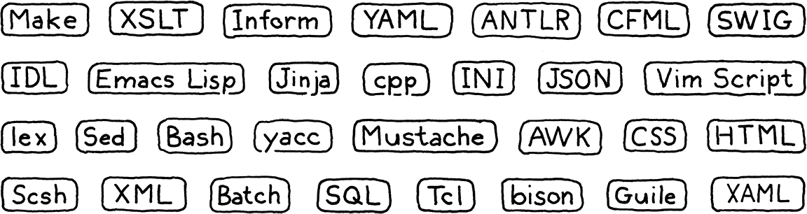
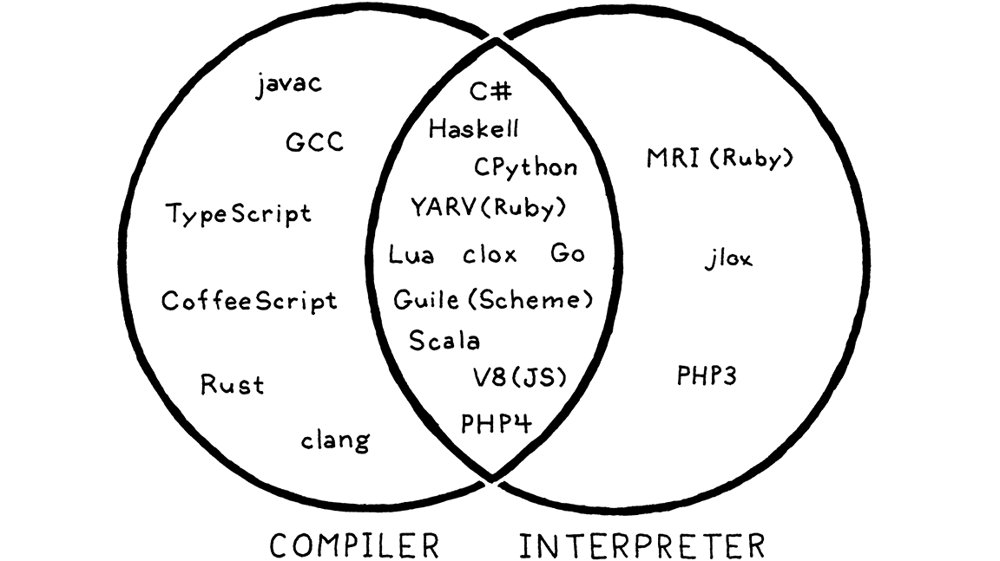

# 第一部分 欢迎致辞

## 1. 前言

> 童话故事是无比真实的：不是因为它告诉我们龙的存在，而是因为它告诉我们龙可以被击败。

我真的很兴奋我们能一起踏上这段旅程。这是一本关于为编程语言实现解释器的书。它也是一本关于如何设计一种值得实现的编程语言的书。我刚开始接触编程语言的时候就希望我能够看到这样的书，而这本书我在脑子里已经写了将近十年了。

在本书中，我将一步一步地介绍一种功能齐全的编程语言的两个完整的解释器实现。我假设这是你第一次涉足编程语言这个领域，因此我将介绍并构建一个完整、可用、快速的编程语言所需的每个概念和代码。

为了在一本书中塞进两个完整的实现，而且避免这变成一个门槛，本书（相比其它书籍）不会在理论上着墨太多。在构建系统的每个模块时，我将介绍它背后的历史和概念。我会尽力让你熟悉这些程序设计语言领域的行话，这样的话，即便你在充满PL（编程语言）研究人员的鸡尾酒会中，也能快速融入其中。

但我们主要还是要花费精力让这门编程语言运行起来。这并不是说理论不重要。在学习一门编程语言时，能够对语法和语义进行精确而形式化的推理[^1]是一项至关重要的技能。但是，就我个人而言，我通过实践来学习理论，效果最好。对我来说，要深入阅读那些充满抽象概念的书本并真正理解它们太难了。但是，如果我（根据理论）编写了代码，运行并调试成功，那么我就明白了。

这就是我对你的期望。我想让你们直观地理解一门真正的编程语言是如何生活和呼吸的。我的希望是，由于你已经自己实现过一门编程语言，在这个坚实的基础之上，当你以后阅读其他理论性更强的书籍时，这些概念会牢牢地留在你的脑海中。

### 1.1 为什么要学习这些知识？

每一本编译器相关书籍的前言似乎都有这一节。我不知道为什么编程语言会引起这种存在性的怀疑。我认为鸟类学书籍作者完全不需要去顾虑一个问题，那就是，为什么需要存在鸟类学这一学科？他们假设读者喜欢鸟，然后就开始讲授内容。

但是编程语言有一点不同。我认为，对我们中的任何一个人来说，能够创建一种广泛成功的通用编程语言的可能性都很小，这是事实。设计世界级的通用编程语言的设计师们，一辆汽车就能装得下。如果加入这个精英群体是学习编程语言的唯一原因，那么就很难证明其合理性。幸运的是，事实并非如此。

#### 1.1.1 小型语言无处不在

对于每一种成功的通用编程语言，都有上千种成功的小众编程语言。我们过去称它们为“小语言”，但术语泛滥的今天它们有了新的名字：“领域特定语言（即DSL）”。这些是为特定任务量身定做的洋泾浜语言[^2]，如应用程序脚本语言、模板引擎、标记语言和配置文件。



几乎每个大型软件项目都需要一些这样的工具。如果可以的话，最好重用现有的工具，而不是自己动手实现。一旦考虑到文档、调试器、编辑器支持、语法高亮显示和所有其他可能的障碍，自己实现一门编程语言就成了一项艰巨的任务。

但是，当现有的库不能满足你的需要时，你仍然很有可能发现自己需要一个语法分析器或其他东西。即使当你重用一些现有的实现时，你也不可避免地需要调试和维护它们，并在其内部进行探索。

#### 1.1.2 实现编程语言是很好的锻炼

长跑运动员有时会在脚踝上绑上重物，或者在空气稀薄的高海拔地区进行训练。当他们卸下自己的负担以后，轻便的肢体和富氧的空气带来了新的相对舒适度，使它们可以跑得更快，更远。

实现一门语言是对编程技能的真正考验。代码很复杂，而性能很关键。你必须掌握递归、动态数组、树、图和哈希表。你在日常编程中至少使用过哈希表，但你对它们的理解程度有多高呢？嗯，等我们从头完成我们的作品之后，我相信你会理解的。

虽然我想说明解释器并不像你想的那样令人生畏，但实现一个好的解释器仍然是一个挑战。学会了它，你就会成为一个更强大的程序员，并且在日常工作中也能更加聪明地使用数据结构和算法。

#### 1.1.3 最后一个原因

最后一个原因我很难承认，因为它是很私密的理由。自从我小时候学会编程以来，我就觉得编程语言有种神奇的力量。当我第一次一个键一个键地输入BASIC程序时，我无法想象BASIC语言本身是如何制作出来的。

后来，当我的大学朋友们谈论他们的编译器课程时，脸上那种既敬畏又恐惧的表情足以让我相信，编程语言黑客是另一种人，某种获得了通向神秘艺术的特权的巫师。

这是一个迷人的形象，但它也有黑暗的一面。我感觉自己不像个巫师，所以我认为自己缺乏加入秘社所需的先天品质。 尽管自从我在学校笔记本上拼写关键词以来，我一直对编程语言着迷，但我花了数十年的时间鼓起勇气尝试真正地学习它们。那种“神奇”的品质，那种排他性的感觉，将我挡在门外。

当我最终开始拼凑我自己的小型编译器时，我很快意识到，根本就没有魔法。编译器只是代码，而那些掌握编程语言实现的人也只是人。

有一些技巧是你在编程语言之外不会经常遇到的，而且有些部分有点难。但不会比你克服的其他障碍更困难。我希望，如果你对编程语言感到害怕，而这本书能帮助你克服这种恐惧，也许我会让你比以前更勇敢一点。

而且，说不准，你也许会创造出下一个伟大的语言，毕竟总要有人做。

### 1.2 本书的组织方式

这本书分为三个部分。你现在正在读的是第一部分。这部分用了几章来让你进入状态，教你一些编程语言黑客们使用的行话，并向你介绍我们将要实现的编程语言Lox。

其他两个部分则分别构建一个完整的Lox解释器。在这些部分中，每个章节的结构都是相同的。每一章节挑选编程语言的某个特性，并教你背后对应的概念，然后逐步介绍实现方法。

我花了不少时间去试错，但我还是成功地把这两个解释器按照章节分成了一些小块，每一小块的内容都会建立在前面几章的基础上，但不需要后续章节的知识。从第一章开始，你就会有一个可以运行和使用的工作程序。随着章节的推移，程序的功能越来越丰富，直到你最终拥有一门完整的编程语言。

除了大量妙趣横生的英文段落，章节中还会包含一些其它的惊喜：

#### 1.2.1 代码

本书是关于制作解释器的，所以其中会包含真正的代码。所需要的每一行代码都需要包含在内，而且每个代码片段都会告知你需要插入到实现代码中的什么位置。

许多其他的编程语言书籍和编程语言实现都使用[Lex](https://en.wikipedia.org/wiki/Lex_(软件))和[Yacc](https://en.wikipedia.org/wiki/Yacc)[^3]这样的工具，也就是所谓的**生成编译器的编译器**，可以从一些更高层次的（语法）规范中自动生成一些实现的源文件。这些工具有利有弊，而且双方都有强烈的主张——有些人可能将其说成是信仰。

我们这里不会使用这些工具。我想确保魔法和困惑不会藏在黑暗的角落，所以我们会选择手写所有代码。正如你将看到的，这并没有听起来那么糟糕，因为这意味着你将真正理解每一行代码以及两种解释器的工作方式。

一本书和“真实世界”所面对的约束是有区别的，因此这里的代码风格可能并不是编写可维护地产品级软件的最佳实践。可能我对某些写法是无所谓的，比如可能我会省略`private`关键字或者声明一些全局变量，请理解我这样做是为了让你更容易看懂代码。书页不像IDE窗口那么宽，所以每一个字符都很珍贵。

另外，代码也不会有太多的注释。这是因为每一部分代码前后，都使用了一些真的很简洁的文字来对其进行解释。当你写一本书来配合你的程序时，欢迎你也省略注释。否则，你可能应该比我使用更多的`//`。

虽然这本书包含了每一行代码，并教授了每一行代码的含义，但它没有描述编译和运行解释器所需的机制。我假设你可以在IDE中选择一个Makefile或一个项目导入，以使代码运行。这类说明很快就会过时，我希望这本书能像XO白兰地一样醇久，而不是像家酿酒（一样易过期）。

#### 1.2.2 代码片段

因为这本书包含了实现所需的每一行代码，所以代码片段相当精确。此外，即使是在缺少编程语言的一些主要功能的时候，我也尝试将程序保持在可运行状态。因此我们有时会添加临时代码，这些代码将在以后的代码段中替换。

一个完整的代码片段可能如下所示：

<p style="color:red; text-align:center">lox/Scanner.java，在scanToken()替换1行</p>

```java
      default:
// 替换部分开始
        if (isDigit(c)) {
          number();
        } else {
          Lox.error(line, "Unexpected character.");
        }
// 替换部分结束
        break;
```

中间是要添加的新代码。这部分代码的上面或下面可能有一些淡出的行，以显示它在周围代码中的位置。还会附有一小段介绍，告诉你在哪个文件中以及在哪里放置代码片段。如果简介说要“替换 x 行”，表明在浅色的行之间有一些现有的代码需要删除，并替换为新的代码片段。

#### 1.2.3 题外话

题外话中包含传记简介、历史背景、对相关主题的引用以及对其他要探索的领域的建议。你无需深入了解就可以理解本书的后续部分，因此可以根据需要跳过它们。我不会批评你，但我可能会有些难过。【注：由于排版原因，在翻译的时候，将有用的旁白信息作为脚注附在章节之后】

#### 1.2.4 挑战

每章结尾都会有一些练习题。不像教科书中的习题集那样用于回顾已讲述的内容，这些习题是为了帮助你学习更多的知识，而不仅仅是本章中的内容。它们会迫使你走出文章指出的路线，自行探索。它们将要求你研究其他编程语言，弄清楚如何实现某些其它功能，换句话说，就是使你走出舒适区。

克服挑战，你将获得更广泛的理解，也可能遇到一些挫折。如果你想留在旅游巴士的舒适区内，也可以跳过它们。都随你便[^4]。

#### 1.2.5 设计笔记

大多数编程语言书籍都是严格意义上的编程语言*实现*书籍。他们很少讨论如何*设计*正在实现的语言。实现之所以有趣，是因为它的定义是很精确的。我们程序员似乎很喜欢黑白、1和0这样的事物[^5]。

就个人而言，我认为世界只需要目前这么多的FORTRAN 77实现。在某个时候，你会发现自己正在设计一种新的语言。 一旦开始这样做，方程式中较柔和，人性化的一面就变得至关重要。 诸如哪些编程语言特性易于学习，如何在创新和熟悉度之间取得平衡，哪种语法更易读以及对谁有帮助[^6]。

所有这些都会对你的新编程语言的成功产生深远的影响。我希望你的语言取得成功，因此在某些章节中，我以一篇“设计笔记”结尾，这些是关于编程语言的人文方面的一些文章。我并不是这方面的专家——我不确定是否有人真的精通这些，因此，请你在阅读这些文字的时候仔细评估。这样的话，这些文字就能成为你思考的食材，这也正是我的目标。

### 1.3 第一个解释器

我们将用Java编写第一个解释器jlox。（这里的）主要关注点是概念。 我们将编写最简单，最干净的代码，以正确实现该编程语言的语义。这样能够帮助我们熟悉基本技术，并磨练对编程语言表现形式的确切理解。

Java是一门很适合这种场景的语言。它的抽象层级足够高，我们不会被繁琐的实现细节淹没，但代码仍是非常明确的。与脚本语言不同的是，Java并没有隐藏太过复杂的底层机制，你可以使用静态类型来查看正在处理的数据结构。

我选择Java还有一个特别的原因，就是因为它是一种面向对象的语言。这种编程范式在90年代席卷了整个编程世界，如今已成为数百万程序员的主流思维方式。很有可能你已经习惯了将代码组织到类和方法中，因此我将让你在舒适的环境中学习。

虽然程序设计语言领域的专家有时瞧不起面向对象语言，但事实上，它们即使在编程语言的实现工作中也被广泛使用。GCC和LLVM是用C++编写的，大多数JavaScript虚拟机也是这样。面向对象的语言无处不在，并且针对该语言的工具和编译器通常是用同一种语言编写的[^7]。

最后，Java非常流行。这意味着你很有可能已经了解它了，所以你要学习的东西就更少了。如果你不太熟悉Java，也请不要担心。我尽量只使用Java的最小子集。我使用Java 7中的菱形运算符使代码看起来更简洁，但就“高级”功能而言，仅此而已。如果你了解其它面向对象的语言（例如C#或C++），就没有问题。

在第二部分结束时，我们将得到一个简单易读的解释器实现。但是我们得到的不会是一个高性能的解释器。它还是利用了Java虚拟机自身的运行时工具。我们想要学习Java本身是如何实现这些东西的。

### 1.4 第二个解释器

所以在下一部分，我们将从头开始，但这一次是用C语言。对于理解解释器的实现来说，C语言是一门完美的编程语言，使用C语言实现解释器，可以帮助你一直理解到最底层，例如内存中的字节和流经CPU的代码。

我们使用C语言的一个重要原因是，我可以向你展示C语言特别擅长的东西，但这并不意味着你需要非常熟练地使用它。你不必是丹尼斯·里奇（Dennis Ritchie）转世，但也不应被指针吓倒。

如果你（对C的掌握）还没到那一步，找一本关于C的入门书，仔细阅读，读完后再回来。作为回报，读完本书你将成为一个更优秀的C程序员。可以想想有多少语言实现是用C完成的：Lua、CPython和Ruby's MRI等，这里仅举几例。

在我们的C解释器clox中[^8]，我们不得不自己实现那些Java免费提供给我们的东西。我们将编写自己的动态数组和哈希表。我们将决定对象在内存中的表示方式，并构建一个垃圾回收器来回收它。

我们的Java版实现专注于正确性。既然我们已经完成了，那么我们就要变得越来越快。我们的C解释器将包含一个编译器[^9]，该编译器会将Lox转换为有效的字节码形式（不用担心，我很快就会讲解这是什么意思）之后它会执行对应的字节码。这与Lua，Python，Ruby，PHP和许多其它成功的编程语言的实现所使用的技术相同。

我们甚至会尝试进行基准测试和优化。到最后，我们将为Lox编程语言提供一个强大，准确，快速的解释器，并能够不落后于其他专业水平的实现。对于一本书和几千行代码来说已经不错了。

[^1]: 静态类型系统尤其需要严格的形式化推理。破解类型系统就像证明数学定理一样。事实证明这并非巧合。上世纪初，Haskell Curry和William Alvin Howard证明了它们是同一枚硬币的两个方面：[Curry-Howard同构](https://en.wikipedia.org/wiki/Curry%E2%80%93Howard_correspondence)。
[^2]: pidgins，洋泾浜语言，一种混杂的英语
[^3]: Yacc是一个工具，它接收语法规范文件并生成编译器的源文件，因此它有点像一个输出“编译器”的编译器，在术语中叫作“compiler-compiler”，即编译器的编译器。Yacc并不是同类工具中的第一个，这就是为什么它被命名为“Yacc”——*Yet Another* Compiler-Compiler（另一个Compiler-Compiler）。后来还有一个类似的工具是Bison，它的名字源于Yacc和yak的发音，是一个双关语。
[^4]: 警告：挑战题目通常要求你对正在构建的解释器进行更改。你需要在代码副本中实现这些功能。后面的章节都假设你的解释器处于原始（未解决挑战题）状态。
[^5]: 我知道很多编程语言黑客的职业就基于此。你将一份语言规范塞到他们的门下，等上几个月，代码和基准测试结果就出来了。
[^6]: 希望你的新编程语言不会将对打孔卡宽度的假设硬编码到语法中。
[^7]: 编译器以一种语言读取文件。 翻译它们，并以另一种语言输出文件。你可以使用任何一种语言（包括与目标语言相同的语言）来实现编译器，该过程称为“自举”。你现在还不能使用编译器本身来编译你自己的编译器，但是如果你用其它语言为你的语言写了一个编译器，你就可以用那个编译器编译一次你的编译器。现在，你可以使用自己的编译器的已编译版本来编译自身的未来版本，并且可以从另一个编译器中丢弃最初的已编译版本。 这就是所谓的“自举”，通过自己的引导程序将自己拉起来。
[^8]: 我把这个名字读作“sea-locks”，但是你也可以读作“clocks”，如果你愿意的话可以像希腊人读“x”那样将其读作“clochs”，
[^9]: 你以为这只是一本讲解释器的书吗？它也是一本讲编译器的书。买一送一。

### 习题

1. 在我编写的这个[小系统](https://github.com/munificent/craftinginterpreters)中，至少有六种领域特定语言（DSL），它们是什么？

2. 使用Java编写并运行一个“Hello, world!”程序，设置你需要的makefile或IDE项目使其正常工作。如果你有调试器，请先熟悉一下，并在程序运行时对代码逐步调试。

3. 对C也进行同样的操作。为了练习使用指针，可以定义一个堆分配字符串的[双向链表](https://en.wikipedia.org/wiki/Doubly_linked_list)。编写函数以插入，查找和删除其中的项目。 测试编写的函数。

### 设计笔记：编程语言的名字有什么含义吗？

写这本书最困难的挑战之一是为它所实现的编程语言取个名字。我翻了好几页的备选名字才找到一个合适的。当你某一天开始构建自己的编程语言时，你就会发现命名是非常困难的。一个好名字要满足几个标准：

1. **尚未使用**。如果你不小心使用了别人的名字，就可能会遇到各种法律和社会上的麻烦。
2. **容易发音**。如果一切顺利，将会有很多人会说和写你的语言名称。超过几个音节或几个字母的任何内容都会使他们陷入无休止的烦恼。
3. **足够独特，易于搜索**。人们会Google你的编程语言的名字来了解它，所以你需要一个足够独特的单词，以便大多数搜索结果都会指向你的文档。不过，随着人工智能搜索引擎数量的增加，这已经不是什么大问题了。但是，如果你将语言命名为“for”，那对用户基本不会有任何帮助。
4. **在多种文化中，都没有负面的含义**。这很难防范，但是值得深思。Nimrod编程语言的设计师最终将其语言重命名为“Nim”，因为太多的人只记得Bugs Bunny使用“Nimrod”作为一种侮辱（其实是讽刺）。

如果你潜在的名字通过了考验，就保留它吧。不要纠结于寻找一个能够抓住你语言精髓的名称。如果说世界上其他成功的编程语言的名字教会了我们什么的话，那就是编程语言的名字并不重要。你所需要的只是一个相当独特的标记。

## 2. 本书导航

> 你必须要有一张地图，无论它是多么粗糙。否则你就会到处乱逛。在《指环王》中，我从未让任何人在某一天走得距离超出他力所能及的范围。

我们不想到处乱逛，所以在我们开始之前，让我们先浏览一下以前的编程语言实现者所绘制的编程语言的领土地图。它能帮助我们了解我们的目的地和其他人采用的备选路线。

首先，我先做个简单说明。本书的大部分内容都是关于编程语言的*实现*，它与*编程语言本身*这种柏拉图式的理想形式有所不同。诸如“栈”，“字节码”和“递归下降”之类的东西是某个特定实现中可能使用的基本组件。从用户的角度来说，只要最终产生的装置能够忠实地遵循编程语言的规范，它内部的都是实现细节。

我们将会花很多时间在这些细节上，所以如果我每次提及的时候都写“编程语言实现”，我的手指都会被磨掉。相反，除非有重要的区别，否则我将使用“编程语言”来指代一种编程语言或该编程语言的一种实现，或两者皆有。

## 2.1 语言的各部分

自计算机的黑暗时代以来，工程师们就一直在构建编程语言。而当我们和计算机对话的时候，我们发现构建编程语言太难了，于是我们需要寻求远古工程师们的帮助。我觉得很有趣的是，即使今天的机器确实快了一百万倍，存储空间也大了几个数量级，但我们构建编程语言的方式几乎没有改变。

尽管编程语言设计师所探索的领域非常辽阔，但他们所遍历过的路径却很少。并非每种编程语言都采用完全相同的路径——有些会采用一种或两种捷径——但实际上，编程语言所采用的路径都是很相似的。从海军少将Grace Hopper实现的第一个COBOL编译器，一直到一些热门的移植到JavaScript的编程语言——它们的“文档”完全是由Git仓库中一个编辑得很差的README文件组成的[^1]，它们的实现路径都很相似。

我把一个编程语言的实现可能选择的路径网络类比为爬山。你从山底开始往上爬，山底是程序的原始的源文本，实际上只是一串字符。每个阶段都会对程序进行分析，并将其转换为更高层次的表示形式，从而使程序的语义（作者希望计算机做什么）变得更加明显。

最终我们达到了峰顶。我们可以鸟瞰用户的程序，可以看到他们的代码含义是什么。我们开始从山的另一边下山。我们将这个最高层的表示形式转化为连续的较低层次的表示形式，从而越来越接近我们所知道的可以让CPU真正执行的表示形式。


让我们沿着每一条路线和每一个感兴趣的地方走一遍。我们的旅程从左边的用户源代码的纯文本开始


### 2.1.1 扫描

第一步是**扫描**，也就是所谓的**词法**，或者说（如果你想给别人留下深刻印象）**词法分析**。它们的意思都差不多。我喜欢“lexing”，因为这听起来像是一个邪恶的超级大坏蛋会做的事情，但我还是用“scanning”，因为它似乎更常见一些。

扫描器（或词法分析器）接收线性的字符流，并将它们组合成一系列更类似于“单词”的东西。在编程语言中，这些单词的每一个都被称为**标记**。有些标记是单个字符，比如`(`和 `,`。其他的可能是几个字符组成的，比如数字（`123`）、字符串字面量（`"hi!"`）和标识符（`min`）。

源文件中的一些字符实际上没有任何意义。空格通常是无关紧要的，而注释，从定义就能看出来，会被语言忽略。扫描器通常会丢弃这些字符，留下一个干净的有意义的标记序列。

![[var] [average] [=] [(] [min] [+] [max] [)] [/] [2] [;]](2.领土地图/tokens.png)

### 2.1.2 语法分析

下一步是**语法分析**。 这就是我们从句法中得到**文法**的地方——文法能够将较小的部分组成较大的表达式和语句。你在英语课上画过句子图吗？如果有，你就做了语法分析器所做的事情，区别在于，英语中有成千上万的“关键字”和大量的歧义，而编程语言要简单得多。

**语法分析器**接受的是标记流，并构建反映文法嵌套本质的树形结构。这些树有两个不同的名称：**语法分析树**或**抽象语法树**，这取决于它们与源语言的语法结构有多接近。在实践中，编程语言黑客通常称它们为“**语法树**”、“**AST**”，或者干脆直接说“**树**”。


语法分析器在计算机科学中有着悠久而丰富的历史，它与人工智能界有着密切的联系。今天用于对编程语言进行语法分析的许多技术最初是由人工智能研究人员设想的，他们试图对人类语言进行语法分析来让计算机与我们对话。

事实证明，相对那些语法分析器能够处理的严格文法来说，人类语言的文法太混乱了；但对于编程语言中更简单的人工文法来说，人类语言却是完美的。唉，可惜我们这些有缺陷的人类仍然会错误地使用这些简单的编程语言文法，因此语法分析器的工作还包括通过报告**语法错误**让我们知道出错了。

### 2.1.3 静态分析

在所有实现中，前两个阶段都非常相似。 现在，每种语言的个性化特征开始发挥作用。 至此，我们知道了代码的语法结构（诸如哪些表达式嵌套在其他表达式中）之类的东西，但是我们知道的也就仅限于此了。

在`a+b`这样的表达式中，我们知道我们要把`a`和`b`相加，但我们不知道这些变量名字指的是什么。它们是局部变量吗？全局变量？它们在哪里被定义？

大多数语言所做的第一点分析叫做**绑定**或**决议**。对于每一个**标识符**，我们都要找出定义该标识符的地方，并将两者连接起来。这就是**作用域**的作用——在这个源代码区域中，某个名字可以用来引用某个声明。

如果编程语言是静态类型的，这时我们就进行类型检查。一旦我们知道了`a`和`b`的声明位置，我们也可以弄清楚它们的类型。然后如果这些类型不支持互相累加，我们就会报告一个**类型错误**[^2]。

深吸一口气。 我们已经到达了山顶，并对用户的程序有了全面的了解。所有这些从语义分析中得到的语义信息都需要存储在某个地方。我们可以把它藏在几个地方：

* 通常，它会被直接存储在语法树本身的**属性**中——属性是语法树节点中的额外字段，这些字段在语法分析时不会初始化，但在稍后会进行填充。
* 有时，我们可能会将数据存储在外部的查找表中。 通常，该表的关键字是标识符，即变量和声明的名称。在这种情况下，我们称其为**符号表**，并且其中与每个键关联的值告诉我们该标识符所指的是什么。
* 最强大的记录工具是将树转化为一个全新的数据结构，更直接地表达代码的语义。这是下一节的内容。

到目前为止，所有内容都被视为实现的**前端**。你可能会猜至此以后是**后端**，其实并不是。在过去的年代，当“前端”和“后端”被创造出来时，编译器要简单得多。后来，研究人员在前端和后端之间引入了新阶段。威廉·沃尔夫（William Wulf）和他的同伴没有放弃旧术语，而是新添加了一个迷人但有点自相矛盾的名称“**中端**”。

### 2.1.4 中间表示

你可以把编译器看成是一条流水线，每个阶段的工作是把代表用户代码的数据组织起来，使下一阶段的实现更加简单。流水线的前端是针对程序所使用的源语言编写的。后端关注的是程序运行的最终架构。

在中间阶段，代码可能被存储在一些**中间表示**（**intermediate representation**， 也叫**IR**）中，这些中间表示与源文件所使用的编程语言或目的文件所使用的编程语言都没有紧密的联系（因此叫作“中间表示”）。相反，IR充当了这两种语言之间的接口[^3]。

这可以让你更轻松地支持多种源语言和多种目标平台。假设你想实现Pascal、C和Fortran编译器，并且你想针对x86、ARM，还有SPARC体系结构开发编译器。通常情况下，这意味着你需要写九个完整的编译器：Pascal→x86，C→ARM，以及其他各种组合[^4]。

一个共享的中间表示可以大大减少这种情况。你为每个产生IR的源语言写*一个*前端。然后为每个目标平台写*一个*后端。现在，你可以将这些混搭起来，得到每一种组合。

还有一个重要的原因是，我们可能希望将代码转化为某种形式，使语义更加明确......。

### 2.1.5 优化

一旦我们理解了用户程序的含义，我们就可以自由地用另一个具有相同语义但实现效率更高的程序来替换用户程序——我们可以对它进行**优化**。

一个简单的例子是**常量折叠**：如果某个表达式求值得到的始终是完全相同的值，我们可以在编译时进行求值，并用其结果替换该表达式的代码。 如果用户输入：

```java
pennyArea = 3.14159 * (0.75 / 2) * (0.75 / 2);
```

我们可以在编译器中完成所有的算术运算，并将代码更改为：

```java
pennyArea = 0.4417860938;
```

优化是编程语言业务的重要组成部分。许多编程语言黑客把他们的整个职业生涯都花在了这里，竭尽所能地从他们的编译器中挤出每一点性能，以使他们的基准测试速度提高一个百分点。这可能会成为一种困扰。

我们在本书中会跳过优化这个棘手的问题。许多成功的语言令人惊讶地很少进行编译时优化。例如，Lua和CPython生成相对未优化的代码，并将其大部分性能工作集中在运行时上[^5]。

### 2.1.6 代码生成

我们已经将所有可以想到的优化应用到了用户程序中。最后一步是将其转换为机器可以实际运行的形式。换句话说，**生成代码**（或**代码生成**），这里的“代码”通常是指CPU运行的类似于汇编的原始指令，而不是人类可能想要阅读的“源代码”。

最后，我们到了**后端**，从山的另一侧开始向下。从现在开始，随着我们越来越接近于思维简单的机器可以理解的东西，我们对代码的表示变得越来越原始，就像逆向进化。

我们需要做一个决定。我们是为真实CPU还是虚拟CPU生成指令？如果我们生成真实的机器代码，则会得到一个可执行文件，操作系统可以将其直接加载到芯片上。原生代码的执行速度快如闪电，但生成它需要大量工作。当今的体系结构包含大量指令，复杂的流水线和足够塞满一架波音747飞机行李舱的历史包袱。

使用芯片的语言也意味着你的编译器是与特定的架构相绑定的。如果你的编译器以x86机器代码为目标，那么它就无法在[ARM](https://en.wikipedia.org/wiki/ARM_architecture)设备上运行。一直到60年代，在计算机体系结构的寒武纪大爆发期间，这种缺乏可移植性的情况是一个真正的障碍[^6]。

为了解决这个问题，像BCPL的Martin Richards和Pascal的Niklaus Wirth这样的黑客，让他们的编译器生成虚拟机代码。他们不是为真正的芯片编写指令，而是为一个假设的、理想化的机器编写代码。Wirth称这种**p-code**为“可移植代码”，但今天，我们通常称它为**字节码**，因为每条指令通常都是一个字节长。

这些合成指令的设计是为了更紧密地映射到编程语言的语义上，而不必与任何一个计算机体系结构的特性和它积累的历史错误绑定在一起。你可以把它想象成编程语言底层操作的密集二进制编码。

### 2.1.7 虚拟机

如果你的编译器产生了字节码，你的工作还没有结束。因为没有芯片可以执行这些字节码，因此你还需要进行翻译。同样，你有两个选择。你可以为每个目标体系结构编写一个小型编译器，将字节码转换为该机器的机器代码[^7]。你仍然需要针对你支持的每个芯片做一些工作，但最后这个阶段非常简单，你可以在你想要支持的所有机器上重复使用编译器流水线的其余部分。你基本上是把你的字节码作为一个中间表示。

或者，你可以编写**虚拟机（VM）**[^8]，该程序可在运行时模拟支持虚拟体系结构的虚拟芯片。在虚拟机中运行字节码比提前将其翻译成机器代码要慢，因为每条指令每次执行时都必须在运行时模拟。作为回报，你得到的是简单性和可移植性。用比如说C语言实现你的虚拟机，你就可以在任何有C编译器的平台上运行你的语言。这就是我们在本书中构建的第二个解释器的工作原理。

### 2.1.8 运行时

我们终于将用户程序锤炼成可以执行的形式。最后一步是运行它。如果我们将其编译为机器码，我们只需告诉操作系统加载可执行文件，然后就可以运行了。如果我们将它编译成字节码，我们需要启动VM并将程序加载到其中。

在这两种情况下，除了最基本的底层语言外，我们通常需要我们的语言在程序运行时提供一些服务。例如，如果编程语言是自动管理内存的，我们需要一个垃圾收集器去回收未使用的比特位。如果我们的语言支持“instance of”测试，这样你就可以看到你有什么类型的对象，那么我们就需要一些表示方法来跟踪执行过程中每个对象的类型。

所有这些东西都是在运行时进行的，所以它被恰当地称为，**运行时**。在一个完全编译的语言中，实现运行时的代码会直接插入到生成的可执行文件中。比如说，在[Go](https://golang.org/)中，每个编译后的应用程序都有自己的一份Go的运行时副本直接嵌入其中。如果语言是在解释器或虚拟机内运行，那么运行时将驻留于虚拟机中。这也就是Java、Python和JavaScript等大多数语言实现的工作方式。

## 2.2 捷径和备选路线

这是一条漫长的道路，涵盖了你要实现的每个可能的阶段。许多编程语言的确走完了整条路线，但也有一些捷径和备选路径。

### 2.2.1 单遍编译器

一些简单的编译器将语法分析、语义分析和代码生成交织在一起，这样它们就可以直接在语法分析器中生成输出代码，而无需分配任何语法树或其他IR。这些**单遍编译器**限制了编程语言的设计。你没有中间数据结构来存储程序的全局信息，也不会重新访问任何之前语法分析过的代码部分。这意味着，一旦你看到某个表达式，就需要足够的知识来正确地对其进行编译[^9]。

Pascal和C语言就是围绕这个限制而设计的。在当时，内存非常珍贵，一个编译器可能连整个源文件都无法存放在内存中，更不用说整个程序了。这也是为什么Pascal的语法要求类型声明要放在一个块的最前面。这也是为什么在C语言中，你不能调用后面才会定义的函数，除非在调用位置之前就明确地声明要调用的函数，告诉编译器它需要知道什么，以便生成调用后面才会定义的函数的代码。

### 2.2.2 树遍历解释器

有些编程语言在将代码语法分析为AST后就开始执行代码（可能应用了一点静态分析）。为了运行程序，解释器每次都会遍历语法树的一个分支和叶子，并在运行过程中计算每个节点。

这种实现风格在学生项目和小型语言中很常见，但在通用语言中并不广泛使用，因为它往往很慢。有些人使用“解释器”仅指这类实现，但其他人对“解释器”一词的定义更宽泛，因此我将使用没有歧义的“**树遍历解释器**”来指代这些实现。我们的第一个解释器就是这样工作的[^10]。

### 2.2.3 转译器

为一种语言编写一个完整的后端可能需要大量的工作。如果你有一些现有的通用IR作为目标，则可以将前端转换到该IR上。否则，你可能会陷入困境。但是，如果你将某些其他*源语言*视为中间表示，该怎么办？

你需要为你的编程语言编写一个前端。然后，在后端，你可以生成一份与你的编程语言层级差不多的其他语言的有效源代码字符串，而不是将所有代码*降低*到某个原始目标语言的语义。然后，你可以使用该语言现有的编译工具作为逃离大山的路径，得到某些可执行的内容。

人们过去称之为**源到源编译器**或**转换编译器**[^11]。随着那些为了在浏览器中运行而编译成JavaScript的各类语言的兴起，它们有了一个时髦的名字——**转译器**。

虽然第一个编译器是将一种汇编语言翻译成另一种汇编语言，但现今，大多数编译器都适用于高级语言。在UNIX病毒式地传播到各种各样的机器之后，开始了一个悠久的编译器传统，即编译器以C语言作为输出语言。只要UNIX存在，就可以使用C编译器，并生成有效的代码，因此，以C为目标是让语言在许多体系结构上运行的好方法。

Web浏览器是今天的“机器”，它们的“机器代码”是JavaScript，所以现在似乎[几乎所有的语言都有一个以JS为目标的编译器](https://github.com/jashkenas/coffeescript/wiki/list-of-languages-that-compile-to-js)，因为这是让你的代码在浏览器中运行的主要方式[^12]。

编译器的前端（扫描器和语法分析器）看起来跟其他编译器相似。然后，如果源语言只是在目标语言之上包装的简单语法外壳，则它可能会完全跳过分析，并直接输出目标语言中的类似语法。

如果两种语言的语义差异较大，那么你就会看到完整编译器的更多典型阶段，包括分析甚至优化。然后，在代码生成阶段，无需输出一些像机器代码一样的二进制语言，而是在目标语言中生成一串语法正确的源码（好吧，目标代码）。

不管是哪种方式，你再通过目标语言已有的编译流水线运行生成的代码，就可以了。

### 2.2.4 即时编译

最后一个与其说是捷径，不如说是危险的高山争霸赛，最好留给专家。执行代码最快的方法是将代码编译成机器代码，但你可能不知道你的最终用户的机器支持什么架构。该怎么做呢？

你可以做和HotSpot JVM、Microsoft的CLR和大多数JavaScript解释器相同的事情。在终端用户的机器上，当程序加载时（无论是从JS中还是从源代码加载，或者是JVM和CLR的平台无关的字节码），都可以将其编译为对应的本机的机器代码，以适应本机支持的体系结构。自然地，这被称为**即时编译**。大多数黑客只是说“JIT”，其发音与“fit”押韵。

最复杂的JIT将性能分析钩子插入到生成的代码中，以查看哪些区域对性能最为关键，以及哪些类型的数据正在流经其中。然后，随着时间的推移，它们将通过更高级的优化功能自动重新编译那些热点部分[^13]。

## 2.3 编译器和解释器

现在我已经向你的脑袋里塞满了一大堆编程语言术语，我们终于可以解决一个自远古以来一直困扰着程序员的问题：编译器和解释器之间有什么区别？

事实证明，这就像问水果和蔬菜的区别一样。这看上去似乎是一个非此即彼的选择，但实际上“水果”是一个植物学术语，“蔬菜”是烹饪学术语。严格来说，一个并不意味着对另一个的否定。有不是蔬菜的水果（苹果），也有不是水果的蔬菜（胡萝卜），也有既是水果又是蔬菜的可食用植物，比如西红柿[^14]。


好，回到编程语言上：

* **编译**是一种实现技术，其中涉及到将源语言翻译成其他语言——通常是较低级的形式。当你生成字节码或机器代码时，你就是在编译。当你移植到另一种高级语言时，你也在编译。
* 当我们说语言实现“是**编译器**”时，是指它会将源代码转换为其他形式，但不会执行。用户必须获取结果输出并自己运行。
* 相反，当我们说一个实现“是**解释器**”时，是指它接受源代码并立即执行它。 它“从源代码”运行程序。

像苹果和橘子一样，某些实现显然是编译器，而不是解释器。GCC和Clang接受你的C代码并将其编译为机器代码。最终用户直接运行该可执行文件，甚至可能永远都不知道使用了哪个工具来编译它。所以这些是C的*编译器*。

在Matz的旧版本的Ruby规范实现中，用户从源代码中运行Ruby。该实现通过遍历语法树对其进行语法分析并直接执行。期间都没有发生其他的转换，无论是在实现内部还是以任何用户可见的形式。所以这绝对是一个Ruby的*解释器*。

但是CPython呢？当你使用它运行你的Python程序时，代码会被语法分析并转换为内部字节码格式，然后在虚拟机内部执行。从用户的角度来看，这显然是一个解释器——他们是从源代码开始运行自己的程序。但如果你看一下CPython的内部，你会发现肯定有一些编译工作在进行。

答案是两者兼而有之。CPython是一个解释器，但它也*有*一个编译器。实际上，大多数脚本语言都以这种方式工作[^15]，如你所见：



中间那个重叠的区域也是我们第二个解释器所在的位置，因为它会在内部将编程语言编译成字节码。所以，虽然本书名义上是关于解释器的，但我们也会涉及一些编译的内容。

## 2.4 我们的旅程

一下子有太多东西要消化掉。别担心。这一章并不是要求你理解所有这些零碎的内容。我只是想让你们知道它们是存在的，以及大致了解它们是如何组合在一起的。

当你探索本书所指导的路径之外的领域时，这张地图应该对你很有用。我希望你自己出击，在那座山里到处游走。

但是，现在，是我们自己的旅程开始的时候了。系好你的鞋带，背好你的包，走吧。从这里开始，你需要关注的是你面前的路。

[^1]: 毫无疑问，CS论文也有死胡同，引用数为零的悲惨小众论文以及如今被遗忘的优化方法，这些优化方法只有在以字节为单位来衡量内存时才有意义。
[^2]: 我们在本书中构建的编程语言是动态类型的，因此将在稍后的运行时中进行类型检查。
[^3]: 有几种成熟的IR风格。点击你熟悉的搜索引擎，搜索“控制流图”、“静态单赋值形式”、“延续传递形式”和“三地址码”。
[^4]: 如果你曾经好奇[GCC](https://en.wikipedia.org/wiki/GNU_Compiler_Collection)如何支持这么多疯狂的编程语言和体系结构，例如Motorola 68k上的Modula-3，现在你就明白了。编程语言前端针对的是少数IR，主要是[GIMPLE](https://gcc.gnu.org/onlinedocs/gccint/GIMPLE.html)和[RTL](https://gcc.gnu.org/onlinedocs/gccint/RTL.html)。目标后端如68k，会接受这些IR并生成机器代码。
[^5]: 如果你无法抗拒要进入这个领域，可以从以下关键字开始，例如“常量折叠”，“公共表达式消除”，“循环不变代码外提”，“全局值编号”，“强度降低”，“ 聚合量标量替换”，“死代码删除”和“循环展开”。
[^6]: 例如，[AAD](http://www.felixcloutier.com/x86/AAD.html)（“ASCII Adjust AX Before Division”，除法前ASCII调整AX）指令可以让你执行除法，这听起来很有用。除了该指令将两个二进制编码的十进制数字作为操作数打包到一个16位寄存器中。你最后一次在16位机器上使用BCD是什么时候？
[^7]: 这里的基本原则是，你把特定于体系架构的工作推得越靠后，你就可以在不同架构之间共享更多的早期阶段。不过，这里存在一些矛盾。许多优化（例如寄存器分配和指令选择）在了解特定芯片的优势和功能时才能发挥最佳效果。弄清楚编译器的哪些部分可以共享，哪些应该针对特定目标是一门艺术。
[^8]: 术语“虚拟机”也指另一种抽象。“系统虚拟机”在软件中模拟整个硬件平台和操作系统。这就是你可以在Linux机器上玩Windows游戏的原因，也是云服务商为什么可以给客户提供控制自己的“服务器”的用户体验，而无需为每个用户实际分配单独的计算机。在本书中，我们将要讨论的虚拟机类型是“编程语言的虚拟机”或“进程虚拟机”（如果你需要明确的话）。
[^9]: [语法制导翻译](https://en.wikipedia.org/wiki/Syntax-directed_translation)是一种结构化的技术，用于构建这些一次性编译器。你可以将一个操作与文法的每个片段（通常是生成输出代码的语法片段）相关联。然后，每当语法分析器匹配该语法块时，它就执行操作，一次构建一个规则的目标代码。
[^10]: 一个明显的例外是早期版本的Ruby，它们是树遍历解释器。在Ruby 1.9时，Ruby的规范实现从最初的MRI（“Matz's Ruby Interpreter”）切换到了Koichi Sasada的YARV（“Yet Another Ruby VM”）。YARV是一个字节码虚拟机。
[^11]: 第一个转译器XLT86将8080汇编语言转换为8086汇编语言。这看似简单，但请记住8080是8位芯片，而8086是16位芯片，可以将每个寄存器用作一对8位寄存器。XLT86进行了数据流分析，以跟踪源程序中的寄存器使用情况，然后将其有效地映射到8086的寄存器集。它是由悲惨的计算机科学英雄加里·基尔达尔（Gary Kildall）撰写的。 他是最早认识到微型计算机前景的人之一，他创建了PL/M和CP/M，这是它们的第一种高级语言和操作系统。
[^12]: JS曾经是在浏览器中执行代码的唯一方式。多亏了[Web Assembly](https://github.com/webassembly/)，编译器现在有了第二种可以在Web上运行的低级语言。
[^13]: 当然，这正是HotSpot JVM名称的来源。
[^14]: 花生（连真正的坚果都算不上）和小麦等谷类其实都是水果，但我把这个图画错了。我能说什么呢，我是个软件工程师，不是植物学家。我也许应该抹掉这个花生小家伙，但他太可爱了，我不忍心。
[^15]: [Go工具](https://golang.org/)更是一个奇葩。如果你运行`go build`，它就会把你的Go源代码编译成机器代码然后停止。如果你输入`go run`，它也会这样做，然后立即执行生成的可执行文件。所以，可以说Go是一个编译器（你可以把它当做一个工具来编译代码而不运行）；也可以说是一个解释器（你可以调用它立即从源码中运行一个程序），并且有一个编译器（当你把它当做解释器使用时，它仍然在内部编译）。

## 习题

1. 选择一个你喜欢的编程语言的开源实现。下载源代码，并在其中探索。试着找到实现扫描器和语法分析器的代码，它们是手写的，还是用Lex和Yacc等工具生成的？（存在`.l`或`.y`文件通常意味着后者）

2. 及时编译往往是提升动态类型编程语言性能最好的方法，但并不是所有的语言都使用它。有什么理由不采用JIT呢？

3. 大多数可编译为C的Lisp实现也包含一个解释器，该解释器还使它们能够随时执行Lisp代码。为什么？

## 3. Lox语言

> 你能够为别人做什么比做早餐更好的事情吗？

我们将用本书的其余部分来照亮Lox语言的每一个黑暗和杂乱的角落，但如果让你在对目标一无所知的情况下，就立即开始为解释器编写代码，这似乎很残忍。

与此同时，我也不想在你编码之前，就把你拖入大量的编程语言和规范的术语中。所以这是一个温和、友好的Lox介绍，它会省去很多细节和边缘情况[^1]。后面我们有足够的时间来解决这些问题。

### 3 . 1 Hello, Lox

下面是你对Lox的第一次体验：

```js
// Your first Lox program!
print "Hello, world!";
```

正如那句`//`行注释和后面的分号所暗示的那样，Lox的语法是C语言家族的成员之一。（因为`print`是一个内置语句，而不是库函数，所以字符串周围没有括号。）

这里，我并不是想说C语言具有出色的语法[^2]。如果我们想要一些优雅的东西，我们可能会模仿Pascal或Smalltalk。如果我们想要完全体现斯堪的纳维亚家具的极简主义风格，我们会实现一个Scheme。这些都有其优点。

但是，类C语法所具有的反而是一些在语言中更有价值的东西：*熟悉度*。我知道你已经对这种风格很熟悉了，因为我们将用来实现Lox的两种语言——Java和C——也继承了这种风格。让Lox使用类似的语法，你就少了一件需要学习的事情。

### 3.2 高级编程语言

虽然这本书最终比我所希望的要厚，但它仍然不够厚，无法将Java这样一门庞大的语言放进去。为了在有限的篇幅里容纳两个完整的Lox实现，Lox语言的语法必须相当紧凑。

当我想到那些小而有用的编程语言时，我脑海中浮现的是像JavaScript[^3]、Scheme和Lua这样的高级“脚本”语言。在这三种语言中，Lox看起来最像JavaScript，主要是因为大多数类C语法的编程语言都是这样的。稍后我们将了解到，Lox的作用域的实现与Scheme密切相关。我们将在第三部分中构建的类C风格的Lox很大程度上得益于Lua的干净、高效的实现。

Lox与这三种语言有两个共同之处：

#### 3.2.1 动态类型

Lox是动态类型的。变量可以存储任何类型的值，单个变量甚至可以在不同时间存储不同类型的值。如果尝试对错误类型的值执行操作（例如，将数字除以字符串），则会在运行时检测到错误并报告。

喜欢静态类型的原因有很多，但它们都比不上为Lox选择动态类型的实际原因[^4]。静态类型系统需要学习和实现大量的工作。跳过它会让你的语言更简单，也可以让本书更短。如果我们将类型检查推迟到运行时，我们将可以更快地启动解释器并执行代码。

#### 3.2.2 自动内存管理

高级语言的存在是为了消除容易出错的低级工作，还有什么比手动管理存储的分配和释放更繁琐的呢？没有人会在抬起头来迎接早晨的阳光时说：“我迫不及待想找到添加`free()`方法的正确位置，来释放我今天分配的内存的每个字节”。

有两种主要的内存管理技术：**引用计数**和**跟踪垃圾收集**（通常仅称为“**垃圾收集**”或“ **GC**”）[^5]。 引用计数器的实现要简单得多——我想这就是为什么Perl、PHP和Python一开始都使用该方式的原因。但是，随着时间的流逝，引用计数的限制变得太麻烦了。 所有这些编程语言最终都添加了完整的跟踪GC或至少一种足以清除循环引用的管理方式。

跟踪垃圾收集算法有着可怕的名声。在原始内存的层面上工作是有点折磨人的。调试GC有时会让你在梦中看到“hex dumps”。但是，请记住，这本书是关于驱散魔法和杀死那些怪物的，所以我们要写出自己的垃圾收集器。我想你会发现这个算法相当简单，而且实现起来很有趣。

### 3.3 数据类型

在Lox的小宇宙中，构成所有物质的原子是内置的数据类型。只有几个：

**Booleans**——没有逻辑就不能编码，没有布尔值也就没有逻辑[^6]。“真”和“假”，就是软件的阴与阳。与某些古老的编程语言重新利用已有类型来表示真假不同，Lox具有专用的布尔类型。在这次探险中，我们可能会有些粗暴，但我们不是野蛮人。

显然，有两个布尔值，每个值都有一个字面量：

```c
true;  // Not false.
false; // Not *not* false.
```

**Numbers**——Lox只有一种数值类型：双精度浮点数。 由于浮点数还可以表示各种各样的整数，因此可以覆盖很多领域，同时保持简单。

功能齐全的语言具有多种数值表示语法——十六进制，科学计数法，八进制和各种有趣的东西。我们只使用基本的整数和十进制字面量：

```c
1234;  // An integer.
12.34; // A decimal number.
```

**Strings**——在第一个示例中，我们已经看到一个字符串字面量。与大多数编程语言一样，它们用双引号引起来：

```c
"I am a string";
"";    // The empty string.
"123"; // This is a string, not a number.
```

我们在实现它们时会看到，在这个无害的字符序列[^7]中隐藏了相当多的复杂性。

**Nil**——还有最后一个内置数据类型，它从未被邀请参加聚会，但似乎总是会出现。它代表“没有值”。在许多其他编程语言中称为“null”。 在Lox中，我们将其拼写为`nil`。（当我们实现它时，这将有助于区分Lox的`nil`与Java或C的`null`）

有一些很好的理由表明在编程语言中不使用空值类型是合理的，因为空指针错误是我们行业的祸害。如果我们使用的是静态类型语言，那么禁止它是值得的。然而，在动态类型中，消除它往往比保留它更加麻烦。

### 3.4 表达式

如果内置数据类型及其字面量是原子，那么表达式必须是分子。其中大部分大家都很熟悉。

#### 3.4.1 算术运算

Lox具备了你从C和其他语言中了解到的基本算术运算符：

```c
add + me;
subtract - me;
multiply * me;
divide / me;
```

运算符两边的子表达式都是**操作数**。因为有两个操作数，它们被称为**二元**运算符（这与二进制的1和0二元没有关联）。由于运算符固定在操作数的中间，因此也称为**中缀**运算符，相对的，还有**前缀**运算符（运算符在操作数前面）和**后缀**运算符（运算符在操作数后面）[^8]。

有一个数学运算符既是中缀运算符也是前缀运算符，`-`运算符可以对数值取负：

```c
-negateMe;
```

所有这些操作符都是针对数字的，将任何其他类型操作数传递给它们都是错误的。唯一的例外是`+`运算符——你也可以传给它两个字符串将它们串接起来。

#### 3.4.2 比较与相等

接下来，我们有几个返回布尔值的运算符。我们可以使用传统的比较运算符来比较数值（并且只能比较数值）：

```c
less < than;
lessThan <= orEqual;
greater > than;
greaterThan >= orEqual;
```

我们可以测试两个任意类型的值是否相等：

```c
1 == 2;         // false.
"cat" != "dog"; // true.
```

即使是不同类型也可以：

```c
314 == "pi"; // false.
```

不同类型的值*永远不会*相等：

```c
123 == "123"; // false.
```

我通常是反对隐式类型转换的。

#### 3.4.3 逻辑运算

取非运算符，是前缀运算符`!`，如果操作数是true，则返回false，反之亦然：

```c
!true;  // false.
!false; // true.
```

其他两个逻辑运算符实际上是表达式伪装下的控制流结构。`and`表达式用于确认两个操作数是否*都是*true。如果左侧操作数是false，则返回左侧操作数，否则返回右侧操作数：

```c
true and false; // false.
true and true;  // true.
```

`or`表达式用于确认两个操作数中任意一个（或者都是）为true。如果左侧操作数为true，则返回左侧操作数，否则返回右侧操作数：

```c
false or false; // false.
true or false;  // true.
```

`and`和 `or`之所以像控制流结构，是因为它们会**短路**[^9]。如果左操作数为假，`and`不仅会返回左操作数，在这种情况下，它甚至不会计算右操作数。反过来，（“相对的”？)如果`or`的左操作数为真，右操作数就会被跳过。

#### 3.4.4 优先级与分组

所有这些运算符都具有与C语言相同的优先级和结合性（当我们开始语法分析时，会进行更详细的说明）。在优先级不满足要求的情况下，你可以使用`()`来分组：

```js
var average = (min + max) / 2;
```

我把其他典型的运算符从我们的小型编程语言中去掉了，因为它们在技术上不是很有趣。没有位运算、移位、取模或条件运算符。我不是在给你打分，但如果你通过自己的方式来完成支持这些运算的Lox实现，你会在我心中得到额外的加分。

这些都是表达式形式（除了一些与我们将在后面介绍的特定特性相关的），所以让我们继续。

### 3.5 语句

现在我们来看语句。表达式的主要作用是产生一个*值*，语句的主要作用是产生一个*作用*。由于根据定义，语句不求值，因此必须以某种方式改变世界（通常是修改某些状态，读取输入或产生输出）才能有用。

你已经看到了几种语句。第一个是：

```js
print "Hello, world!";
```

`print`语句计算单个表达式并将结果显示给用户[^10]。 你还看到了一些语句，例如：

```js
"some expression";
```

表达式后跟分号“;”可以将表达式提升为语句状态。这被称为（很有想象力）**表达式语句**。

如果你想将一系列语句打包成一个语句，那么可以将它们打包在一个块中：

```js
{
  print "One statement.";
  print "Two statements.";
}
```

块还会影响作用域，我们将在下一节中进行说明。

### 3.6 变量

你可以使用`var`语句声明变量。如果你省略了初始化操作，变量的值默认为`nil`[^11]：

```js
var imAVariable = "here is my value";
var iAmNil;
```

一旦声明完成，你自然就可以通过变量名对其进行访问和赋值：

```js
var breakfast = "bagels";
print breakfast; // "bagels".
breakfast = "beignets";
print breakfast; // "beignets".
```

我不会在这里讨论变量作用域的规则，因为我们在后面的章节中将会花费大量的时间来详细讨论这些规则。在大多数情况下，它的工作方式与你期望的C或Java一样。

### 3.7 控制流

如果你不能跳过某些代码，或者不能多次执行某些代码，就很难写出有用的程序[^12]。这意味着控制流。除了我们已经介绍过的逻辑运算符之外，Lox直接从C中借鉴了三条语句。

`if`语句根据某些条件执行两条语句中的一条：

```js
if (condition) {
  print "yes";
} else {
  print "no";
}
```

只要条件表达式的计算结果为true，`while`循环就会重复执行循环体[^13]：

```js
var a = 1;
while (a < 10) {
  print a;
  a = a + 1;
}
```

最后，还有`for`循环：

```js
for (var a = 1; a < 10; a = a + 1) {
  print a;
}
```

这个循环与之前的 while 循环做同样的事情。大多数现代编程语言也有某种for-in或foreach循环，用于显式迭代各种序列类型[^14]。在真正的编程语言中，这比我们在这里使用的粗糙的C风格for循环要好。Lox只保持了它的基本功能。

### 3.8 函数

函数调用表达式与C语言中一样：

```js
makeBreakfast(bacon, eggs, toast);
```

你也可以在不传递任何参数的情况下调用一个函数：

```js
makeBreakfast();
```

与Ruby不同的是，在本例中括号是强制性的。如果你把它们去掉，就不会调用函数，只是指向该函数。

如果你不能定义自己的函数，一门编程语言就不能算有趣。在Lox里，你可以通过`fun`关键字完成：

```js
fun printSum(a, b) {
  print a + b;
}
```

现在是澄清一些术语的好时机[^15]。有些人把“parameter”和“argument”混为一谈，好像它们可以互换，而对许多人来说，它们确实可以互换。我们要花很多时间围绕语义学来对其进行分辨，所以让我们在这里把话说清楚：

* **argument**是你在调用函数时传递给它的实际值。所以一个函数*调用*有一个*argument*列表。有时你会听到有人用**实际参数**指代这些参数。
* **parameter**是一个变量，用于在函数的主体里面存放argument的值。因此，一个函数*声明*有一个*parameter*列表。也有人把这些称为**形式参数**或者干脆称为**形参**。

函数体总是一个块。在其中，你可以使用`return`语句返回一个值：

```js
fun returnSum(a, b) {
  return a + b;
}
```

如果执行到达代码块的末尾而没有`return`语句，则会隐式地返回`nil`。

#### 3.8.1 闭包

在Lox中，函数是一等公民，这意味着它们都是真实的值，你可以对这些值进行引用、存储在变量中、传递等等。下面的代码是有效的：

```js
fun addPair(a, b) {
  return a + b;
}

fun identity(a) {
  return a;
}

print identity(addPair)(1, 2); // Prints "3".
```

由于函数声明是语句，所以可以在另一个函数中声明内部函数：

```js
fun outerFunction() {
  fun localFunction() {
    print "I'm local!";
  }

  localFunction();
}
```

如果将内部函数、作为一等公民的函数和块作用域组合在一起，就会遇到这种有趣的情况：

```js
fun returnFunction() {
  var outside = "outside";

  fun inner() {
    print outside;
  }

  return inner;
}

var fn = returnFunction();
fn();
```

在这里，`inner()`访问了在其函数体外的外部函数中声明的局部变量。这样可行吗？现在很多编程语言都从Lisp借鉴了这个特性，你应该也知道答案是肯定的。

要做到这一点，`inner()`必须“保留”它使用的任何外部变量的引用，这样即使在外部函数返回之后，这些变量仍然存在。我们把能做到这一点的函数称为**闭包**[^16]。现在，这个术语经常被用于任何作为一等公民的函数，但是如果函数没有包住任何外部变量，那就有点用词不当了。

可以想象，实现这些功能会增加一些复杂性，因为我们不能再假定变量作用域严格地像栈一样工作，在函数返回时局部变量就消失了。我们将度过一段有趣的时间来学习如何使这些功能工作起来，并高效地实现这些功能。

### 3.9 类

因为Lox具有动态类型、词法（粗略地说，就是块）作用域和闭包，所以它离函数式编程语言的距离很近。但正如你将看到的，它离成为一种面向对象的语言也有一半的距离。这两种模式都有很多优点，所以我认为有必要分别介绍一下。

类因为没有达到其宣传效果而受到抨击，所以让我先解释一下为什么我把它们放到Lox和这本书中。这里实际上有两个问题：

#### 3.9.1 为什么任何编程语言都想要面向对象？

现在像Java这样的面向对象编程语言已经销声匿迹了，只能在舞台上表演，喜欢它们已经不酷了。为什么有人要用对象来做一门新的语言呢？这不就像发行8轨音乐一样吗？

90年代的“一直都是继承”的狂潮确实产生了一些畸形的类层次结构，但面向对象的编程还是很流行的。数十亿行成功的代码都是用OOP语言编写的，为用户提供了数百万个应用程序。很可能今天大多数在职程序员都在使用面向对象编程语言。他们不可能都错得那么离谱。

特别是，对于动态类型语言来说，对象是非常方便的。我们需要某种方式来定义复合数据类型，用来将一堆数据组合在一起。

如果我们也能把方法挂在这些对象上，那么我们就不需要把函数操作的数据类型的名字作为函数名称的前缀，以避免与不同类型的类似函数发生冲突。比如说，在Racket中，你最终不得不将你的函数命名为hash-copy（复制一个哈希表）和vector-copy（复制一个向量），这样它们就不会互相覆盖。方法的作用域是对象，所以这个问题就不存在了。

#### 3.9.2 为什么Lox是面向对象的？

我可以声明对象是groovy的，但仍然超出了本书的范围。大多数编程语言的书籍，特别是那些试图实现一门完整语言的书籍，都忽略了对象。对我来说，这意味着这个主题没有被很好地覆盖。对于如此广泛使用的范式，这种遗漏让我感到悲伤。

鉴于我们很多人整天都在使用OOP语言，似乎这个世界应该有一些关于如何制作OOP语言的文档。正如你将看到的那样，事实证明这很有趣。没有你担心的那么难，但也没有你想象的那么简单。

#### 3.9.3 类还是原型？

当涉及对象时，实际上有两种方法，类和原型。 类最先出现，由于C++、Java、C#和其它近似语言的出现，类更加普遍。直到JavaScript意外地占领了世界之前，原型几乎是一个被遗忘的分支。

在基于类的语言中，有两个核心概念：实例和类。实例存储每个对象的状态，并有一个对实例的类的引用。类包含方法和继承链。要在实例上调用方法，总是存在一个中间层。你要先查找实例的类，然后在其中找到方法：


基于原型的语言融合了这两个概念[^17]。这里只有对象——没有类，而且每个对象都可以包含状态和方法。对象之间可以直接继承（或者用原型语言的术语说是 “委托”）：


这意味着原型语言在某些方面比类更基础。它们实现起来真的很整洁，因为它们很简单。另外，它们还可以表达很多不寻常的模式，而这些模式是类所不具备的。

但是我看过很多用原型语言写的代码——包括[我自己设计的一些代码](http://finch.stuffwithstuff.com/)。你知道人们一般会怎么使用原型的强大功能和灵活性吗？...他们用它来重新发明类。

我不知道这是为什么，但人们自然而然地似乎更喜欢基于类的（经典？优雅？）风格。原型在语言中更简单，但它们似乎只是通过将复杂性推给用户来实现的[^18]。所以，对于Lox来说，我们将省去用户的麻烦，直接把类包含进去。

#### 3.9.4 Lox中的类

理由已经说够了，来看看我们实际上拥有什么。在大多数语言中，类包含了一系列的特性。对于Lox，我选择了我认为最闪亮的一点。你可以像这样声明一个类及其方法：

```js
class Breakfast {
  cook() {
    print "Eggs a-fryin'!";
  }

  serve(who) {
    print "Enjoy your breakfast, " + who + ".";
  }
}
```

类的主体包含其方法。它们看起来像函数声明，但没有`fun`关键字。当类声明生效时，Lox将创建一个类对象，并将其存储在以该类命名的变量中。就像函数一样，类在Lox中也是一等公民：

```js
// Store it in variables.
var someVariable = Breakfast;

// Pass it to functions.
someFunction(Breakfast);
```

接下来，我们需要一种创建实例的方法。我们可以添加某种`new`关键字，但为了简单起见，在Lox中，类本身是实例的工厂函数。像调用函数一样调用一个类，它会生成一个自己的新实例：

```js
var breakfast = Breakfast();
print breakfast; // "Breakfast instance".
```

#### 3.9.5 实例化和初始化

只有行为的类不是非常有用。面向对象编程背后的思想是将行为和状态封装在一起。为此，你需要有字段。Lox和其他动态类型语言一样，允许你自由地向对象添加属性：

```js
breakfast.meat = "sausage";
breakfast.bread = "sourdough";
```

如果一个字段不存在，那么对它进行赋值时就会先创建。

如果你想从方法内部访问当前对象上的字段或方法，可以使用`this`：

```js
class Breakfast {
  serve(who) {
    print "Enjoy your " + this.meat + " and " +
        this.bread + ", " + who + ".";
  }

  // ...
}
```

在对象中封装数据的目的之一是确保对象在创建时处于有效状态。为此，你可以定义一个初始化器。如果你的类中包含一个名为`init()`的方法，则在构造对象时会自动调用该方法。传递给类的任何参数都会转发给它的初始化器：

```js
class Breakfast {
  init(meat, bread) {
    this.meat = meat;
    this.bread = bread;
  }

  // ...
}

var baconAndToast = Breakfast("bacon", "toast");
baconAndToast.serve("Dear Reader");
// "Enjoy your bacon and toast, Dear Reader."
```

#### 3.9.6 继承

在每一种面向对象的语言中，你不仅可以定义方法，而且可以在多个类或对象中重用它们。为此，Lox支持单继承。当你声明一个类时，你可以使用小于(`<`)操作符指定它继承的类[^19]：

```js
class Brunch < Breakfast {
  drink() {
    print "How about a Bloody Mary?";
  }
}
```

这里，Brunch是**派生类**或**子类**，而Breakfast是**基类**或**超类**。父类中定义的每个方法对其子类也可用：

```js
var benedict = Brunch("ham", "English muffin");
benedict.serve("Noble Reader");
```

即使是`init()`方法也会被继承。在实践中，子类通常也想定义自己的`init()`方法。但还需要调用原始的初始化方法，以便超类能够维护其状态[^20]。我们需要某种方式能够调用自己实例上的方法，而无需触发实例自身的方法。

与Java中一样，你可以使用`super`：

```js
class Brunch < Breakfast {
  init(meat, bread, drink) {
    super.init(meat, bread);
    this.drink = drink;
  }
}
```

这就是面向对象的内容。我尽量将功能设置保持在最低限度。本书的结构确实迫使我做了一个妥协。Lox不是一种纯粹的面向对象的语言。在真正的OOP语言中，每个对象都是一个类的实例，即使是像数字和布尔值这样的基本类型。

因为我们开始使用内置类型很久之后才会实现类，所以这一点很难实现。因此，从类实例的意义上说，基本类型的值并不是真正的对象。它们没有方法或属性。如果以后我想让Lox成为真正的用户使用的语言，我会解决这个问题。

### 3.10 标准库

我们快结束了，这就是整个语言，所剩下的就是“核心”或“标准”库——这是一组直接在解释器中实现的功能集，所有用户定义的行为都是建立在此之上。

这是Lox中最可悲的部分。它的标准库已经超过了极简主义，解决彻底的虚无主义。对于本书中的示例代码，我们只需要证明代码在运行，并且在做它应该做的事。为此，我们已经有了内置的`print`语句。

稍后，当我们开始优化时，我们将编写一些基准测试，看看执行代码需要多长时间。这意味着我们需要跟踪时间，因此我们将定义一个内置函数`clock()`，该函数会返回程序启动后的秒数。

嗯...就是这样。 我知道，有点尴尬，对吧？

如果你想将Lox变成一门实际可用的语言，那么你应该做的第一件事就是对其充实。 字符串操作、三角函数、文件I/O、网络、扩展，甚至读取用户的输入都将有所帮助。但对于本书来说，我们不需要这些，而且加入这些也不会教给你任何有趣的东西，所以我把它省略了。

别担心，这门语言本身就有很多精彩的内容让我们忙个不停。

[^1]: 如果你不亲自运行代码，那教程就毫无意义。唉，你还没有Lox解释器，因为你还没有建立一个!不要害怕。你可以用[我的](https://github.com/munificent/craftinginterpreters)。
[^2]: 我肯定有偏见，但我认为Lox的语法很干净。 C语言最严重的语法问题就是关于类型的。丹尼斯·里奇（Dennis Ritchie）有个想法叫“声明反映使用”，其中变量声明反映了为获得基本类型的值而必须对变量执行的操作。这主意不错，但是我认为实践中效果不太好。Lox没有静态类型，所以我们避免了这一点。
[^3]: 现在，JavaScript已席卷全球，并已用于构建大量应用程序，很难将其视为“小型脚本语言”。但是Brendan Eich曾在十天内将第一个JS解释器嵌入了Netscape Navigator，以使网页上的按钮具有动画效果。 从那时起，JavaScript逐渐发展起来，但是它曾经是一种可爱的小语言。因为Eich大概只用了一集MacGyver的时间把JS糅合在一起，所以它有一些奇怪的语义，会有明显的拼凑痕迹。比如变量提升、动态绑定`this`、数组中的漏洞和隐式转换等。我有幸在Lox上多花了点时间，所以它应该更干净一些。
[^4]: 毕竟，我们用于实现Lox的两种语言都是静态类型的。
[^5]: 在实践中，引用计数和追踪更像是连续体的两端，而不是对立的双方。大多数引用计数系统最终会执行一些跟踪来处理循环，如果你仔细观察的话，分代收集器的写屏障看起来有点像保留调用。有关这方面的更多信息，请参阅[垃圾收集统一理论](https://researcher.watson.ibm.com/researcher/files/us-bacon/Bacon04Unified.pdf)(PDF)。
[^6]: 布尔变量是Lox中唯一以人名George Boole命名的数据类型，这也是为什么“Boolean”是大写的原因。他死于1864年，比数字计算机把他的代数变成电子信息的时间早了近一个世纪。我很好奇他看到自己的名字出现在数十亿行Java代码中时会怎么想。
[^7]: 就连那个 "character "一词也是个骗局。是ASCII码？是Unicode？一个码点，还是一个“字词群”？字符是如何编码的？每个字符是固定的大小，还是可以变化的？
[^8]: 有些操作符有两个以上的操作数，并且操作符与操作数之间是交错的。唯一广泛使用的是C及其相近语言中的“条件”或“三元”运算符：`condition ? thenArm : elseArm;`，有些人称这些为mixfix操作符。有一些语言允许你定义自己的操作符，并控制它们的定位方式——它们的“固定性”。
[^9]: 我使用了`and`和`or`，而不是`&&`和`||`，因为Lox不使用`&`和`|`作为位元操作符。不存在单字符形式的情况下引入双字符形式感觉很奇怪。我喜欢用单词来表示运算，也是因为它们实际上是控制流结构，而不是简单的操作符。
[^10]: 将`print`融入到编程语言中，而不是仅仅将其作为一个核心库函数，这是一种入侵。但对我们来说，这是一个很有用的“入侵”：这意味着在我们实现所有定义函数、按名称查找和调用函数所需的机制之前，我们的解释器可以就开始产生输出。
[^11]: 这是一种情况，没有`nil`并强制每个变量初始化为某个值，会比处理`nil`本身更麻烦。
[^12]: 我们已经有`and`和`or`可以进行分支处理，我们可以用递归来重复代码，所以理论上这就足够了。但是，在命令式语言中这样编程会很尴尬。另一方面，Scheme没有内置的循环结构。它确实依赖递归进行重复执行代码。Smalltalk没有内置的分支结构，并且依赖动态分派来选择性地执行代码。
[^13]: 我没有在Lox中使用do-while循环，因为它们并不常见，相比while循环也没有多余的内涵。如果你高兴的话，就把它加入到你的实现中去吧。你自己做主。
[^14]: 这是我做出的让步，因为本书中的实现是按章节划分的。for-in循环需要迭代器协议中的某种动态分派来处理不同类型的序列，但我们完成控制流之后才能实现这种分派。我们可以回过头来，添加for-in循环，但我认为这样做不会教给你什么超级有趣的东西。
[^15]: 说到术语，一些静态类型的语言，比如C语言，会对函数的声明和定义进行区分。声明是将函数的类型和它的名字绑定在一起，所以调用时可以进行类型检查，但不提供函数体。定义也会填入函数的主体，这样就可以进行编译。由于Lox是动态类型的，所以这种区分没有意义。一个函数声明完全指定了函数，包括它的主体。
[^16]: Peter J. Landin创造了这个词。没错，几乎一半的编程语言术语都是他创造的。它们中的大部分都出自一篇不可思议的论文 "[The Next 700 Programming Languages](https://homepages.inf.ed.ac.uk/wadler/papers/papers-we-love/landin-next-700.pdf)"。为了实现这类函数，你需要创建一个数据结构，将函数代码和它所需要的周围变量绑定在一起。他称它为“闭包”，是因为函数“闭合”并保留了它需要的变量。
[^17]: 实际上，基于类的语言和基于原型的语言之间的界限变得模糊了。JavaScript的“构造函数”概念[使你很难](http://gameprogrammingpatterns.com/prototype.html#what-about-javascript)定义类对象。 同时，基于类的Ruby非常乐意让你将方法附加到单个实例中。
[^18]: Perl的发明家/先知Larry Wall将其称为“水床理论”。 某些复杂性是必不可少的，无法消除。 如果在某个位置将其向下推，则在另一个位置会出现膨胀。原型语言并没有消除类的复杂性，因为它们确实让用户通过构建近似类的元编程库来承担这种复杂性。
[^19]: 为什么用`<`操作符？我不喜欢引入一个新的关键字，比如`extends`。Lox不使用`:`来做其他事情，所以我也不想保留它。相反，我借鉴了Ruby的做法，使用了`<`。如果你了解任何类型理论，你会发现这并不是一个完全任意的选择。一个子类的每一个实例也是它的超类的一个实例，但可能有超类的实例不是子类的实例。这意味着，在对象的宇宙中，子类对象的集合比超类的集合要小，尽管类型迷们通常用`<:`来表示这种关系。
[^20]: Lox不同于不继承构造函数的C++、Java和C#，而是类似于Smalltalk和Ruby，它们继承了构造函数。

### 习题

1. 编写一些示例Lox程序并运行它们(你可以使用[我的Lox实现](https://github.com/munificent/craftinginterpreters))。试着想出我在这里没有详细说明的边界情况。它是否按照期望运行？为什么？

2. 这种非正式的介绍留下了很多未说明的东西。列出几个关于语言语法和语义的开放问题。你认为答案应该是什么？

3. Lox是一种很小的语言。 你认为缺少哪些功能会使其不适用于实际程序？ （当然，除了标准库。）

### 设计笔记：表达式和语句

Lox既有表达式也有语句。有些语言省略了后者。相对地，它们将声明和控制流结构也视为表达式。这类“一切皆表达式”的编程语言往往具有函数式的血统，包括大多数Lisps、SML、Haskell、Ruby和CoffeeScript。

要做到这一点，对于语言中的每一个“类似于语句”的构造，你需要决定它所计算的值是什么。其中有些很简单：

* `if`表达式的计算结果是所选分支的结果。同样，`switch`或其他多路分支的计算结果取决于所选择的情况。
* 变量声明的计算结果是变量的值。
* 块的计算结果是序列中最后一个表达式的结果。

有一些是比较复杂的。循环应该计算什么值？在CoffeeScript中，一个`while`循环计算结果为一个数组，其中包含了循环体中计算到的每个元素。这可能很方便，但如果你不需要这个数组，就会浪费内存。

你还必须决定这些类似语句的表达式如何与其他表达式组合，必须将它们放入语法的优先表中。例如，Ruby允许下面这种写法：

```ruby
puts 1 + if true then 2 else 3 end + 4
```

这是你所期望的吗？这是你的用户所期望的吗？这对你如何设计“语句”的语法有什么影响？请注意，Ruby有一个显式的`end`关键字来表明`if`表达式结束。如果没有它，`+4`很可能会被解析为`else`子句的一部分。

把每个语句都转换成表达式会迫使你回答一些类似这样的复杂问题。作为回报，你消除了一些冗余。C语言中既有用于排序语句的块，以及用于排序表达式的逗号操作符。它既有`if`语句，也有`?:`条件运算符。如果在C语言中所有东西都是表达式，你就可以把它们统一起来。

取消了语句的语言通常还具有**隐式返回**的特点——函数自动返回其函数主体所计算得到的任何值，而不需要显式的`return`语法。对于小型函数和方法来说，这真的很方便。事实上，许多有语句的语言都添加了类似于`=>`的语法，以便能够定义函数体是计算单一表达式结果的函数。

但是让所有的函数以这种方式工作可能有点奇怪。即使你只是想让函数产生副作用，如果不小心，函数也可能会泄露返回值。但实际上，这些语言的用户并不觉得这是一个问题。

对于Lox，我在其中添加语句是出于朴素的原因。为了熟悉起见，我选择了一种类似于C的语法，而试图把现有的C语句语法像表达式一样解释，会变得非常快。

