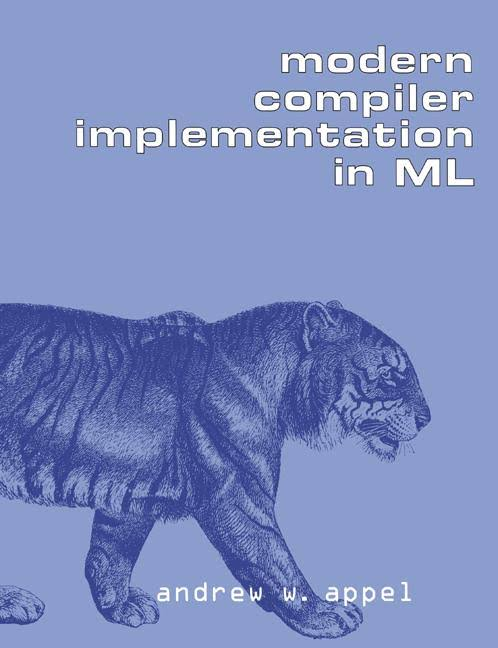

<div style="page-break-after: always; break-after: page;"></div>

[toc]

# 第一部分 编译基本原理

## 前言

近十余年来，编译器的构建方法出现了一些新的变化。一些新的程序设计语言得到应用，例如，具有动态方法的面向对象语言、具有嵌套作用域和一等函数闭包（first-class function closure）的函数式语言等。这些语言中有许多都需要垃圾收集技术的支持。另一方面，新的计算机都有较大的寄存器集合，且存储器访问成为了影响性能的主要因素。这类机器在具有指令调度能力并能对指令和数据高速缓存（cache）进行局部性优化的编译器辅助下，常常能运行得更快。

本书可作为一到两个学期编译课程的教材。学生将看到编译器不同部分中隐含的理论，学习到将这些理论付诸实现时使用的程序设计技术和以模块化方式实现该编译器时使用的接口。为了清晰具体地给出这些接口和程序设计的例子，我使用ML语言来编写它们。本（序列）书还有使用C和Java语言的另外两种版本。

**实现项目**。我在书中概述了一个“学生项目编译器”，它相当简单，而且其安排方式也便于说明现在常用的一些重要技术。这些技术包括避免语法和语义相互纠缠的抽象语法树，独立于寄存器分配的指令选择，能使编译器前期阶段有更多灵活性的复写传播，以及防止从属于特定目标机的方法。与其他许多教材中的“学生编译器”不同，本书中采用的编译器有一个简单而完整的后端，它允许在指令选择之后进行寄存器分配。

本书第一部分中，每一章都有一个与编译器的某个模块对应的程序设计习题。在http://www.cs.princeton.edu/~appel/modern/ml中可找到对这些习题有帮助的一些软件。

**习题**。每一章都有一些书面习题：标有一个星号的习题有点挑战性，标有两个星号的习题较难但仍可解决，偶尔出现的标有三个星号的习题是一些尚未找到解决方法的问题。

**授课顺序**。下图展示了各章相互之间的依赖关系。


- 一学期的课程可包含第一部分的所有章节（第1~12章），同时让学生实现项目编译器（多半按项目组的方式进行）。另外，授课内容中还可以包含从第二部分中选择的一些主题。

- 高级课程或研究生课程可包含第二部分的内容，以及另外一些来自其他文献的主题。第二部分中有许多章节和第一部分无关，因此，对于那些在初始课程中使用不同教材的学生而言，仍然可以给他们讲授高级课程。

- 若按两个半个学期来安排教学，则前半学期可包含第1~8章，后半学期包括第9~12章和第二部分的某些章。

**致谢**。对于本书，许多人给我提出了富有建设性的意见，或在其他方面给我提供了帮助。我要感谢这些人，他们是Leonor Abraido-Fandino，Scott Ananian，Stephen Bailey，Maia Ginsburg，Max Hailperin，David Hanson，Jeffrey Hsu，David MacQueen，Torben Mogensen，Doug Morgan，Robert Netzer，Elma Lee Noah，Mikael Petterson，Todd Proebsting，Anne Rogers，Barbara Ryder，Amr Sabry，Mooly Sagiv，Zhong Shao，Mary Lou Soffa，Andrew Tolmach，Kwangkeun Yi和Kenneth Zadeck。

## 1. 绪论

> **编译器**（compiler）：原指一种将各个子程序装配组合到一起的程序[连接-装配器]。当1954年出现了（确切地说是误用了）复合术语“代数编译器”（algebraic compiler）之后，这个术语的意思变成了现在的含义。
>
> ——Bauer和Eickel[1975]

本书讲述将程序设计语言转换成可执行代码时使用的技术、数据结构和算法。现代编译器常常由多个阶段组成，每一阶段处理不同的抽象“语言”。本书的章节按照编译器的结构来组织，每一章循序渐进地论及编译器的一个阶段。

为了阐明编译真实的程序设计语言时遇到的问题，本书以Tiger语言为例来说明如何编译一种语言。Tiger语言是一种类Algol的语言，它有嵌套的作用域和在堆中分配存储空间的记录，虽简单却并不平凡。每一章的程序设计练习都要求实现相应的编译阶段；如果学生实现了本书第一部分讲述的所有阶段，便能够得到一个可以运行的编译器。将Tiger修改成*函数式的*或*面向对象的*（或同时满足两者的）语言并不难，第二部分中的习题说明了如何进行这种修改。第二部分的其他章节讨论了有关程序优化的高级技术。附录描述了Tiger语言。

编译器各模块之间的接口几乎和模块内部的算法同等重要。为了具体描述这些接口，较好的做法是用真正的程序设计语言来编写它们，本书使用的是ML语言——一种严格的，具有模块系统的，静态类型的函数式编程语言。ML语言适合用来编写很多类型的应用程序。但如果使用ML语言来实现编译器，似乎能最大限度的利用ML语言中的一些强大特性，同时无需使用ML语言的一些缺陷特性。使用ML语言来实现一个编译器，是一个很愉快的过程。而且，对于一本完备的编译器教材来讲，书中需要引入一些现代编程语言设计的教学内容。

### 1.1 模块与接口

对于任何大型软件系统，如果设计者注意到了该系统的基本抽象和接口，那么对这个系统的理解和实现就要容易得多。图1-1展示了一个典型的编译器的各个阶段，每个阶段由一至多个软件模块来实现。

<figure>
  
  <figcaption>图1-1 编译器的各个阶段及其之间的接口</figcaption>
</figure>

将编译器分解成这样的多个阶段是为了能够重用它的各种构件。例如，当要改变此编译器所生成的机器语言的目标机时，只要改变栈帧布局（Frame Layout）模块和指令选择（Instruction Selection）模块就够了。当要改变被编译的源语言时，则至多只需改变翻译（Translate）模块之前的模块就可以了，该编译器也可以在*抽象语法*（Abstract Syntax）接口处与面向对象的语法编辑器相连。

每个学生都不应缺少反复多次“*思考-实现-重新设计*”，从而获得正确的抽象这样一种学习经历。但是，想要学生在一个学期内实现一个编译器是不现实的。因此，我在书中给出了一个项目框架，其中的模块和接口都经过深思熟虑，而且尽可能地使之既精巧又通用。

*抽象语法*（Abstract Syntax）、IR*树*（IR Tree）和*汇编*（Assem）之类的接口是数据结构的形式，例如语法分析动作阶段建立*抽象语法*}数据结构，并将它传递给语义分析阶段。另一些接口是抽象数据类型：*翻译*}接口是一组可由语义分析阶段调用的函数；*标记符号*（Token）接口是函数形式，分析器通过调用它而得到输入程序中的下一个标记符号。

**各个阶段的描述**

第一部分的每一章各描述编译器的一个阶段，具体如表1-2所示。

| **章号** | **阶段**   | **描述**                                                     |
| -------- | ---------- | ------------------------------------------------------------ |
| 2        | 词法分析   | 将源文件分解成一个个独立的*标记符号*                         |
| 3        | 语法分析   | 分析程序的短语结构                                           |
| 4        | 语义动作   | 建立每个短语对应的*抽象语法树*                               |
| 5        | 语义分析   | 确定每个短语的含义，建立变量和其声明的关联，检查表达式的类型，翻译每个短语 |
| 6        | 栈帧布局   | 按机器要求的方式将变量、函数参数等分配于活动记录（即栈帧）内 |
| 7        | 翻译       | 生成*中间表示树*（**IR**树），这是一种与任何特定程序设计语言和目标机体系结构无关的表示 |
| 8        | 规范化     | 提取表达式中的副作用，整理条件分支，以方便下一阶段的处理     |
| 9        | 指令选择   | 将**IR**树结点组合成与目标机指令的动作相对应的块             |
| 10       | 控制流分析 | 分析指令的顺序并建立*控制流图*，此图表示程序执行时可能流经的所有控制流 |
| 10       | 数据流分析 | 收集程序变量的数据流信息。例如，*活跃分析*（liveness analysis）计算每一个变量仍需使用其值的地点（即它的*活跃点*） |
| 11       | 寄存器分配 | 为程序中的每一个变量和临时数据选择一个寄存器，不在同一时间活跃的两个变量可以共享同一个寄存器 |
| 12       | 代码流出   | 用机器寄存器替代每一条机器指令中出现的临时变量名             |

<p style="text-align:center">表1-2 编译器的各个阶段</p>

这种模块化设计是很多真实编译器的典型设计。但是，也有一些编译器把语法分析、语义分析、翻译和规范化合并成一个阶段，还有一些编译器将指令选择安排在更后一些的位置，并且将它与代码流出合并在一起。简单的编译器通常没有专门的控制流分析、数据流分析和寄存器分配阶段。

我在设计本书的编译器时尽可能地进行了简化，但并不意味着它是一个简单的编译器。具体而言，虽然为简化设计而去掉了一些细枝末节，但该编译器的结构仍然可以允许增加更多的优化或语义而不会违背现存的接口。

### 1.2 工具和软件

现代编译器中使用的两种最有用的抽象是*上下文无关文法*（context-free grammar）和*正则表达式*（regular expression）。上下文无关文法用于语法分析，正则表达式用于词法分析。为了更好地利用这两种抽象，较好的做法是借助一些专门的工具，例如Yacc（它将文法转换成语法分析器）和Lex（它将一个说明性的规范转换成一个词法分析器）。幸运的是，ML语言提供了这些工具的比较好的版本，所以本书中的项目ML提供的工具来描述。

本书中的编程项目可以使用Standard ML of New Jersey系统来编译，这个系统中还包含了像ML-Yacc、ML-Lex以及Standard ML of New Jersey Software Library。所有这些工具都可以在因特网上免费获取；具体信息可以查看网页：

http://www.cs.princeton.edu/~appel/modern/ml

Tiger编译器中某些模块的源代码、某些程序设计习题的框架源代码和支持代码、Tiger程序的例子以及其他一些有用的文件都可以从该网址中找到。本书的程序设计习题中，当提及特定子目录或文件所在的某个目录时，指的是目录$TIGER/。

### 1.3 树语言的数据结构

编译器中使用的许多重要数据结构都是被编译程序的*中间表示*。这些表示常常采用树的形式，树的结点有若干类型，每一种类型都有一些不同的属性。这种树可以作为图1-1所示的许多阶段的接口。

树表示可以用文法来描述，就像程序设计语言一样。为了介绍有关概念，我将给出一种简单的程序设计语言，该语言有语句和表达式，但是没有循环或if语句[这种语言称为*直线式程序*（straight-line program）语言]。

该语言的语法在文法1-3中给出。

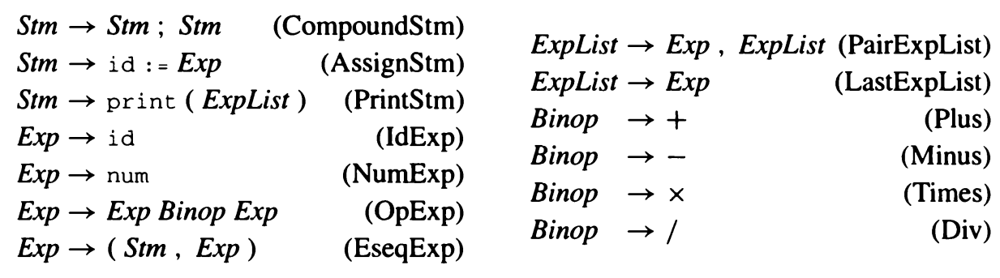

<p style="text-align:center">文法1-3 直线式程序设计语言</p>

这个语言的非形式语义如下。每一个$Stm$是一个语句，每一个$Exp$是一个表达式。$s_1;s_2$表示先执行语句$s_1$，再执行语句$s_2$。$i := e$表示先计算表达式$e$的值，然后把计算结果赋给变量$i$。print($e_1,e_2,\cdots,e_n$)表示从左到右输出所有表达式的值，这些值之间用空格分开并以换行符结束。

*标识符表达式*，例如$i$，表示变量$i$的当前内容。*数*按命名它的整数计值。*运算符表达式*$e_1$ op $e_2$表示先计算$e_1$再计算$e_2$，然后按给定的二元运算符计算表达式结果。*表达式序列*$(s,e)$的行为类似于C语言中的逗号运算符，在计算表达式$e$（并返回其结果）之前先计算语句$s$的副作用。

例如，执行下面这段程序：

```
a := 5+3; b := (print(a, a-1), 10*a); print(b);
```

将打印出：

```
8 7
80
```

那么，这段程序在编译器内部是如何表示的呢？一种表示是*源代码*形式，即程序员所编写的字符，但这种表示不易处理。较为方便的表示是树数据结构。每一条语句（$Stm$）和每一个表达式（$Exp$）都有一个树结点。图1-4给出了这个程序的树表示，其中结点都用文法1-3中产生式的标识加以标记，并且每个结点的子节点数量与相应文法产生式右边的符号个数相同。


<p style="text-align:center">图1-4 直线式程序的树形表示</p>

我们可以将这个文法直接翻译成数据结构定义，如程序1-5所示。每个文法符号对应于这些数据结构中的一个type。

每一项文法规则都有一个*构造器*（constructor），隶属于规则左部符号的类型（type）。ML语言的datatype声明语法可以非常漂亮地表达这些树形结构。这些构造器的名字在文法1-3各项右部的括号内。

```sml
type id = string

datatype binop = Plus | Minus | Times | Div

datatype stm = CompoundStm of stm * stm
             | AssignStm of id * stm
             | PrintStm of exp list

     and exp = IdExp of id
             | NumExp of int
             | OpExp of exp * binop * exp
             | EseqExp of stm * exp
```

<p style="text-align:center">程序1-5 直线式程序的表示</p>

**ML程序的模块化规则**。编译器是一个很大的程序，仔细地设计模块和接口能避免混乱。在用ML语言编写一个编译器时，我们将使用如下一些规则。

1. 编译器的每个阶段或者模块都应该归入各自的structure。
2. 我们将不会使用open声明。如果一个ML文件以如下开头：

```sml
open A.F; open A.G; open B; open C;
```

​	那么你（一个人类读者）*将必须查看一下这个文件之外的代码*来确定X.put()表达式中的X是在哪一个structure中定义的。

​	structure的缩略形式将会是一个比较好的解决方案。如果一个模块以如下开头：

```sml
structure W=A.F.W and X=A.G.X and Y=B.Y and Z=C.Z
```

​	那么你*无需查看这个文件外的代码*就可以确定X来自A.G。

### 程序设计：直线式程序解释器

为直线程序设计语言实现一个简单的程序分析器和解释器。对*环境*（即符号表，它将变量名映射到这些变量相关的信息）、*抽象语法*（表示程序的短语结构的数据结构）、*树数据结构的递归性*（它对于编译器中很多部分都是非常有用的）以及无赋值语句的*函数式风格*程序设计，这可作为入门练习。

这个练习也可以作为ML语言程序设计的热身。熟悉其他语言但对ML语言陌生的程序员应该也能完成这个习题，只是需要有关ML语言的辅助资料（如教材）的帮助。

需要进行解释的程序已经被分析为抽象语法，这种抽象语法如程序1-5中的数据类型所示。

但是，我们并不希望涉及该语言的具体分析细节，因此利用了相应数据的构造器来编写该程序：

```sml
val prog =
 CompoundStm(AssignStm("a",OpExp(NumExp 5, Plus, NumExp 3)),
  CompoundStm(AssignStm("b",
      EseqExp(PrintStm[IdExp "a",OpExp(IdExp "a", Minus,
                                       NumExp 1)],
           OpExp(NumExp 10, Times, IdExp "a"))),
   PrintStm[IdExp "b"]))
```

在目录$TIGER/chap1中可以找到包含树的数据类型声明的文件以及这个样板程序。

编写没有副作用（即更新变量和数据结构的赋值语句）的解释器是理解*指称语义*（denotational semantic）和*属性文法*（attribute grammar）的好方法，后两者都是描述程序设计语言做什么的方法。对编写编译器而言，它也常常是很有用的技术，因为编译器也需要知道程序设计语言做的是什么。

因此，在实现这些程序时，不要使用引用变量，数组或者赋值表达式等ML语言的语法特性。

1. 写一个函数(maxargs : stm $\rightarrow$ int)，告知给定语句中所有子表达式内的print语句中包含最大参数数量的print语句的参数个数。例如，maxargs(prog)是2。
2. 写一个函数interp : stm $\rightarrow$ unit，对一个用这种直线式程序语言写的程序进行“解释”。使用“函数式”的风格来编写这个函数——不使用赋值（:=）或者数组特性——维护一个（变量，整型）元组所组成的列表，然后再解释每个AssignStm时，产生这个列表的新版本。

对于第一个程序，要记住print语句可能会包含一些表达式，而这些表达式中又包含了其他的print语句。

对于第二个程序，编写两个互相递归调用的函数interpStm和interpExp。构造一个“表”，将标识符映射到赋值给标识符的整型数值，“表”使用id $\times$ int偶对所组成的列表来实现。那么interpStm的类型是：stm $\times$ table $\rightarrow$ table，如果表$t_1$作为参数的话，那么返回值将会是一个新的表$t_2$，$t_2$和$t_1$基本相同。不同的是，作为语句的执行结果，一些标识符被映射到了一些不同的整型数值。

例如，表$t_1$中$a$映射到了$3$，$c$映射到了$4$，我们将$t_1$写成$\{a \mapsto 3,c \mapsto 4\}$这样的数学符号，还可以将$t_1$写成链表的形式，写成ML代码是`("a",3)::("c",4)::nil`。

现在，令表$t_2$就像表$t_1$，不同的是，$c$映射到了$7$而不是$4$。我们可以将这个过程写为以下数学形式：

$$t_2=update(t_1,c,7)$$

其中函数update返回一个新表$\{a \mapsto 3,c \mapsto 7\}$。

在计算机中，只要我们假设在链表中$c$的*第一次*出现优先于它较后的任何出现，就可以通过在表头插入一个新元素来实现新表$t_2$

因此，update函数很容易实现，而与之相应的lookup函数

```
val lookup : table * id -> int
```

则只要沿着链表从头向后搜索即可。

表达式的解释要比语句的解释复杂一些，因为表达式返回整型数值*且*有副作用。我们希望解释器本身在模拟直线程序设计语言的赋值语句时不产生任何副作用（但是print语句将有解释器的副作用来实现）。实现它的方法是将interpExp的类型设计成exp $\times$ table $\rightarrow$ int $\times$ table。用表$t_1$解释表达式$e_1$的结果是得到一个整型数值$i$和一个新表$t_2$。当解释一个含有两个子表达式的表达式（例如OpExp）时，由第一个子表达式得到的表$t_2$可以继续用于处理第二个子表达式。

### 习题

1.1 下面这个简单的程序实现了一种*持久化*（persistent）函数式二叉搜索树，使得如果`tree2 = insert(x, tree1)`，则当使用tree2时，tree1仍然可以继续用于查找。

```
type key = string
datatype tree = LEAF | TREE of tree * key * tree

val empty = LEAF

fun insert(key, LEAF) = TREE(LEAF, key, LEAF)
  | insert(key, TREE(l, k, r)) =
                if key < k
                  then TREE(insert(key, l), k, r)
                else if key > k
                  then TREE(l, k, insert(key, r))
                else TREE(l, key, r)
```

​	a. 实现函数member，若查找到了相应项，返回true，否则返回false。

​	b. 扩充这个程序使其不仅包含成员关系，而且还包含了键值（key）到绑定的映射。

```
datatype 'a tree = ...
insert : 'a tree * key * 'a -> 'a tree
lookup : 'a tree * key -> 'a
```

​	c. 这个程序构造的树是不平衡的；用下述插入顺序说明树的形成过程：

​		(i) t s p i p f b s t

​		(ii) a b c d e f g h i

​	\*d. 研究Sedgewick[1997]中讨论过的平衡搜索树，并为函数式符号表推荐一种平衡树数据结构。**提示：**为了保持函数式风格，算法应该在插入时而不是在查找时保持树的平衡，因此，不适合使用类似于*伸展树*（splay tree）这样的数据结构。

## 2 词法分析

> **词法的**（lex-i-cal）：与语言的单词或词汇有关，但有别于语言的文法和结构。
>
> ——韦氏词典

为了将一个程序从一种语言翻译成另一种语言，编译器必须首先把程序的各种成分拆开，并搞清其结构和含义，然后再用另一种方式把这些成分组合起来。编译器的前端执行分析，后端进行合成。

分析一般分为以下三种。

- **词法分析：**将输入分解成一个个独立的词法符号，即“标记符号”（token），简称标记。
- **语法分析：**分析程序的短语结构。
- **语义分析：**推算程序的含义。

词法分析器以字符流作为输入，生成一系列的名字、关键字和标点符号，同时抛弃标记之间的空白符和注释。程序中每个地方都有可能出现空白符和注释，如果让语法分析器来处理它们就会使得语法分析过于复杂，这便是将词法分析从语法分析中分离出去的主要原因。

词法分析并不太复杂，但是我们却使用能力强大的形式化方法和工具来实现它，因为类似的形式化方法对语法分析研究很有帮助，并且类似的工具还可以应用于编译器以外的其他领域。

### 2.1 词法标记

词法标记是字符组成的序列，可以将其看作程序设计语言的文法单位。程序设计语言的词法标记可以归类为有限的几组标记类型。例如，典型程序设计语言的一些标记类型为：

| **类型** | **例子**                     |
| -------- | ---------------------------- |
| ID       | foo  n14  last               |
| NUM      | 73  0  00  515  082          |
| REAL     | 66.1  .5  10.  1e67  5.5e-10 |
| IF       | if                           |
| COMMA    | ,                            |
| NOTEQ    | !=                           |
| LPAREN   | (                            |
| RPAREN   | )                            |

IF、VOID、RETURN等由字母字符组成的标记称为*保留字*（reserved word），在多数语言中，它们不能作为标识符使用。

不是标记的例子有：

|                        |                     |
| ---------------------- | ------------------- |
| 注释                   | /* try again */     |
| 预处理命令             | \#include <stdio.h> |
| 预处理命令             | \#define NUMS 5 , 6 |
| 宏                     | NUMS                |
| 空格符、制表符和换行符 |                     |

在能力较弱而需要宏预处理器的语言中，由预处理器处理源程序的字符流，并生成另外的字符流，然后由词法分析器读入这个新产生的字符流。这种宏处理过程也可以与词法分析集成到一起。

对于下面一段程序：

```c
float match0(char *s) /* find a zero */
{if (!strncmp(s, "0.0", 3))
    return 0.;
}
```

词法分析器将返回下列标记流：

```
  FLOAT    ID(match0)    LPAREN    CHAR    STAR    ID(s)    RPAREN
  LBRACE     IF  LPAREN     BANG    ID(strncmp)    LPAREN    ID(s)
  COMMA      STRING(0.0)    COMMA     NUM(3)     RPAREN     RPAREN
  RETURN     REAL(0.0)    SEMI  RBRACE    EOF
```

其中报告了每个标记的标记类型。这些标记中的一些（如标识符和字面量）有\textit{*语义值*}与之相连，因此，词法分析器还给出了除标记类型之外的附加信息。

应当如何描述程序设计语言的词法规则？词法分析器又应当用什么样的语言来编写呢？

我们可以用自然语言来描述一种语言的词法标记。例如，下面是对C或Java中标识符的一种描述：

> *标识符是字母和数字组成的序列，第一个字符必须是字母。下划线“**\_**”视为字母。大小写字母不同。如果经过若干标记分析后输入流已到达一个给定的字符，则下一个标记将由有可能组成一个标记的最长字符串所组成。其中的空格符、制表符、换行符和注释都将被忽略，除非它们作为独立的一类标记。另外需要有某种空白符来分隔相邻的标识符、关键字和常数。*

任何合理的程序设计语言都可以用来实现特定的词法分析器。我们将用*正则表达式*的形式语言来指明词法标记，用*确定性有限自动机*来实现词法分析器，并用数学的方法将两者联系起来。这样将得到一个简单且可读性更好的词法分析器。

### 2.2 正则表达式

我们说*语言*（language）是字符串组成的集合，字符串是*符号*（symbol）的有限序列。符号本身来自有限*字母表*（alphabet）。

Pascal语言是所有组成合法Pascal程序的字符串的集合，素数语言是构成素数的所有十进制数字字符串的集合，C语言保留字是C程序设计语言中不能作为标识符使用的所有字母数字字符串组成的集合。这3种语言中，前两种是无限集合，后一种是有限集合。在这3种语言中，字母表都是ASCII字符集。

以这种方式谈论语言时，我们并没有给其中的字符串赋予任何含义，而只是企图确定每个字符串是否属于其语言。

为了用有限的描述来指明这类（很可能是无限的）语言，我们将使用*正则表达式*（regular expression）表示法。每个正则表达式代表一个字符串集合。

- **符号**（symbol）：对于语言字母表中的每个符号**a**，正则表达式**a**表示仅包含字符串a的语言。
- **或**（alternation）：对于给定的两个正则表达式**M**和**N**，或运算符（|）形成一个新的正则表达式**M | N**。如果一个字符串属于语言**M**或者语言**N**，则它属于语言**M | N**。因此，**a | b**组成的语言包含a和b这两个字符串。
- **联结**（concatenation）：对于给定的两个正则表达式**M**和**N**，联结运算符（$\boldsymbol{\cdot}$）形成一个新的正则表达式$\textbf{M}\boldsymbol{\cdot}\textbf{N}$。如果一个字符串是任意两个字符串$\alpha$和$\beta$的联结，且$\alpha$属于语言**M**，$\beta$属于语言**N**，则该字符串属于$\textbf{M}\boldsymbol{\cdot}\textbf{N}$组成的语言。因此，正则表达式$(\textbf{a} | \textbf{b})\boldsymbol{\cdot} \textbf{a}$定义了包含两个字符串aa和ba的语言。
- $\epsilon$（epsilon）：正则表达式$\epsilon$表示仅含一个空字符串的语言。因此，$(\textbf{a}\boldsymbol{\cdot}\textbf{b})|\epsilon$表示语言\{"", "ab"\}。
- **重复**（repetition）：对于给定的正则表达式**M**，它的克林闭包（Kleene closure）是$\textbf{M}^*$。如果一个字符串是由$M$中的字符串经零至多次联结运算的结果，则该字符串属于$\textbf{M}^*$。因此，$((\textbf{a}|\textbf{b})\boldsymbol{\cdot}\textbf{a})^*$表示无穷集合\{"", "aa", "ba", "aaaa", "baaa", "aaba", "baba", "aaaaaa", $\cdots$\}。

通过使用符号、或、联结、$\epsilon$和克林闭包，我们可以规定与程序设计语言词法标记相对应的ASCII字符集。首先，考虑若干例子：

$(\textbf{0}|\textbf{1})^*\boldsymbol{\cdot}\textbf{0}$    由2的倍数组成的二进制数。

$\textbf{b}^*(\textbf{abb}^*)^*(\textbf{a}|\epsilon)$    由a和b组成，但a不连续出现的字符串。

$(\textbf{a}|\textbf{b})^*\textbf{aa}(\textbf{a}|\textbf{b})^*$    由a和b组成，且有连续出现a的字符串。

在书写正则表达式时，我们有时会省略联结运算符或$\epsilon$符号，并假定克林闭包的优先级高于联结运算，联结运算的优先级高于或运算，所以$\textbf{ab}|\textbf{c}$表示$(\textbf{a}\boldsymbol{\cdot}\textbf{b})|\textbf{c}$，而$(\textbf{a}|)$表示$(\textbf{a}|\epsilon)$。

还有一些更为简洁的缩写形式：[**abcd**]表示$(\textbf{a}|\textbf{b}|\textbf{c}|\textbf{d})$，[**b-g**]表示[**bcdefg**]，[**b-gM-Qkr**]表示[**bcdefgMNOPQkr**]，**M**?表示$(\textbf{M}|\epsilon)$，$\textbf{M}^+$表示$\textbf{M}\boldsymbol{\cdot}\textbf{M}^*$。这些扩充很方便，但它们并没有扩充正则表达式的描述能力：任何可以用这些简写形式描述的字符串集合都可以用基本运算符集合来描述。图2-1概括了所有这些运算符。

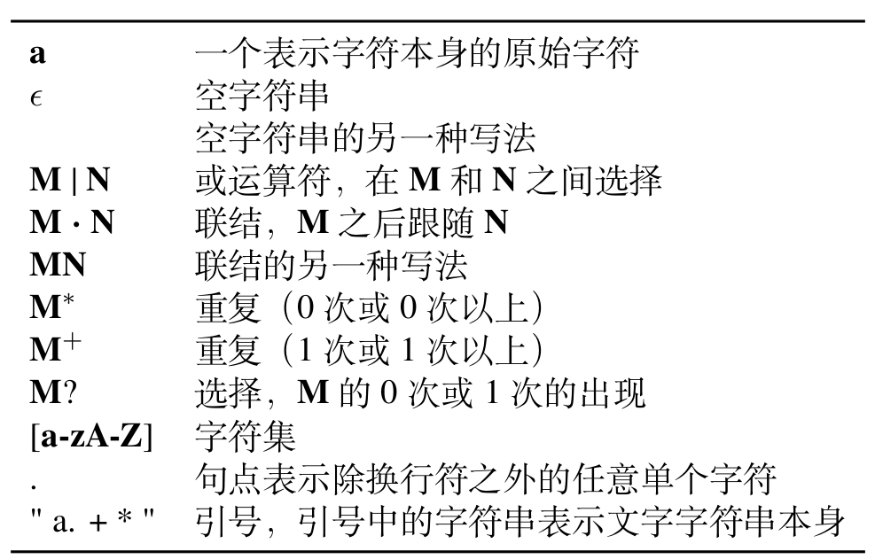

<p style="text-align:center">图2-1 正则表达式表示法</p>

使用这种语言，我们便可以指明程序设计语言的词法标记（见图2-2）。对于每一个标记，我们提供一段ML代码，报告识别的是哪种标记类型。


<p style="text-align:center">图2-2 某些标记的正则表达式</p>

图2-2第5行的描述虽然识别注释或空白，但是不提交给语法分析器，而是忽略它们并重新开始词法分析。这个分析器识别的注释以两个短横线开始，且只包含字母字符，并以换行符结束。

最后，词法规范应当是*完整的*，它应当总是能与输入中的某些初始子串相匹配；使用一个可以与任意字符相匹配的规则，我们便总能做到这一点（在这种情况下，将打印出"illegal character"错误信息，然后再继续进行）。

图2-2中的规则存在着二义性。例如，对于if8，应当将它看成一个标识符，还是两个标记if和8？字符串"if 89"是以一个标识符开头还是以一个保留字开头？Lex，ML-Lex以及其他类似的词法分析器使用了两条消除二义性的重要规则。

- **最长匹配**：初始输入子串中，取可与任何正则表达式匹配的那个最长的字符串作为下一个标记。
- **规则优先**：对于一个特定的最长初始子串，第一个与之匹配的正则表达式决定了这个子串的标记类型。也就是说，正则表达式规则的书写顺序有意义。

因此，依据最长匹配规则，if8是一个标识符；根据规则优先，if是一个保留字。

### 2.3 有限自动机

用正则表达式可以很方便地指明词法标记，但我们还需要一种用计算机程序来实现的形式化方法。可以使用有限自动机达到此目的。有限自动机有一个有限状态集合和一些从一个状态通向另一个状态的边，每条边上标记有一个符号；其中一个状态是**初始状态**，某些状态是**接受状态**。

图2-3给出了一些有限自动机的例子。为了方便讨论，我们给每个状态一个编号。每个例子中的初始状态都是编号为1的状态。标有多个字符的边是多条平行边的缩写形式；因此，在机器ID中，实际上有26条边从状态1通向状态2，每条边用不同的字母标记。


<p style="text-align:center">图2-3 词法标记的有限自动机。</br>圆圈表示状态，双圆圈表示接受状态。</br>初始状态是进入边没有来源的状态。</br>标有多个字符的边是多条平行边的缩写</p>

在**确定性**有限自动机（DFA）中，不会有从同一状态出发的两条边标记为相同的符号。DFA以如下方式接收或拒绝一个字符串：从初始状态出发，对于输入字符串中的每个字符，自动机都将沿着一条确定的边到达另一状态，这条边必须是标有输入字符的边。对n个字符的字符串进行了n次状态转换后，如果自动机到达了接受状态，自动机将接受该字符串。若到达的不是接受状态，或者找不到与输入字符相匹配的边，那么自动机将拒绝接受这个字符串。由一个自动机识别的**语言**是该自动机接受的字符串集合。

例如，显然，在由自动机ID识别的语言中，任何字符串都必须以字母开头。任何单字母都能通至状态2，因此单字母字符串是可被接受的字符串。从状态2出发，任何字母和数字都将重新回到状态2，因此一个后跟任意个数字母和数字的字母也将被接受。

事实上，图2-3所示的自动机接收的语言与图2-2给出的正则表达式相同。

图2-3中是6个独立的自动机，如何将它们合并为一个可作为词法分析器的自动机呢？我们将在下一章学习合并它们的形式化方法；在这里只给出合并它们后得到的机器，如图2-4所示。机器中的每个接受状态都必须标明它所接收的标记类型。在这个自动机中，状态2是自动机IF的状态2和自动机ID的状态2的合并；由于状态2是自动机ID的接受状态，因此这个合并的状态也必须是接受状态。状态 3 与自动机 IF 的状态 3 和自动机 ID 的状态2相同，因为这两者都是接受状态，故我们使用消除二义性的规则优先原则将状态 3 的接收标记类型标为 IF。之所以使用规则优先原则是因为我们希望这一标记被识别为保留字，而不是标识符。

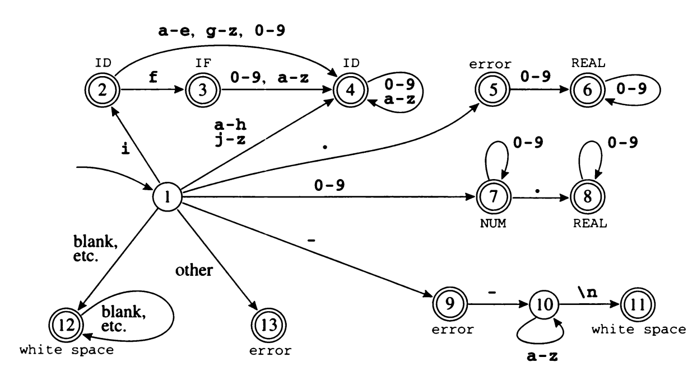

<p style="text-align:center">图2-4 合并后的有限自动机</p>

这个自动机可用一个转换矩阵来表示。转换矩阵是一个二维数组（一个元素为向量的向量），数组的下标是状态编号和输入字符。其中有一个停滞状态（状态0），这个状态对于任何输入字符都返回到自身，我们用它来表示不存在的边。

```
val edges =
  vector[           (* ···0 1 2···-···e f g h i j··· *)
(* state 0 *) vector[0,0,···0,0,0···0···0,0,0,0,0,0···],
(* state 1 *) vector[0,0,···7,7,7···9···4,4,4,4,2,2···],
(* state 2 *) vector[0,0,···4,4,4···0···4,3,4,4,4,4···],
(* state 3 *) vector[0,0,···4,4,4···0···4,4,4,4,4,4···],
(* state 4 *) vector[0,0,···4,4,4···0···4,4,4,4,4,4···],
(* state 5 *) vector[0,0,···6,6,6···0···0,0,0,0,0,0···],
(* state 6 *) vector[0,0,···6,6,6···0···0,0,0,0,0,0···],
(* state 7 *) vector[0,0,···7,7,7···0···0,0,0,0,0,0···],
  等等
        ]
```

另外还需要有一个“终结”（finality）数组，它的作用是将状态编号映射至动作。例如，接受状态2映射到动作ID，等等。

**识别最长的匹配**

很容易看出如何使用转换矩阵来识别一个字符串是否会被接收，但是词法分析器的任务是要找到最长的匹配，因为输入中最长的初始子串才是合法的标记。在进行转换的过程中，词法分析器要一直追踪迄今见到的最长匹配以及这个最长匹配的位置。

追踪最长匹配意味着需要用变量 Last-Final（最近遇到的接受状态的编号）和 Input-Position-at-Last-Final 来记住自动机最后一次处于接受状态时的时机。每次进入一个接受状态时，词法分析器都要更新这两个变量，当到达*停滞*状态（无出口转换的非接受状态状态）时，从这两个变量便能得知所匹配的标记和它的结束位置。

图2-5说明了词法分析器识别最长匹配的操作过程。注意，当前输入位置可能相距识别器最近到达接受状态时的位置已很远。

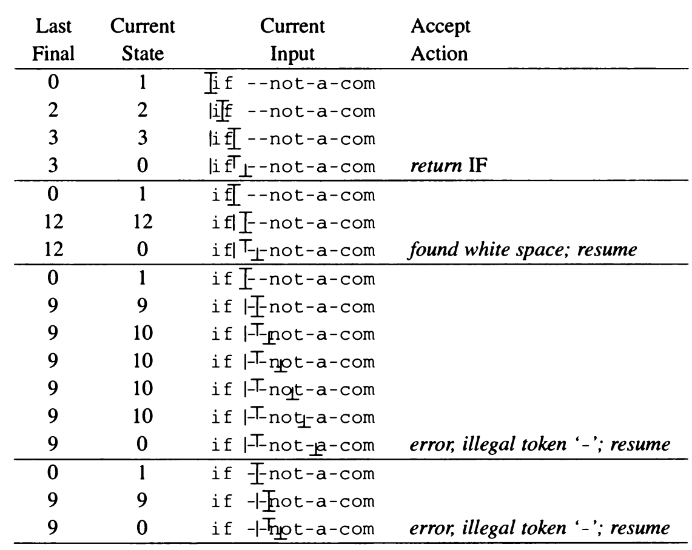

图2-5 图2-4中自动机识别的几个标记。符号“|”指出每次调用词法分析器时的输入位置，符号“$\perp$”指出自动机的当前位置，符号“$\top$”指出自动机最近一次处于接受状态时的位置

### 2.4 非确定性有限自动机

非确定性有限自动机（NFA）是一种需要对从一个状态出发的多条标有相同符号的边进行选择的自动机。它也可能存有标有$\epsilon$（希腊字母）的边，这种边可以在不接收输入字符的情况下进行状态转换。

下面是一个NFA的例子：


在初始状态时，根据输入字母a，自动机既可向左转换，也可向右转换。若选择了向左转换，则接收的是长度为3的倍数的字符串；若选择了向右转换，则接收的是长度为偶数的字符串。因此，这个NFA识别的语言是长度为2的倍数或3的倍数的所有由字母a组成的字符串的集合。

在第一次转换时，这个自动机必须选择走哪条路。如果存在着*任何*导致该字符串被接收的可选择路径，那么自动机就必须接收该字符串。因此，自动机必须进行“猜测”，并且必须总是作出正确的猜测。

标有$\epsilon$的边可以不使用输入中的字符。下面是接收同样语言的另一个NFA：

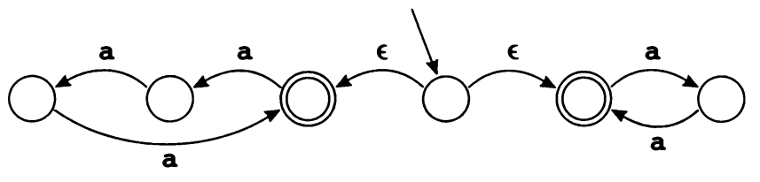

同样地，这个自动机必须决定选取哪一条$\epsilon$边。若存在一个状态既有一些$\epsilon$边，又有一些标有符号的边，则自动机可以选择接收一个输入符号（并沿着标有对应符号的边前进），或者选择沿着$\epsilon$边前进。

#### 2.4.1 将正则表达式转换为NFA

非确定性的自动机是一个很有用的概念，因为它很容易将一个（静态的、说明性的）正则表达式转换成一个（可模拟的、准可执行的）NFA。

转换算法可以将任何一个正则表达式转换为有一个尾巴和一个脑袋的NFA。它的尾巴即开始边，简称为*尾*；脑袋即末端状态，简称为*头*。例如，单个符号的正则表达式**a**转换成的NFA为：

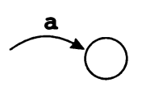

由**a**和**b**经联结运算而形成的正则表达式**ab**对应的NFA是由两个NFA组合而成的，即将**a**的头与**b**的尾连接起来。由此得到的自动机有一个用**a**标记的尾和一个从**b**边进入的头。


一般而言，任何一个正则表达式**M**都有一个具有尾和头的NFA：


我们可以归纳地定义正则表达式到NFA的转换。一个正则表达式或者是原语（单个符号或$\epsilon$），或者是由多个较小的表达式组合而成。


<p style="text-align:center">图2-6 正则表达式至NFA的转换</p>

图2-6展示了将正则表达式转换至NFA的规则。我们用图2-2中关于标记IF、ID、NUM以及error的一些表达式来举例说明这种转换算法。每个表达式都转换成了一个NFA，每个NFA的头是用不同标记类型标记的接受状态结点，并且每一个表达式的尾汇合成一个新的初始结点。由此得到的结果（在合并了某些等价的NFA状态之后）如图2-7所示。

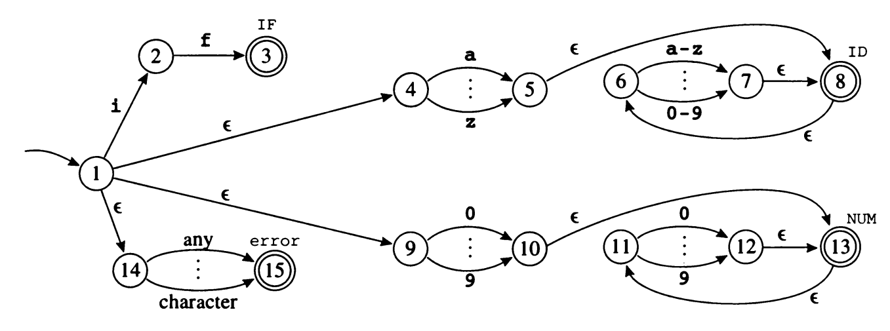

<p style="text-align:center">图2-7 由4个正则表达式转换成的一个NFA</p>

#### 2.4.2 将NFA转换为DFA

如在2.3节看到的，用计算机程序实现确定的有限自动机（DFA）较容易。但实现NFA则要困难一些，因为大多数计算机都没有足够好的可以进行“猜测”的硬件。

通过一次同时尝试所有可能的路径，可以避免这种猜测。我们用字符串in来模拟图2-7的NFA。首先从状态1开始。现在，替代猜测应采用哪个$\epsilon$转换，我们只是说此时NFA可能选择它们中的任何一个，因此，它是状态{1,4,9,14}当中的任何一个，即我们需要计算{1}的$\epsilon$*闭包*。显然，不接收输入中的第一个字符，就不可能到达其他状态。

现在要根据字符i来进行转换。从状态1可以到达状态2，从状态4可以到达状态5，从状态9则无处可去，而从状态14则可以到达状态15，由此得到状态集合{2,5,15}。但是，我们还必须计算$\epsilon$闭包：从状态5有一个$\epsilon$转换至状态8，从状态8有一个$\epsilon$转换至状态6。因此这个NFA一定属于状态集合{2,5,6,8,15}。

对于下一个输入字符n，我们从状态6可到达状态7，但状态2、5、8和15都无相应的转换。因此得到状态集合{7}，它的$\epsilon$闭包是{6,7,8}。

现在我们已经到达了字符串in的末尾，那么，这个NFA是否已经到达了接受状态呢？在我们得到的可能状态集合中，状态8是接受状态，因此in是一个ID标记。

我们形式化地定义$\epsilon$闭包如下。令$\textbf{edge}(s,c)$是从状态$s$沿着标有$c$的一条边可以到达的所有NFA状态的集合。对于状态集合$S$，$\textbf{closure}(S)$是从$S$中的状态出发，无需接收任何字符，即只通过$\epsilon$边便可以到达的状态组成的集合。这种经过$\epsilon$边的概念可用数学方式表述，即$\textbf{closure}(S)$是满足如下条件的最小集合$T$：

$T = S \cup (\bigcup_{s \in T} \textbf{edge}(s,\epsilon))$

我们可以用迭代法来算出$T$：
$$
\begin{align}
& T \leftarrow S \\
& \textbf{repeat} \quad T' \leftarrow T \\
&    \quad\quad\quad\quad T  \leftarrow T' \cup (\bigcup_{s \in T'} \textbf{edge}(s,\epsilon)) \\
& \textbf{until} \quad T = T'
\end{align}
$$
这个算法为什么是正确的？因为$T$只可能在迭代中扩大，所以最终的$T$一定包含$S$。如果在一次迭代之后有$T=T'$，则$T$也一定包含$\bigcup_{s \in T'} \textbf{edge}(s,\epsilon)$。因为在NFA中只有有限个不同的状态，所以算法一定会终止。

现在，当用前面描述的方法来模拟一个NFA时，假设我们位于由NFA状态$s_i$、$s_k$、$s_l$组成的集合$d=\{s_i,s_k,s_l\}$中。从$d$中的状态出发，并吃进输入符号$c$，将到达NFA的一个新的状态集合；我们称这个集合为$\textbf{DFAedge}(d,c)$：

$\textbf{DFAedge}(d,c)=\textbf{closure}(\bigcup_{s \in d} \textbf{edge}(s,c))$

利用**DFAedge**能够更加形式化地写出NFA模拟算法。如果NFA的初始状态是$s_1$，输入字符串中的字符是$c_1,\cdots,c_k$，则算法为：
$$
\begin{align*}

& d \leftarrow \textbf{closure}(\{s_1\}) \\

& \textbf{for} \; \textit{i} \leftarrow 1 \;\textbf{to}\; \textit{k} \\

& \quad d \leftarrow \textbf{DFAedge}(d,c_i)

\end{align*}
$$
状态集合运算是代价很高的运算——对进行词法分析的源程序中的每一个字符都做这种运算几乎是不现实的。但是，预先计算出所有的状态集合却是有可能的。我们可以由NFA构造一个DFA，使得NFA的每一个状态集合都对应于DFA的一个状态。因为NFA的状态个数有限（$n$个），所以这个DFA的状态个数也是有限的（至多为$2^n$个）。

一旦有了$\textbf{closure}$和$\textbf{DFAedge}$的算法，就很容易构造出DFA。DFA的状态$d_1$就是$\textbf{closure}(s_1)$，这同NFA模拟算法一样。抽象而言，如果$d_j=\textbf{DFAedge}(d_i,c)$，则存在着一条从$d_i$到$d_j$的标记为$c$的边。令$\Sigma$是字母表。
$$
\begin{align*}

& states[0] \leftarrow \{\}; \quad\quad states[1] \leftarrow \textbf{closure}(\{s_1\}) \\

& p \leftarrow 1; \quad\quad j \leftarrow 0 \\

& \textbf{while} \; j \leq p \\

& \quad \textbf{foreach} \; c \in \Sigma \\

& \quad\quad e \leftarrow \textbf{DFAedge}(states[j],c) \\

& \quad\quad \textbf{if} \; e = states[i] \; for \; some \; i \leq p \\

& \quad\quad\quad \textbf{then} \; trans[j,c] \leftarrow i \\

& \quad\quad\quad \textbf{else} \;\; p \leftarrow p + 1 \\

& \quad\quad\quad\quad\quad states[p] \leftarrow e \\

& \quad\quad\quad\quad\quad trans[j,c] \leftarrow p \\

& \quad j \leftarrow j + 1

\end{align*}
$$
这个算法不访问DFA的不可到达状态。这一点特别重要，因为原则上DFA有$2^n$个状态，但实际上一般只能找到约$n$个状态是从初始状态可以到达的。这一点对避免DFA解释器的转换表出现指数级的膨胀很重要，因为这个转换表是编译器的一部分。

只要$states[d]$中有任何状态是其NFA中的接受状态，状态$d$就是DFA的*接受状态*。仅仅标志一个状态为\textit{*接受状态*}是不够的，我们还必须告知它识别的是什么标记，并且$states[d]$中还可能有多个状态是这个NFA的接受状态。在这种情况下，我们用一个适当的标记类型来标识$d$，这个适当的标记类型即组成词法规则的正则表达式中最先出现的那个标记类型。这就是*规则优先*的实现方法。

构造了DFA之后便可以删除“状态”数组，只保留“转换”数组用于词法分析。

对图2-7的NFA应用这个DFA构造算法得到了图2-8的自动机。

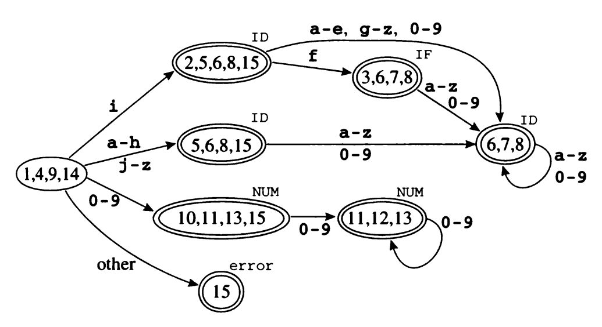

<p style="text-align:center">图2.8 NFA转换成的DFA</p>

这个自动机还不是最理想的，也就是说，它不是识别相同语言的最小自动机。一般而言，我们称两个状态$s_1$和$s_2$是等价的，如果开始于$s_1$的机器接收字符串$\sigma$，则它从状态$s_2$开始也一定接收$\sigma$，反之亦然。图2-8中，标为[5,6,8,15]的状态和标为[6,7,8]的状态等价。标为[10,11,13,15]的状态与标为[11,12,13]的状态等价。若自动机存在两个等价状态$s_1$和$s_2$，则我们可以使得所有进入$s_2$的边都指向$s_1$而删除$s_2$。

那么如何才能找出所有等价的状态呢？若$s_1$和$s_2$同为接受状态或同为非接受状态，且对于任意符号$c$，$trans[s_1,c]=trans[s_2,c]$，则显然它们两者等价。容易看出[10,11,13,15]和[11,12,13]满足这个判别条件。但是这个条件的普遍性还不够充分，考虑下面的自动机：


其中状态2和4等价，但是$trans[2,a] \neq trans[4,a]$。

在构造出一个DFA后，用一个算法来找出它的等价状态，并将之最小化是很有好处的；见习题2.6。

### 2.5 ML-Lex：词法分析器的生成器

构造DFA是一种机械性的工作，很容易由计算机来实现，因此一种有意义的做法是，用*词法分析器的自动生成器*来将正则表达式转换为DFA。

ML-Lex就是这样的一个词法分析器的生成器，它由*词法规范*生成一个ML程序。对于要进行分析的程序设计语言中的每一种标记类型，该规范包含一个正则表达式和一个*动作*。这个动作将标记类型（可能和其他信息一起）传给编译器的下一个处理阶段。

ML-Lex的输出是一个ML程序，即一个词法分析器。该分析器使用2.3节介绍的算法来解释DFA，并根据每一种匹配执行一段动作代码，这段动作代码是用于返回标记类型的ML语句。

图2-2描述的标记类型在ML-Lex中的规范如程序2-9所示。

```
(* ML Declarations: *)
  type lexresult = Tokens.token
  fun eof() = Tokens.EOF(0,0)
  %%
(* Lex Definitions: *)
  digits = [0-9]+
  %%
(* Regular Expressions and Actions *)
  if                    => (Tokens.IF(yypos,yypos+2));
  [a-z][a-z0-9]*        => (Tokens.ID(yytext,yypos,yypos+size yytext));
  {digits}              => (Tokens.NUM(Int.fromString yytext,
                                       yypos,yypos+size yytext));
  ({digits}"."[0-9]*)|([0-9]*"."{digits})
                        => (Tokens.REAL(Real.fromString yytext,
                                        yypos,yypos+size yytext));
  ("--"[a-z]*"\n")|(" ""\n""\t")+
                        => (continue());
                        => (ErrorMsg.error yypos "illegal character";
                            continue());
```

<p style="text-align:center">程序2-9 图2-2描述的标记的ML-Lex规范</p>

该规范的第一部分，即位于第一个“%%”标志上面的部分，包含了ML编写的函数和类型。在这一部分里面，必须包含lexresult类型，这个类型是每次调用词法分析函数所产生的结果的类型；而eof函数，将会在词法分析引擎碰到文件结尾时被调用。这一部分也可以包含一些功能函数，作为第三部分的语义动作使用。

这个规范的第二部分包含正则表达式的简写形式和状态说明。例如，在这一部分中的说明digits[0-9]+允许用名字{digits}代表正则表达式中非空的数字序列。

第三部分包含正则表达式和动作。这些动作是一段原始的ML代码。每一个动作必须返回一个lexresult类型的值。在这个约定里面，lexresult是Tokens结构中的一个标记。

动作代码中可以使用几个特殊的变量。由正则表达式匹配的字符串是yytext。匹配到的字符串的开始位置在文件中的位置是yypos。函数continue()递归地调用词法分析器。

在这个特定的例子中，每种标记都是一个数据构造器，构造器接受两个整型参数来表示位置——输入文件中的位置——标记开始的位置和结束的位置。

```
  structure Tokens =
  struct
     type pos = int
     datatype token = EOF of pos * pos
                    | IF of pos * pos
                    | ID of string * pos * pos
                    | NUM of int * pos * pos
                    | REAL of real * pos * pos
                    .
                    .
                    .
  end
```

所以，我们将yypos和yypos + size(yytext)这两个值作为参数传递给构造器就可以了。有一些标记关联有*语义值*。例如，ID的语义值是组成标识符的字符串，NUM的语义值是一个整数，而IF则没有语义值（因为每一个IF都有别于其他标记）。所以，ID构造器和NUM构造器都有一个额外的参数来作为语义值，而这个语义值可以从yytext变量计算出来。

**初始状态**

正则表达式是*静态的*和*说明性的*，自动机是*动态的*和*命令式的*；也就是说，你不必用一个算法来模拟就能看到正则表达式的成分和结构，但是理解自动机常常需要你在自己的头脑中来“执行”它。因此，正则表达式一般更适合于用来知名程序设计语言标记的词法结构。

有时候一步一步地模拟自动机的状态转换过程也是一种合适的做法。ML-Lex有一种将状态和正则表达式混合到一起的机制。你可以声明一组*初始状态*，每个正则表达式的前面可以有一组对它而言是合法的初始状态作为其前缀。动作代码可以明显地改变初始状态。这相当于我们有这样的一种有限自动机，其边标记的不是符号而是正则表达式。下面的例子给出了一种只由简单标识符、标记if和以“(* ”和“ *)”作为界定符的注释所组成的语言。

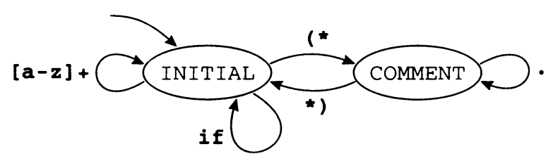

尽管有可能写出与整个注释相匹配的单个正则表达式，但是随着注释变得越来越复杂，特别是在允许注释嵌套的情况下，这种正则表达式也会越来越复杂，甚至变得不可能。

与这个机器对应的ML-Lex的规范为：

```
            规范一般以如下代码开头...
%%
%s COMMENT
%%
<INITIAL>if         => (Tokens.IF(yypos,yypos+2));
<INITIAL>[a-z]+     => (Tokens.ID(yytext,yypos,
                                  yypos+size(yytext)));
<INITIAL>"(*"       => (YYBEGIN COMMENT; continue());
<COMMENT>"*)"       => (YYBEGIN INITIAL; continue());
<COMMENT>.          => (continue();)
```

其中INITIAL是“任何注释之外”的状态。最后一个规则是一种调整，其用途是使得ML-Lex进入此状态。任何不以\<STATE\>为前缀的正则表达式在所有状态中都能工作，这种特征很少有用处。

利用一个全局变量，并在语义动作中适当增减此全局变量的值，这个例子便很容易扩充成可以处理嵌套的注释。

### 程序设计：词法分析

用ML-Lex写出一个Tiger语言的词法分析器。附录中描述了Tiger的词法标记。

本章未对词法分析器应当如何初始化以及它应当如何与编译器的其他部分通信作出说明。你可以从ML-Lex使用手册中得到这些内容，而在`$TIGER/chap2`目录中有一个最基本的“脚手架”文件可以帮助你入门。

你应当在连同tiger.lex文件一起提交的文档中描述清楚以下问题：

- 你是怎样处理注释的。
- 你是怎样处理字符串的。
- 错误处理。
- 文本结束处理。
- 你的词法分析器的其他令人感兴趣的特征。

在`$TIGER/chap2`中有如下一些可用的支持文件。

- tokens.sig，Tokens结构的签名。
- tokens.sml，Tokens结构，包含token类型和构造器，你的词法分析器可以用它们来创建token类型的实例。以这种方式来完成词法分析非常重要，因为当把“真正的”语法分析器链接到这个词法分析器的后面，以及使用“真正的”Tokens结构时，所有的代码仍然可以运行。
- errormsg.sml，ErrorMsg结构可以用来产生带有文件名和行号的错误信息。
- driver.sml，一个运行你的词法分析器来分析输入文件的测试平台。
- tiger.lex，tiger.lex文件的初始代码。
- sources.cm，ML编译管理器的“makefile”。

在阅读附录（Tiger语言参考手册）时，要特别注意以**标识符**（Identifier）、**注释**（Comment）、**整型字面量**（Integer literal）和**字符串字面量**（String literal）作为标题的段落。

Tiger语言的保留字是：while、for、to、break、let、in、end、function、var、type、array、if、then、else、do、of、nil。

Tiger语言使用的符号是：

, : ; ( ) [ ] \{ \} . + - * / = <> < <= > >= \& | :=

对于字符串字面量，你的词法分析器返回的字符串值应当包含所有已转换到其含义的转义字符。

没有负整型字面量。对于带负号的整型字面量，例如-32，要返回两个标记。

检测没有闭合的注释（在文件末尾）和没有闭合的字符串。

目录`$TIGER/testcases`中含有几个简单的Tiger样例程序。

开始时：首先创建一个目录，并复制`$TIGER/chap2`中的内容到此目录。用Tiger语言编写一个小程序保存于文件`test.tig`中。然后，键入`sml`并输入命令`CM.make()`；CM（Compilation Manager，编译管理器）将会*使得*系统运行ml-lex命令，如果需要的话，还会编译和链接需要的ML源文件。

最后，`Parse.parse "test.tig";`命令将会利用一个测试台对该文件进行词法分析。

### 推荐阅读

Lex是第一个基于正则表达式的词法分析器的生成器[Lesk 1975]，它现在仍被广泛使用。

将那种还未对它的边进行过$\epsilon$转换检查的状态保存在一个队列或栈中，可以更高效地计算闭包[Aho et al. 1986]。正则表达式可以直接转换成DFA而不需经过NFA[McNaughton and Yamada1960;Aho et al. 1986]。

DFA转换表可能非常大，而且很稀疏。若用一个二维矩阵（状态$\times$符号）来表示这张表则会需要太多的存储空间。在实际中，这个表是经过压缩的。这样做减少了存储空间需求，但却增加了寻找下一状态需要的时间[Aho et al. 1986]。

词法分析器，无论是自动生成的还是手工书写的，都必须有效地处理其输入。当然，输人可以放在缓冲区中，从而一次可以获取成批的字符，然后词法分析器可以每次处理缓冲区中的一个字符。每次读取字符时，词法分析器都必须检查是否已到达缓冲区的末尾。通过在缓冲区末尾放置一个敏感标记（sentinel），即一个不属于任何标记的字符，词法分析器就有可能只对每个标记进行一次检查，而不是对每个字符都进行检查[Aho et al. 1986]。Gray[1988]使用的一种设计可以只需每行检查一次，而不是每个标记检查一次，但它不能适合那种包含行结束字符的标记。Bumbulis和Cowan[1993]的方法只需对DFA中的每一次循环检查一次；当DFA中存在很长的路径时，这可减少检查的次数（相对每个字符一次）。

自动生成的词法分析器常常受到速度太慢的批评。从原理上而言，有限自动机的操作非常简单，因而应该是高效的，但是通过转换表进行解释增加了开销。Gray[1988]指出直接将DFA转换为可执行代码（将状态作为case语句来实现），其速度可以和手工编写的词法分析器一样快。例如，Flex(fast lexical analyzer generator)[Paxson 1995]的速度就比Lex要快许多。

### 习题

2.1 写出下面每一种标记的正则表达式。

​	a. 字母表{a,b,c}上满足后面条件的字符串：首次出现的a位于首次出现的b之前。

​	b. 字母表{a,b,c}上由偶数个a组成的字符串。

​	c. 是4的倍数的二进制数。

​	d. 大于101001的二进制数。

​	e. 字母表{a,b,c}上不包含连续子串baa的字符串。

​	f. 使得方程$a^n+b^n=c^n$存在着整数解的二进制整数$n$。

2.2 对于下列描述，试解释为什么不存在对应的正则表达式。

​	a. 由$a$和$b$组成的字符串，其中$a$的个数要多于$b$。

​	b. 由$a$和$b$组成的回文字符串（顺读与倒读相同）。

​	c. 语法上正确的C程序。

2.3 用自然语言描述下述有限状态自动机识别的语言。


2.4 将下面两个正则表达式转换为非确定性有限自动机。

​	a. $(\textbf{if}|\textbf{then}|\textbf{else})$

​	b. $\textbf{a}((\textbf{b}|\textbf{a}*\textbf{c})\textbf{x})*|\textbf{x}*\textbf{a}$

2.5 将下面的NFA转换为确定性有限自动机。


2.6 在下面这个自动机中找出两个等价的状态，并合并它们产生一个识别相同语言且较小的自动机。重复这个过程直到没有等价状态为止。

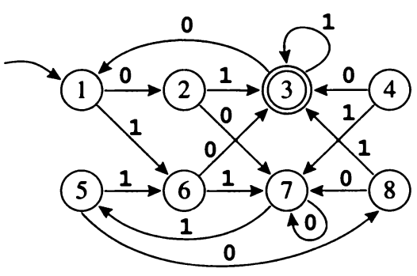

实际上，最小化有限自动机的通用算法是以相反的思路来工作的。它首先要找出的是所有不等价的状态偶对。若$X$是终结符而$Y$不是，或者（通过迭代）$X\overset{a}{\rightarrow}X'$且$Y\overset{a}{\rightarrow}Y'$但$X$和$Y$不等价，则状态$X$和$Y$不等价。用这种迭代方式寻找新的不等价状态偶对且由于没有更多的不等价状态而停止后，如果$X$、$Y$仍不是不等价偶对，则它们就是等价状态。参见Hopcroft和Ullman[1979]中的定理3.10。

*2.7  任何接收至少一个字符串的DFA都能转换为一个正则表达式。将习题2.3c的DFA转换为正则表达式。提示：首先假装状态1是初始状态。然后，编写一个通到状态2并返回到状态1的正则表达式和一个类似的通到状态0并返回到状态1的正则表达式。或者查看Hopcroft和Ullman[1979]一书中定理2.4关于此算法的论述。

2.8 假设Lex使用下面这个DFA来找输入文件中的标记：

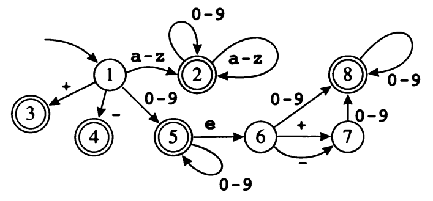

​	a. Lex在匹配一个标记之前，必须在该标记之后再检测多少个字符？

​	b. 设你对问题a的答案为$k$，写出一个至少包含两个标记的输入文件，使得Lex的第一次调用在返回第一个标记前需要检测该标记末尾之后的$k$个字符。若对问题a的答案为0，则写出一个包含至少两个标记的输人文件，并指出每个标记的结束点。

2.9 一个基于DFA的解释型词法分析器使用以下两张表：

- edges以状态和输入符号为索引产生一个状态号。
- final以状态为索引，返回0一个动作号。

从下面这个词法规范开始：

> (aba)+        (action 1);
>
> (a(b*)a)      (action 2);
>
> (a|b)          (action 3);

为一个词法分析器生成edges和final表。

然后给出该词法分析器分析字符串abaabbaba的每一步。注意，一定要给出此词法分析器重要的内部变量的值。该词法分析器将被反复调用以获得后继的标记。

2.10 词法分析器Lex有一个*超前查看*操作符“/”，它使得正则表达式abc/def只有在abc之后跟有def时，才能匹配abc（但是def并不是所匹配字符串的一部分，而是下一个或几个标记的一部分)。Aho等人[1986]描述了一种不正确的实现超前查看的算法，并且Lex[Lesk 1975]中也使用了这种算法（对于(alab)/ba，当输入为aba时，该算法不能进行正确的识别。它在应当匹配a的地方匹配了ab）。Flex[Paxson1995]使用了一种更好的机制，这种机制对于(alab)/ba能正确工作，但对zx*/xy*却不能（但能打印出警告信息）。

​	请设计出一种更好的超前查看机制。

### 本章代码

环境

- 操作系统：Ubuntu 20.04
- 编译器：Standard ML of New Jersey (64-bit) v110.99

标记的签名文件`tokens.sig`：

```
signature Tiger_TOKENS =
sig
  type pos
  type linenum (* = int *)
  type token
  val TYPE:  pos * pos * linenum -> token
  val VAR:  pos * pos * linenum -> token
  val FUNCTION:  pos * pos * linenum -> token
  val BREAK:  pos * pos * linenum -> token
  val OF:  pos * pos * linenum -> token
  val END:  pos * pos * linenum -> token
  val IN:  pos * pos * linenum -> token
  val NIL:  pos * pos * linenum -> token
  val LET:  pos * pos * linenum -> token
  val DO:  pos * pos * linenum -> token
  val TO:  pos * pos * linenum -> token
  val FOR:  pos * pos * linenum -> token
  val WHILE:  pos * pos * linenum -> token
  val ELSE:  pos * pos * linenum -> token
  val THEN:  pos * pos * linenum -> token
  val IF:  pos * pos * linenum -> token
  val ARRAY:  pos * pos * linenum -> token
  val ASSIGN:  pos * pos * linenum -> token
  val OR:  pos * pos * linenum -> token
  val AND:  pos * pos * linenum -> token
  val GE:  pos * pos * linenum -> token
  val GT:  pos * pos * linenum -> token
  val LE:  pos * pos * linenum -> token
  val LT:  pos * pos * linenum -> token
  val NEQ:  pos * pos * linenum -> token
  val EQ:  pos * pos * linenum -> token
  val DIVIDE:  pos * pos * linenum -> token
  val TIMES:  pos * pos * linenum -> token
  val MINUS:  pos * pos * linenum -> token
  val PLUS:  pos * pos * linenum -> token
  val DOT:  pos * pos * linenum -> token
  val RBRACE:  pos * pos * linenum -> token
  val LBRACE:  pos * pos * linenum -> token
  val RBRACK:  pos * pos * linenum -> token
  val LBRACK:  pos * pos * linenum -> token
  val RPAREN:  pos * pos * linenum -> token
  val LPAREN:  pos * pos * linenum -> token
  val SEMICOLON:  pos * pos * linenum -> token
  val COLON:  pos * pos * linenum -> token
  val COMMA:  pos * pos * linenum -> token
  val STRING: (string) *  pos * pos * linenum -> token
  val INT: (int) *  pos * pos * linenum -> token
  val ID: (string) *  pos * pos * linenum -> token
  val EOF:  pos * pos * linenum -> token
end
```

标记的签名的实现文件`tokens.sml`：

```
structure Tokens : Tiger_TOKENS =
struct
  (* A "scaffold" structure for debugging lexers. *)

  type pos = int
  type linenum = int
  type token = string
  fun TYPE(i,j,k)      = "TokenType: TYPE       LineNum: " ^ Int.toString(k)
  fun VAR(i,j,k)       = "TokenType: VAR        LineNum: " ^ Int.toString(k)
  fun FUNCTION(i,j,k)  = "TokenType: FUNCTION   LineNum: " ^ Int.toString(k)
  fun BREAK(i,j,k)     = "TokenType: BREAK      LineNum: " ^ Int.toString(k)
  fun OF(i,j,k)        = "TokenType: OF         LineNum: " ^ Int.toString(k)
  fun END(i,j,k)       = "TokenType: END        LineNum: " ^ Int.toString(k)
  fun IN(i,j,k)        = "TokenType: IN         LineNum: " ^ Int.toString(k)
  fun NIL(i,j,k)       = "TokenType: NIL        LineNum: " ^ Int.toString(k)
  fun LET(i,j,k)       = "TokenType: LET        LineNum: " ^ Int.toString(k)
  fun DO(i,j,k)        = "TokenType: DO         LineNum: " ^ Int.toString(k)
  fun TO(i,j,k)        = "TokenType: TO         LineNum: " ^ Int.toString(k)
  fun FOR(i,j,k)       = "TokenType: FOR        LineNum: " ^ Int.toString(k)
  fun WHILE(i,j,k)     = "TokenType: WHILE      LineNum: " ^ Int.toString(k)
  fun ELSE(i,j,k)      = "TokenType: ELSE       LineNum: " ^ Int.toString(k)
  fun THEN(i,j,k)      = "TokenType: THEN       LineNum: " ^ Int.toString(k)
  fun IF(i,j,k)        = "TokenType: IF         LineNum: " ^ Int.toString(k)
  fun ARRAY(i,j,k)     = "TokenType: ARRAY      LineNum: " ^ Int.toString(k)
  fun ASSIGN(i,j,k)    = "TokenType: ASSIGN     LineNum: " ^ Int.toString(k)
  fun OR(i,j,k)        = "TokenType: OR         LineNum: " ^ Int.toString(k)
  fun AND(i,j,k)       = "TokenType: AND        LineNum: " ^ Int.toString(k)
  fun GE(i,j,k)        = "TokenType: GE         LineNum: " ^ Int.toString(k)
  fun GT(i,j,k)        = "TokenType: GT         LineNum: " ^ Int.toString(k)
  fun LE(i,j,k)        = "TokenType: LE         LineNum: " ^ Int.toString(k)
  fun LT(i,j,k)        = "TokenType: LT         LineNum: " ^ Int.toString(k)
  fun NEQ(i,j,k)       = "TokenType: NEQ        LineNum: " ^ Int.toString(k)
  fun EQ(i,j,k)        = "TokenType: EQ         LineNum: " ^ Int.toString(k)
  fun DIVIDE(i,j,k)    = "TokenType: DIVIDE     LineNum: " ^ Int.toString(k)
  fun TIMES(i,j,k)     = "TokenType: TIMES      LineNum: " ^ Int.toString(k)
  fun MINUS(i,j,k)     = "TokenType: MINUS      LineNum: " ^ Int.toString(k)
  fun PLUS(i,j,k)      = "TokenType: PLUS       LineNum: " ^ Int.toString(k)
  fun DOT(i,j,k)       = "TokenType: DOT        LineNum: " ^ Int.toString(k)
  fun RBRACE(i,j,k)    = "TokenType: RBRACE     LineNum: " ^ Int.toString(k)
  fun LBRACE(i,j,k)    = "TokenType: LBRACE     LineNum: " ^ Int.toString(k)
  fun RBRACK(i,j,k)    = "TokenType: RBRACK     LineNum: " ^ Int.toString(k)
  fun LBRACK(i,j,k)    = "TokenType: LBRACK     LineNum: " ^ Int.toString(k)
  fun RPAREN(i,j,k)    = "TokenType: RPAREN     LineNum: " ^ Int.toString(k)
  fun LPAREN(i,j,k)    = "TokenType: LPAREN     LineNum: " ^ Int.toString(k)
  fun SEMICOLON(i,j,k) = "TokenType: SEMICOLON  LineNum: " ^ Int.toString(k)
  fun COLON(i,j,k)     = "TokenType: COLON      LineNum: " ^ Int.toString(k)
  fun COMMA(i,j,k)     = "TokenType: COMMA      LineNum: " ^ Int.toString(k)
  fun STRING(s,i,j,k)  = "TokenType: STRING     LineNum: " ^ Int.toString(k) ^ "  Literal: " ^ s
  fun INT(c,i,j,k)     = "TokenType: INT        LineNum: " ^ Int.toString(k) ^ "  Literal: " ^ Int.toString(c)
  fun ID(s,i,j,k)      = "TokenType: ID         LineNum: " ^ Int.toString(k) ^ "  Literal: " ^ s
  fun EOF(i,j,k)       = "TokenType: EOF        LineNum: " ^ Int.toString(k)
end
```

用于输出错误信息的功能文件`errormsg.sml`：

```
signature ERRORMSG =
sig
    val anyErrors : bool ref
    val fileName : string ref
    val lineNum : int ref
    val linePos : int list ref
    val sourceStream : TextIO.instream ref
    val error : int -> string -> unit
    exception Error
    val impossible : string -> 'a   (* raises Error *)
    val reset : unit -> unit
end

structure ErrorMsg : ERRORMSG =
struct

  val anyErrors = ref false
  val fileName = ref ""
  val lineNum = ref 1
  val linePos = ref [1]
  val sourceStream = ref TextIO.stdIn

  fun reset() = (anyErrors:=false;
		 fileName:="";
		 lineNum:=1;
		 linePos:=[1];
		 sourceStream:=TextIO.stdIn)

  exception Error

  fun error pos (msg:string) =
      let fun look(a::rest,n) =
		if a<pos then app print [":",
				       Int.toString n,
				       ".",
				       Int.toString (pos-a)]
		       else look(rest,n-1)
	    | look _ = print "0.0"
       in anyErrors := true;
	  print (!fileName);
	  look(!linePos,!lineNum);
	  print ":";
	  print msg;
	  print "\n"
      end

  fun impossible msg =
      (app print ["Error: Compiler bug: ",msg,"\n"];
       TextIO.flushOut TextIO.stdOut;
       raise Error)

end  (* structure ErrorMsg *)
```

Tiger语言的词法描述文件`tiger.lex`：

```
type pos = int
type lexresult = Tokens.token

val lineNum = ErrorMsg.lineNum
val linePos = ErrorMsg.linePos
fun err(p1,p2) = ErrorMsg.error p1

fun eof() = let val pos = hd(!linePos) in Tokens.EOF(pos,pos,!lineNum) end
fun str2int(s) = foldl (fn(a,r) => ord(a)-ord(#"0")+10*r) 0 (explode s)

%%
DIGIT=[0-9]+;
COMMENT=\/\*.*\*\/;
SPACE=[\ \t\b\f\r]+;
IDENTIFIER=[a-zA-Z][a-zA-Z0-9]*;
QUOTE=[\"];
NONQUOTE=[^\"];

%%
\n	=> (lineNum := !lineNum+1; linePos := yypos :: !linePos; continue());

"+"     => (Tokens.PLUS(yypos,yypos+1,!lineNum));
"-"     => (Tokens.MINUS(yypos,yypos+1,!lineNum));
"*"     => (Tokens.TIMES(yypos,yypos+1,!lineNum));
"/"     => (Tokens.DIVIDE(yypos,yypos+1,!lineNum));
"," 	=> (Tokens.COMMA(yypos,yypos+1,!lineNum));
"&"		=> (Tokens.AND(yypos,yypos+1,!lineNum));
"|"     => (Tokens.OR(yypos,yypos+1,!lineNum));
"="     => (Tokens.EQ(yypos,yypos+1,!lineNum));
">="	=> (Tokens.GE(yypos,yypos+2,!lineNum));
">"		=> (Tokens.GT(yypos,yypos+1,!lineNum));
"<="	=> (Tokens.LE(yypos,yypos+2,!lineNum));
"<"		=> (Tokens.LT(yypos,yypos+1,!lineNum));
"<>"	=> (Tokens.NEQ(yypos,yypos+2,!lineNum));
"."		=> (Tokens.DOT(yypos,yypos+1,!lineNum));
":"     => (Tokens.COLON(yypos,yypos+1,!lineNum));
";"     => (Tokens.SEMICOLON(yypos,yypos+1,!lineNum));
":="	=> (Tokens.ASSIGN(yypos,yypos+2,!lineNum));
"{"     => (Tokens.LBRACE(yypos,yypos+1,!lineNum));
"}"     => (Tokens.RBRACE(yypos,yypos+1,!lineNum));
"("     => (Tokens.LPAREN(yypos,yypos+1,!lineNum));
")"     => (Tokens.RPAREN(yypos,yypos+1,!lineNum));
"["     => (Tokens.LBRACK(yypos,yypos+1,!lineNum));
"]"     => (Tokens.RBRACK(yypos,yypos+1,!lineNum));

var  	 => (Tokens.VAR(yypos,yypos+3,!lineNum));
function => (Tokens.FUNCTION(yypos,yypos+8,!lineNum));
break    => (Tokens.BREAK(yypos,yypos+5,!lineNum));
of       => (Tokens.OF(yypos,yypos+2,!lineNum));
end      => (Tokens.END(yypos,yypos+3,!lineNum));
in       => (Tokens.IN(yypos,yypos+2,!lineNum));
nil      => (Tokens.NIL(yypos,yypos+3,!lineNum));
let      => (Tokens.LET(yypos,yypos+3,!lineNum));
do       => (Tokens.DO(yypos,yypos+2,!lineNum));
to       => (Tokens.TO(yypos,yypos+2,!lineNum));
for      => (Tokens.FOR(yypos,yypos+3,!lineNum));
while    => (Tokens.WHILE(yypos,yypos+5,!lineNum));
else     => (Tokens.ELSE(yypos,yypos+4,!lineNum));
then     => (Tokens.THEN(yypos,yypos+4,!lineNum));
if       => (Tokens.IF(yypos,yypos+2,!lineNum));
array    => (Tokens.ARRAY(yypos,yypos+5,!lineNum));
type     => (Tokens.TYPE(yypos,yypos+4,!lineNum));

{QUOTE}{NONQUOTE}*{QUOTE} => (Tokens.STRING(yytext,yypos,yypos+size yytext,!lineNum));
{IDENTIFIER} => (Tokens.ID(yytext,yypos,yypos+size yytext,!lineNum));
{DIGIT}      => (Tokens.INT(str2int yytext,yypos,yypos+size yytext,!lineNum));
{COMMENT}    => (continue());
{SPACE}      => (continue());
.       => (ErrorMsg.error yypos ("illegal character " ^ yytext); continue());
```

在终端执行命令：

```
$ ml-lex tiger.lex
```

会生成文件`tiger.lex.sml`。

然后我们构建一个`main.sml`文件用来打印词法分析器扫描文件后得到的标记流。

```
structure Main = struct

fun lex filename =
  let val file = TextIO.openIn filename
    fun get _ = TextIO.input file
    val lexer = Mlex.makeLexer get
    fun do_it() =
      let val t = lexer()
      in print t; print "\n";
        (* 这里substring的截取只能从0开始截取，不知道为什么 *)
        if substring(t,0,14)="TokenType: EOF" then () else do_it()                     
      end
  in do_it();
    TextIO.closeIn file
  end

fun main (cmd: string, args: string list) =
    let in app lex args; 0 end

end
```

然后编写构建工程的文件`sources.cm`：

```
Group is

main.sml
errormsg.sml
tokens.sig
tokens.sml
tiger.lex.sml
$/basis.cm
$/smlnj-lib.cm
$/ml-yacc-lib.cm
```

在终端执行以下命令：

```
$ ml-build sources.cm Main.main tigerc
```

那么将会得到二进制文件`tigerc.amd64-linux`。

然后我们创建一个用Tiger写的程序`queens.tig`来测试词法分析器。

```
/* A program to solve the 8-queens problem */

let
  var N := 8
  
  type intArray = array of int
  
  var row := intArray [N] of 0
  var col := intArray [N] of 0
  var diag1 := intArray [N+N-1] of 0
  var diag2 := intArray [N+N-1] of 0

  function printboard() = (
    for i := 0 to N-1
      do (
        for j := 0 to N-1 
          do print(if col[i]=j then " O" else " .");
          print("\n")
      );
    print("\n")
  )

  function try(c : int) = (
    /*  for i:= 0 to c do print("."); print("\n"); flush();*/
    if c=N
    then printboard()
    else for r := 0 to N-1
      do if row[r]=0 & diag1[r+c]=0 & diag2[r+7-c]=0
         then (
           row[r]:=1; diag1[r+c]:=1; diag2[r+7-c]:=1; col[c]:=r;
           try(c+1);
           row[r]:=0; diag1[r+c]:=0; diag2[r+7-c]:=0
         )
  )

in try(0)

end
```

然后在终端中输入命令：

```
$ sml @SMLload=tigerc.amd64-linux "queens.tig"
```

就可以得到输出了：

```
TokenType: LET        LineNum: 3
TokenType: VAR        LineNum: 4
TokenType: ID         LineNum: 4  Literal: N
TokenType: ASSIGN     LineNum: 4
TokenType: INT        LineNum: 4  Literal: 8
TokenType: TYPE       LineNum: 6
TokenType: ID         LineNum: 6  Literal: intArray
TokenType: EQ         LineNum: 6
TokenType: ARRAY      LineNum: 6
TokenType: OF         LineNum: 6
TokenType: ID         LineNum: 6  Literal: int
...
...
...
```

## 3. 语法分析

> **语法**（syn-tax）：组合单词以形成词组、从句或句子的方法。
>
> ——韦氏词典

ML-Lex中用一个符号替代某个正则表达式的缩写机制非常方便，这使我们想到用下面的方法来表示一个正则表达式：
$$
\begin{align*}

digits &= [0-9]+ \\

sum &= (digits\text{``}+\text{''})^*digits

\end{align*}
$$
这两个正则表达式定义了形如 28 + 301 + 9 的求和表达式。

但是，考虑下面的定义：
$$
\begin{align*}

digits &= [0-9]+ \\

sum &= expr\text{``}+\text{''}expr \\

expr &= \text{``(''}sum\text{``)''}|digits

\end{align*}
$$
它们定义的是如下形式的表达式：

> (109 + 23)
>
> 61
>
> (1 + (250 + 3))

其中的所有括号都是配对的。可是有限自动机却不能识别出这种括号配对的情况（因为一个状态数为$N$的自动机无法记忆嵌套深度大于$N$的括号），因此，$sum$和$expr$显然不能是正则表达式。

那么，词法分析器ML-Lex怎样实现类似于$digits$这种缩写形式的正则表达式呢？答案是在将正则表达式翻译成有限自动机之前，简单地用$digits$右部的式子（[0-9]+）替代正则表达式中出现的所有$digits$。

但这种方法对于前面给出的那种$sum$-$expr$语言却行不通；我们虽然可以首先将$expr$中的$sum$替换掉，得到：

$$expr=\text{``}(\text{''}expr\text{``}+\text{''}expr\text{``})\text{''} \; | \; digits$$

但是若再用$expr$右部的表达式替换$expr$自身，则得到

$$expr=\text{``}(\text{''}(\text{``}(\text{''}expr\text{``}+\text{''}expr\text{``})\text{''}|digits)\text{``}+\text{''}expr\text{``})\text{''} \; | \; digits$$

右部现在仍然同以前一样出现有$expr$，且事实上，$expr$的出现次数不但没有减少反而还增加了！

因此，仅仅这种形式的缩写表示并不能增强正则表达式的语言描述能力（它并没有定义额外的语言）。除非这种缩写形式是递归的（或者是相互递归的，如$sum$和$expr$的情形），才能增强正则表达式的语言描述能力。

由这种递归而获得的额外的表达能力正好是语法分析需要的。另外，一旦有了递归的缩写形式，则除了在表达式的顶层之外，可以不再需要可选操作。因为定义

$$expr=ab(c|d)e$$

可通过一个辅助定义重写为：
$$
\begin{align*}

aux &= c \; | \; d \\

expr &=a \; b \; aux \; e  

\end{align*}
$$
事实上，可以完全不使用可选符号而写出同一个符号的多个可接受的扩展：
$$
\begin{align*}

aux &= c \\

aux &= d \\

expr &= a \; b \; aux \; e

\end{align*}
$$
克林闭包也不再是必需的，我们可以将

$$expr=(a \; b \; c)*$$

重写为
$$
\begin{align*}

expr &= (a \; b \; c)expr \\

expr &= \epsilon

\end{align*}
$$
至此我们得到了一种非常简单的表示法，称为*上下文无关文法*（context-free grammar）。正如正则表达式以一种静态的、声明式的方式来定义词法结构一样，文法以声明式的方式来定义语法结构。但是我们需要比有限自动机更强大的方法来分析文法所描述的语言。

事实上，文法也可用来描述词法标记的结构[^1]；但对于此目的，使用正则表达式要更为适合，也更为简练。

### 3.1 上下文无关文法

与前面类似，我们认为*语言*是由字符串组成的集合，每个字符串是由有限字母表中的*符号*组成的有限序列。对于语法分析而言，字符串是源程序，符号是词法标记（token），字母表是词法分析器返回的标记类型集合。

一个上下文无关文法描述一种语言。文法有如下形式的*产生式*（production）集合: 

$$symbol \rightarrow symbol \; symbol \cdots synbol$$

其中，产生式的右部有0至多个符号。每一个符号或者是*终结符*（terminal）——来自该语言字符串字母表中的标记，或者是*非终结符*（nonterminal）——出现在某个产生式的左部。标记决不会出现在产生式的左部。最后，有一个区别对待的非终结符，称为文法的*开始符号*（start symbol）。


<p style="text-align:center">文法3-1 直线式程序的文法</p>

文法3-1是一个直线式程序的文法例子。它的开始符号是$S$（当未明确给出开始符号时，约定第一个产生式左部的非终结符为开始符号）。此例中的终结符为：

id print num . + ( ) := ;

非终结符是$S$、$E$和$L$。属于这个文法语言的一个句子为：

id := num; id := id + (id := num + num, id)

与它对应的源程序（在词法分析之前的）可以是：

a := 7;

b := c + (d := 5 + 6, d)

标记（终结符）的类型为id、num、:=等。名字（a、b、c、d）和数字（7、5、6）是与其中一些标记关联的*语义值*（semantic value）。

#### 3.1.1 推导

为了证明这个句子属于该文法的语言，我们可以进行*推导*（derivation）：从开始符号出发，对其右部的每一个非终结符，都用此非终结符对应的产生式中的任一个右部来替换，如推导3-2所示。


<p style="text-align:center">推导3-2</p>

同一个句子可以存在多种不同的推导。*最左推导*（leftmost derivation）是一种总是扩展最左边非终结符的推导；在*最右推导*（rightmost derivation）中，下一个要扩展的非终结符总是最右边的非终结符。

推导3-2既不是最左推导，也不是最右推导，因为这个句子的最左推导应当以下述推导开始：


#### 3.1.2 语法分析树

*语法分析树*（parse tree，也简称为语法树或分析树）是将一个推导中的各个符号连接到从它推导出来的符号而形成的，如图3-3所示。两种不同的推导可以有相同的语法树。


<p style="text-align:center">图3-3 语法分析树</p>

#### 3.1.3 二义性文法

如果一个文法能够推导出具有两棵不同语法树的句子，则该文法有*二义性*（ambiguous）。文法3-1是有二义性的，因为句子id := id + id + id有两棵语法分析树（图3-4）。


<p style="text-align:center">图3-4 文法3-1的同一个句子的两颗语法分析树</p>

文法3-5也是有二义性的。图3-6给出了句子$1-2-3$的两棵语法分析树，图3-7则给出了$1+2*3$的两棵语法树。显然，如果我们用这些语法分析树来解释这两个表达式的含义，$1-2-3$的两棵语法分析树则有两种不同的含义，分别为$(1-2)-3=—4$和$1-(2-3)=2$。同样，$(1+2)\times 3$也不同于$1+(2\times 3)$。而且编译器正是利用语法分析树来推导语义的。


<p style="text-align:center">文法3-5</p>


<p style="text-align:center">文法3-5的句子1-2-3的两颗语法分析树</p>


<p style="text-align:center">文法3-5的句子1-2*3的两颗语法分析树</p>

因此，二义性文法会给编译带来问题，通常我们希望文法是无二义性的。幸运的是，二义性文法常常可以转换为无二义性的文法。

让我们来找出文法3-5的另一种文法，它接收的语言与文法3-5相同，但却是无二义性的。首先，假定\*比+具有*更紧密的约束*，或换言之，\*具有*较高的优先级*。其次，假定每一种操作符都是*左结合*的，于是我们得到$(1-2)-3$而不是$1-(2-3)$。通过引入一个新的非终结符得到文法3-8，我们就可达到此目的。


<p style="text-align:center">文法3-8</p>

文法3-8中，符号$E$、$T$和$F$分别代表*表达式*（expression）、*项*（term）和*因子*（factor）。习惯上，因子是可以相乘的语法实体，项是可以相加的语法实体。

这个文法接收的句子集合与原二义性文法接收的相同，但是现在每一个句子都只有一棵语法分析树。文法3-8决不会产生图3-9所示的两棵语法分析树（见习题3.17）。


<p style="text-align:center">图3-9 文法3-8决不会产生的两颗语法分析树</p>

如果我们想让\*是右结合的，则可将产生式改写为$T\rightarrow F * T$。

我们一般通过文法转换来消除文法的二义性。但是一些语言（即字符串集合）只有有二义性的文法，而没有无二义性的文法。这种语言作为*程序设计*语言会有问题，因为语法上的二义性会导致程序编写和理解上的问题。

#### 3.1.4 文件结束符

语法分析器读入的不仅仅是+、-、num这样的终结符，而且会读入文件结束标志。我们用\$符号来表示文件结束。

设$S$是一文法的开始符号。为了指明\$必须出现在一个完整的$S$词组之后，需要引入一个新的开始符号$S'$以及一个新的产生式$S'\rightarrow S$\$。

在文法3-8中，$E$是开始符号，修改后的文法为文法3-10。


<p style="text-align:center">文法3-10</p>

### 3.2 预测分析

有一些文法使用一种称为*递归下降*（recursive descent）的简单算法就很容易进行分析。这种算法的实质是将每一个文法产生式转变成递归函数中的一个子句。为了举例说明这种算法，我们来为文法3-11写一个递归下降语法分析器。


<p style="text-align:center">文法3-11</p>

这个语言的递归下降语法分析器对每个非终结符有一个函数，非终结符的每个产生式对应一个子句。

```
datatype token = IF | THEN | ELSE | BEGIN | END | PRINT
               | SEMI | NUM | EQ
               
val tok = ref (getToken())
fun advance() = tok := getToken()
fun eat(t) = if (!tok=t) then advance() else error()

fun S() = case !tok
           of IF => (eat(IF); E(); eat(THEN); S();
                     eat(ELSE); S())
            | BEGIN => (eat(BEGIN); S(); L())
            | PRINT => (eat(PRINT); E())
and L() = case !tok
           of END => (eat(END))
            | SEMI => (eat(SEMI); S(); L())
and E() = (eat(NUM); eat(EQ); eat(NUM))
```

若恰当地定义error和getToken，这个程序就能很好地对文法3-11进行分析。

这种简单方法的成功给了我们一种鼓励，让我们再用它尝试文法3-10：

```
fun S() = (E(); eat(EOF))
and E() = case !tok
           of ? => (E(); eat(PLUS); T())
            | ? => (E(); eat(MINUS); T())
            | ? => (T())
and T() = case !tok
           of ? => (T(); eat(TIMES); F())
            | ? => (T(); eat(DIV); F())
            | ? => (F())
and F() = case !tok
           of ID => (eat(ID))
            | NUM => (eat(NUM))
            | LPAREN => (eat(LPAREN); E(); eat(RPAREN))
```

这时我们遇到了一个*冲突*：函数$E$不知道该使用哪个子句。考虑标记串$(1*2-3)+4$和$(1*2-3)$初次调用$E$时，对于前者，应使用产生式$E \rightarrow E+T$；而对于后者，则应该使用$E \rightarrow T$。

递归下降分析也称为*预测*（predictive）分析，它只适合于每个子表达式的第一个终结符号能够为产生式的选择提供足够信息的那种文法。为了便于理解，我们将形式化FIRST集合的概念，然后用一个简单的算法导出无冲突的递归下降语法分析器。

就像从正则表达式可以构造出词法分析器一样，也存在语法分析器的生成器之类的工具，可以用来构造预测分析器。但是如果我们打算使用工具的话，可能同时会需要用到基于更强大的LR(1)分析算法的工具，3.3节将讲述LR(1)分析算法。

有时使用语法分析器生成工具并不方便，或者说不可能。预测分析器的优点就在于其算法简单，我们可以用它手工构造分析器，而无需自动构造工具。

#### 3.2.1 FIRST集合和FOLLOW集合

给定一个由终结符和非终结符组成的字符串$\gamma$，FIRST($\gamma$)是从$\gamma$可以推导出的任意字符串中的开头终结符组成的集合。例如，令$\gamma=T*F$。任何可从$\gamma$推导出的由终结符组成的字符串都必定以id、num或(开始。因此有

FIRST($T*F$)= {id,num,(}

如果两个不同的产生式$X\rightarrow \gamma_1$和$X\rightarrow \gamma_2$具有相同的左部符号（$X$），并且它们的右部有重叠的FIRST集合，则这个文法不能用预测分析法来分析。因为如果存在某个终结符$I$，它既在FIRST($\gamma_1$)中，又在FIRST($\gamma_2$)中，则当输入标记为$I$时，递归下降分析器中与对应的函数将不知道该怎样做。

FIRST集合的计算似乎很简单。若$\gamma=XYZ$，则好像只要忽略$Y$和$Z$，只需计算FIRST($X$)就可以了。但是考虑文法3-12}就可以看出情况并不如此。因为$Y$可能产生空串，所以也可能产生空串，于是我们发现FIRST($XYZ$)一定包含FIRST($Z$)。因此，在计算FIRST集合时，我们必须跟踪能产生空串的符号；这种符号称为*可空*（nullable）符号。同时我们还必须跟踪有可能跟随在可空符号之后的其他符号。

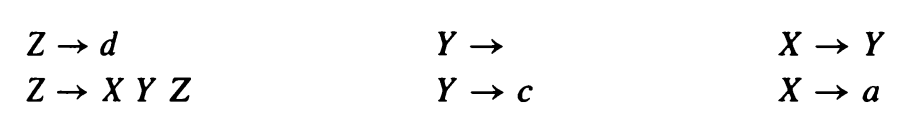

<p style="text-align:center">文法3-12</p>

对于一个特定的文法，当给定由终结符和非终结符组成的字符串$\gamma$时，下述结论成立。

- 若$X$可以导出空串，那么nullable($X$)为真。
- FIRST($\gamma$)是可从$\gamma$推导出的字符串的开头终结符的集合。
- FOLLOW($X$)是可直接跟随于$X$之后的终结符集合。也就是说，如果存在着任一推导包含$Xt$，则$t\in$FOLLOW($X$)。当推导包含$XYZt$，其中$Y$和$Z$都推导出$\epsilon$时，也有$t\in$FOLLOW($X$)。

可将FIRST、FOLLOW和nullable精确地定义为满足如下属性的最小集合：

> **for** 每个产生式$X\rightarrow Y_1Y_2\cdots Y_k$
>
> ​      **if** $Y_1\cdots Y_k$都是可为空的（或者如果$k=0$）
>
> ​            **then** nullable[$X$] = true
>
> ​      **for** 每个$i$从$1$到$k$，每个$j$从$i+1$到$k$，
>
> ​            **if** $Y_1\cdots Y_{i-1}$都是可为空的（或者如果$i=1$）
>
> ​                  **then** FIRST[$X$] = FIRST[$X$]$\cup$FIRST[$Y_1$]
>
> ​            **if** $Y_{i+1}\cdots Y_k$都是可为空的（或者如果$i=k$）
>
> ​                  **then** FOLLOW[$Y_i$] = FOLLOW[$Y_i$]$\cup$FOLLOW[$X$]
>
> ​            **if** $Y_{i+1}\cdots Y_{j-1}$都是可为空的（或者如果$i+1=j$）
>
> ​                  **then** FOLLOW[$Y_i$] = FOLLOW[$Y_i$]$\cup$FOLLOW[$Y_j$]

计算FIRST、FOLLOW和nullable的算法3-13遵循的正式上述事实。我们只需要简单地用一个赋值语句替代每一个方程并进行迭代，就可以计算出每个字符串的FIRST、FOLLOW和nullable。

> *计算*FIRST、FOLLOW和nullable*的算法*
>
> 将所有的FIRST和FOLLOW初始化为空集合，将所有的nullable初始化为false。
>
> **for** 每个终结符$Z$
>
> ​      FIRST[$Z$]$\leftarrow${$Z$}
>
> **repeat**
>
> ​      **for** 每个产生式$X \rightarrow Y_1Y_2\cdots Y_k$
>
> ​            **if** $Y_1...Y_k$都是可为空的（或者如果$k=0$）
>
> ​                  **then** nullable[$X$]$\leftarrow$true
>
> ​            **for** 每个$i$从$1$到$k$，每个$j$从$i+1$到$k$，
>
> ​                  **if** $Y_1\cdots Y_{i-1}$都是可为空的（或者如果$i=1$）
>
> ​                        **then** FIRST[$X$]$\leftarrow$FIRST[$X$] $\cup$ FIRST[$Y_i$]
>
> ​                  **if** $Y_{i+1}\cdots Y_{k}$都是可为空的（或者如果$i=k$）
>
> ​                        **then** FOLLOW[$Y_i$]$\leftarrow$FOLLOW[$Y_i$] $\cup$ FOLLOW[$X$]
>
> ​                  **if** $Y_{i+1}\cdots Y_{j-1}$都是可为空的（或者如果$i+1=j$）
>
> ​                        **then** FOLLOW[$Y_i$]$\leftarrow$FOLLOW[$Y_i$] $\cup$ FIRST[$Y_j$]
>
> **until** FIRST、FOLLOW和nullable在此轮迭代中没有改变

<p style="text-align:center">算法3-13 FIRST、FOLLOW和nullable的迭代计算</p>

当然，按正确的顺序考察产生式会有助于提高这个算法的效率，具体见17.4节。此外，这3个关系式不必同时计算，可单独计算nullable，然后计算FIRST，最后计算FOLLOW。

关于集合的一组方程变成了计算这些集合的算法，这并不是第一次遇到：在2.4.2节计算$\epsilon$闭包的算法中我们也遇到了这种情形。这也不会是最后一次；这种迭代到不动点的技术也适用于编译器后端优化使用的数据流分析。

我们来将这一算法应用于文法3-12。一开始，我们有


在第一次迭代中，我们发现$a\in\text{FIRST}[X]$，$Y$是可为空的，$c\in\text{FIRST}[Y]$，$d\in\text{FIRST}[Z]$，$d\in\text{FOLLOW}[X]$，$d\in\text{FOLLOW}[X]$，$d\in\text{FOLLOW}[Y]$。因此有


在第二次迭代中，我们发现$X$是可为空的，$c\in\text{FIRST}[X]$，$\{a,c\}\subseteq\text{FIRST}[Z]$，$\{a,c,d\}\subseteq\text{FOLLOW}[X]$，$\{a,c,d,\}\subseteq\text{FOLLOW}[Y]$，因此有


第三次迭代没有发现新的信息，于是算法终止。

也可将FIRST关系推广到符号串：

> ​    $\text{FIRST}(X\gamma)=\text{FIRST}[X]$    若$!\text{nullable}[X]$
>
> ​    $\text{FIRST}(X\gamma)=\text{FIRST}[X]\cup\text{FIRST}(\gamma)$    若$\text{nullable}[X]$

并且类似地，如果$\gamma$中的每个符号都是可为空的，则称符号串$\gamma$是可为空的。

#### 3.2.2 构造预测分析器

考虑一个递归下降分析器。非终结符$X$的分析函数对$X$的每个产生式都有一个子句，因此，该函数必须根据下一个输入标记$T$来选择其中的一个子句。如果能够为每一个$(X,T)$选择出正确的产生式，就能够写出这个递归下降分析器。我们需要的所有信息可以用一张关于产生式的二维表来表示，此表以文法的非终结符$X$和终结符$T$作为索引。这张表称为*预测分析表*（predictive parsing table）。

为了构造这张表，对每个$T\in \text{FIRST}(\gamma)$，在表的第$X$行第$T$列，填入产生式$X\rightarrow\gamma$。此外，如果$\gamma$是可为空的，则对每个$T\in\text{FOLLOW}(X)$，在表的第$X$行第$T$列，也填入该产生式。

图3-14给出了文法3-12的预测分析表。但是其中有些项中的产生式不止一个！出现这种多重定义的项意味着不能对文法3-12进行预测分析。


<p style="text-align:center">文法3-12的预测分析表</p>

如果我们仔细地检查这一文法，就能发现它具有二义性。句子$d$有多个语法树，包括：


二义性文法总是会导致预测分析表有多重定义的项。如果我们想要将文法3-12的语言作为程序设计语言，则需要为它找到一个无二义性的文法。

若一个文法的预测分析表不含多重定义的项则称其为LL(1)文法。LL(1)代表从左至右分析、最左推导和超前查看一个符号（Left-to-right parse，Leftmost-derivation，1-symbol lookahead）。显然，递归下降（预测）分析器是用一遍来从左至右扫描输入符号的（有些分析算法不这样做，但它们一般对编译器没有什么帮助）。预测分析器在将非终结符扩展成它们的产生式的右部符号（即递归下降分析器调用非终结符对应的函数）所遵循的顺序恰好就是最左推导扩展非终结符所采用的顺序。而且，递归下降分析器完成其工作只需查看下一个输人单词，从不需要超前查看多于一个以上的单词。

我们也可以推广FIRST集合的概念来描述一个单词串的前$k$个单词，并构造一个LL($k$)分析表，表的行是非终结符，列是k个终结符的每一种序列。这种方法虽然很少被采用（因为这种表实在是太大了），但有时在手工编写递归下降分析器时，会遇到需要超前查看一个以上单词的情况。

可用LL(2)分析表分析的文法称LL(2)文法，类似地，有LL(3)文法，等等。所有 LL(1)文法都属于LL(2)文法，依此类推。对于任何$k$，不存在任何有二义性的文法是LL($k$)文法。

#### 3.2.3 消除左递归

假设我们要为文法3-10构造一个预测分析器。下面两个产生式

> $E \rightarrow E + T$
>
> $E \rightarrow T$

肯定会导致在LL(1)分析表中有双定义的登记项，因为任何属于FIRST(T)的标记同时也属于FIRST(E+T)。问题发生的原因是作为E的产生式的第一个右部符号出现，这种情况称为左递归（left recursion）。具有左递归的文法不是LL(1)文法。

为了消除左递归，我们将利用右递归来重写产生式。为此需要引入一个新的非终结符E并将产生式重写为：

> $E \rightarrow T\;E'$
>
> 
>
> $E' \rightarrow +\; T\; E'$
>
> $E'\rightarrow$

这3个产生式推导出的(关于$T$和$+$的)字符串集合与原来那两个产生式推导出的字符串集合相同，但是它没有左递归。 

一般地，对于产生式$X\rightarrow X\gamma$和$X\rightarrow\alpha$，其中$\alpha$不以$X$开始，我们知道由它们可推导出形如$\alpha\gamma *$的字符串，即一个其后跟随零至多个的字符串。因此我们可以利用右递归来重写正则表达式：


对文法3-10应用这种转换，可以得到文法3-15。

为了构造预测分析器，我们首先要计算nullable、FIRST和FOLLOW集合（见表3-16）。文法3-15的预测分析器如表3-17所示。


<p style="text-align:center">文法3-15</p>


<p style="text-align:center">文法3-15的Nullable，FIRST和FOLLOW</p>

#### 3.2.4 提取左因子

我们已经了解了左递归对预测分析的影响，并知道可以消除它。当一个非终结符的两个产生式以相同的符号开始时也会发生类似的问题，例如：

> $S\rightarrow if\; E\; then\; S\; else\; S$
>
> $S\rightarrow if\; E\; then\; S$

在这种情况下，可以对文法*提取左因子*，即取出它们非公共的尾部（$else\;S$和$\epsilon$），并用一个新的非终结符$X$来代替它们：

> $S\rightarrow if\; E\; then\; S\; X$
>
> $X\rightarrow$
>
> $X\rightarrow else\; S$

由此得到的产生式对预测分析器不会造成问题。尽管文法仍然具有二义性——分析表中包含多重定义的项，但是我们可以使用“$else\; S$”的动作解决二义性问题。

#### 3.2.5 错误恢复

有了预测分析表，便很容易写出递归下降分析器。下面就是文法3-15的分析器的一段代码表示：

```
and T()  = case !tok
            of ID     => (F(); T'())
             | NUM    => (F(); T'())
             | LPAREN => (F(); T'())
             | _      => error!
             
and T'() = case !tok
            of PLUS   => ()
             | TIMES  => (eat(TIMES); F(); T'())
             | RPAREN => ()
             | EOF    => ()
             | _      => error!
```

在LL(1)分析表的第行$x$列的项若为空，表明分析函数`T()`不希望见到标记——若出现标记$x$，则意味着出现了一种语法错误。那么应如何来处理这种错误呢？我们可以仅仅发出一个异常，然后便退出分析，但这样做对用户不够友好。较好的处理方式是，输出一条错误信息。然后尝试恢复错误，并继续后继处理，从而使得在同一编译过程中能发现其他的语法错误。

当输入的标记流不是语言中的句子时便会出现语法错误。错误恢复就是通过删除、替代或插入标记，来寻找一个与那个标记流相似的句子。

例如，对T的错误恢复处理是插入一个num标记。它不必对实际的输入进行调整，而只是假装存在num，输出错误信息，然后正常返回即可。

```
and T()  = case !tok
            of ID     => (F(); T'())
             | NUM    => (F(); T'())
             | LPAREN => (F(); T'())
             | _      => print("expected id, num, or left-paren")
```

通过插入标记来进行错误恢复是一种有点危险的做法，因为如果这种插入会进一步导致其他错误的话，这一过程就有可能陷入死循环。用删除标记进行错误恢复则相对要安全些，因为循环最终会由于遇到文件结束而终止。

一种通过删除单词而实现的简单的错误恢复方法是：跳过若干单词直至到达一个属于FOLLOW集合的标记为止。例如，关于T的错误恢复可以是这样的：

```
and T'() = case !tok
            of PLUS   => ()
             | TIMES  => (eat(TIMES); F(); T'())
             | RPAREN => ()
             | EOF    => ()
             | _      => (print "expected +, *, right-paren,
                                 or end-of-file";
                          skipto[PLUS,TIMES,RPAREN,EOF])
                          
and skipto(stop) =
     if member(!tok, stop) then ()
     else eat((!tok; skipto(stop)))
```

递归下降分析器的错误恢复必须具有调整机制（有时要通过尝试-出错-再尝试的过程），以避免由于一个不适当的标记而导致的大量错误修复信息。

### 3.3 LR分析

LL($k$)分析技术的一个弱点是，它在仅仅看到右部的前$k$个单词时就必须预测要使用的是哪个产生式。另一种更有效的分析方法是LR($k$)分析，它可以将这种判断推迟至已看到与正在考虑的这个产生式的整个右部对应的输入单词以后（多于$k$个单词）。

LR($k$)代表从左至右分析、最右推导、超前查看$k$个标记（Left-to-right parse，Rightmost-derivation，$k$-token lookahead）。使用最右推导似乎有点奇怪，我们会想，它们如何与从左至右的分析过程保持一致呢？图3-18举例说明了用文法3-1(增加了一个新的产生式$S'\rightarrow S$\$)对下面这个程序进行的LR分析：

> a := 7;
>
> b := c + (d := 5 + 6, d)


<p style="text-align:center">图3-18 一个句子的移进-归约分析。栈的数字下标是DFA的状态编号，见表3-19</p>

该分析器有一个栈和一个输入，输入中的前k个单词为超前查看的单词。根据栈的内容和超前查看的单词，分析器执行移进和归约两种动作：

- 移进：将第一个输入单词压入至栈顶。
- 归约：选择一个文法规则$X\rightarrow A\; B\; C$；依次从栈顶弹出$C,B,A$，然后将$X$压入栈。

开始时栈为空，分析器位于输入的开始。移进文件终结符\$的动作称为*接受*（accepting），它导致分析过程成功结束。

图3-18列出了在每一个动作之后的栈和输入，也指明了所执行的是什么动作。将栈和输入合并起来形成的一行总是构成一个最右推导。事实上，图3-18自下而上地给出了对输入字符串的最右推导过程。

#### 3.3.1 LR分析引擎

LR分析器如何知道何时该移进、何时该归约呢？通过确定的有限自动机！这种DFA不是作用于输入（因为有限自动机太弱而不适合上下文无关文法），而是作用于栈。DFA的边是用可以出现在栈中的符号（终结符和非终结符）来标记的。表3-19是文法3-1的转换表。


<p style="text-align:center">表3-19 文法3-1的LR分析表</p>

这个转换表中的元素标有下面4种类型的动作：

> $sn$     移进到状态$n$；
>
> $gn$     转换到状态$n$；
>
> $rk$     用规则$k$归约；
>
> $a$      接收；
>
> ​        错误（用表中的空项来表示）。

为了使用该表进行分析，要将移进和转换动作看作DFA的边，并查看栈的内容。例如，若栈为$id := E$，则DFA将从状态1依次转换到4、6和11。若下一个输入单词是一个分号，状态11的“;”所在列则指出将根据规则2进行归约，因为文法的第二个规则是$S\rightarrow id := E$。于是栈顶的3个单词被弹出，同时$S$被压入栈顶。

在状态11中对于“+”的动作是移进，因此，如果下一个单词是+，它将被从输人中移出并压入栈中。

对于每一个单词，分析器不是重新扫描栈，而是记住每一个栈元素所到达的状态。因此，分析算法如下：

> 查看栈顶状态和输人符号，从而得到对应的动作；
>
> 如果动作是
>
> 移进（$n$）：前进至下一个单词，将$n$压入栈。
>
> 归约（$k$）：从栈顶依次弹出单词，弹出单词的次数与规则$k$的右部符号个数相同；
>
> ​                      令$X$是规则$k$的左部符号；
>
> ​                      在栈顶现在所处的状态下，查看$X$得到动作“转换到$n$”；
>
> ​                      将$n$压入栈顶。
>
> 接收：停止分析，报告成功。
>
> 错误：停止分析，报告失败。

#### 3.3.2 LR(0)分析器生成器

LR($k$)分析器利用栈中的内容和输入中的前$k$个单词来确定下一步采取什么动作。表3-19说明了使用一个超前查看符号的情况。$k=2$时，这个表的每一列是两个单词组成的序列，依此类推。在实际中，编译器并不使用$k>1$的表，在一定程度上是因为这个表十分巨大，但更主要的是因为程序设计语言可以用LR(1)文法来描述。

LR(0)文法是一种只需查看栈就可进行分析的文法，它的移进/归约判断不需要任何超前查看。尽管这一类文法太弱以至于不是很有用，但构造LR(0)分析表的算法对于构造LR(1)分析器算法来说是一个很好的开始。

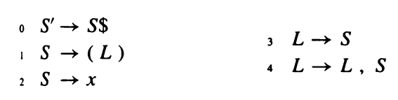

<p style="text-align:center">文法3-20</p>

我们使用文法3-20来举例说明LR(0)分析器的生成过程，看看这个文法的分析器是如何工作的。一开始，分析器的栈为空，输入是$S$的完整句子并以\$结束，即规则$S'$的右部都将出现在输入中。我们用$S'\rightarrow .S$\$来表示这一点，其中圆点“.”指出了分析器的当前位置。

在这个状态下，输入以$S$开始意味着它可能以产生式$S$的任何一个右部开始。我们用下面的表示来指出这种状态∶

称它为状态1。文法规则与指出其右部位置的圆点组合在一起称为*项*（item，具体为LR(0)项）。一个状态就是由若干个项组成的集合。

**移进动作**（shift action）。在状态1，考虑当移进一个$x$时会发生什么变化。我们知道此时栈顶为$x$，并通过将产生式$S'\rightarrow .S$\$中的圆点移到$x$之后来指出这一事实。规则$S'\rightarrow .S$\$和$S\rightarrow .(L)$与这个动作无关，因此忽略它们。于是我们停在状态2：


或者，在状态1也可考虑移进一个左括号，将圆点移到第3项中左括号的右边，得到$S\rightarrow (.L)$。此时我们知道栈顶一定为左括号，并且输入中开头的应当是可从L推导出来的某个单词串，且其后跟随一个右括号。那么，什么样的单词可以作为输入中的开头单词呢？通过将L的所有产生式都包含在项集合中，便可以得出答案。但是现在，在这些L的项中，有一个项的圆点正好位于$S$之前，因此我们还需要包含所有$S$的产生式：


**转换动作**（goto action）。在状态1，考虑分析已经过了由非终结符$S$导出的某些单词串之后的效果。这发生在移进一个$x$或左括号，并随之用一个$S$产生式执行了归约时。那个产生式的所有右部符号都将被弹出，并且分析器将在状态1对$S$执行转换动作。这个效果可以通过将状态1的第一项中的圆点移到$S$之后来模拟，从而得到状态4：


**归约动作**（reduce action）。在状态2我们发现圆点位于一个项的末尾，这意味着栈顶一定对应着产生式（$S\rightarrow x$）的完整的右部，并准备进行归约。在这种状态下，分析器可能会执行一个归约动作。

我们在这些状态执行的基本操作是$Closure(I)$和$Goto(I,X)$，其中$I$是一个项集合，$X$是一个文法符号（非终结符或终结符）。当在一个非终结符的左侧有圆点时，$Closure$将更多的项添加到项集合中；$Goto$将圆点移到所有项中的符号$X$之后。


下面是LR(0)分析器的构造算法。首先，给文法增加一个辅助的开始产生式$S'\rightarrow S$\$。令$T$是迄今看到的状态集合，$E$是迄今已找到的（移进或转换）边集合。

> 初始化$T$为{**Closure**({$S'\rightarrow .S$\$})}
>
> 初始化$E$为空
>
> **repeat**
>
>    **for** $T$中的每一个状态$I$
>
> ​      **for** $I$ 中的每一项$A\rightarrow\alpha .\; X\beta$
>
> ​         **let** $J$ 是**Goto**($I,X$)
>
> ​            $T\leftarrow T\cup \{J\}$
>
> ​            $E\leftarrow E\cup\{I\overset{X}{\rightarrow}J\}$
>
> **until** $E$和$T$在本轮迭代没有改变

但是对于符号$S$，我们不计算$Goto(I,\$)$，而是选择了**accept**动作。

图3-21以文法3-20为例说明了该分析器的分析过程。


<p style="text-align:center">图3-21 文法3-20的LR(0)状态</p>

我们现在可以计算LR(0)的归约动作集合R：

> $R\leftarrow \{\}$
>
> **for**   $T$ 中的每一个状态$I$
>
>       **for**   $I$ 中的每一项$A\rightarrow\alpha .$
>
> ​      $R\leftarrow R\cup\{I,A\rightarrow\alpha\}$

并能够为该文法构造一个分析表（表3-22）。对于每一条边$I\overset{X}{\rightarrow}J$，若$X$为终结符，则在表位置$(I,X)$中放置动作*移进*$J(sJ)$；若$X$为非终结符，则将*转换*$J(gJ)$放在位置$(I,X)$中。对于包含项$S'\rightarrow S.$\$的每个*状态*$I$，我们在位置$(I,\$)$中放置动作接收$(a)$。最后，对于包含项$A\rightarrow\gamma .$（尾部有圆点的产生式$n$）的状态，对每一个单词$Y$，放置动作归约 $n(rn)$于$(I,Y)$中。


<p style="text-align:center">图3-22 文法3-20的LR(0)分析表</p>

因为LR(0)不需要超前查看，所以原则上每个状态只需要一个动作：一个状态要么是移进，要么是归约，但不会两者兼有。实际中，由于我们还需要知道要移至哪个状态，所以此表以状态号作为行的标题，以文法符号作为列的标题。

#### 3.3.3 SLR分析器的生成

让我们来尝试构造文法3-23的LR(0)分析表。它的LR(0)状态和分析表如图3-24所示。


在状态3，对于符号+，有一个多重定义的项：分析器必须移进到状态4，同时又必须用产生式2进行归约。这是一个冲突，它表明该文法不是LR(0)——它不能用LR(0)分析器分析。因此我们需要一种能力更强的分析算法。

构造比LR(0)更好的分析器的一种简单方法称为SLR，即Simple LR的简称。SLR分析器的构造几乎与LR(0)的相同，但是它只在FOLLOW集合指定的地方放置归约动作。

下面是在SLR表中放置归约动作的算法：

> $R\leftarrow\{\}$
>
> **for**   $T$中的每一个状态 $I$
>
>       **for**   $I$ 中的每一个项$A\rightarrow\alpha .$
>
> ​      **for**   FOLLOW($A$) 中的每一个标记$X$
>
> ​         $R\leftarrow R\cup\{I,X,A\rightarrow\alpha\}$

动作$(I,X,A\rightarrow\alpha)$指出，在状态$I$，对于超前查看符号$X$，分析器将用规则$A\rightarrow\alpha$进行归约。

因此，对于文法3-23，尽管我们使用相同的状态图（图3-24），但如图3-25所示，在SLR表中放置的归约动作却要少些。


LR文法类是其SLR分析表不含冲突（多重表项）的那些文法。文法3-23即属于这一类，很多常用的程序设计语言的文法也属于这一类。

#### 3.3.4 LR(1)项和LR(1)分析表

比SLR更强大的是LR(1)分析算法。大多数用上下文无关文法描述其语法的程序设计语言都有一个LR(1)文法。

构造LR(1)分析表的算法与构造LR(0)分析表的算法相似，但是项的概念要更复杂些。一个LR(1)项由一个文法产生式、一个右部位置（用圆点表示）和一个超前查看的符号组成。其思想是，项$(A\rightarrow\alpha,\beta,\x)$指出：序列$\alpha$在栈顶，且输入中开头的是可以从$\beta x$导出的符号串。

LR(1)状态是由LR(1)的项组成的集合，并且存在着合并该超前查看符号的LR(1)的Closure和Goto操作：


开始状态是项$(S'\rightarrow .S\$,?)$的闭包，其中超前查看符号“?”具体是什么无关紧要，因为文件结束标志绝对不会被移进。

归约动作用下面这个算法来选择：

> $R\leftarrow\{\}$
>
> **for**   $T$中的每一个状态 $I$
>
>       **for**   $I$ 中的每一个项$A\rightarrow\alpha .\; ,z$
>
> ​      $R\leftarrow R\cup\{I,z,A\rightarrow\alpha\}$

动作$I,z,A\rightarrow\alpha$指出，在状态$I$看到超前查看符号$z$时，分析器将用规则$A\rightarrow\alpha$进行归约。

文法3-26不是SLR（见习题3.9），但它属于LR(1)文法，图3-27给出了该文法的LR(1)状态。此图中有几个项有相同的产生式，但其超前查看符号不同（如下面左图所示）；我已将它们简化为下面右图所示：


表3-28a是从这个状态图导出的LR(1)分析表。只要在产生式的末尾有圆点（如图3-27的状态3，在产生式$E\rightarrow V$的末尾有圆点），在LR(1)表中与状态号对应的行和与项的超前查看符号对应的列的位置，就存在着那个产生式的一个归约动作（在这个例子中，超前查看符号是\$）。只要圆点位于终结符或非终结符的左边，在LR(1)分析表中就存在相应的移进或转换动作，正如LR(0)表的情形一样。


<p style="text-align:center">表3-28 文法3-26的LR(1)和LALR(1)语法分析表</p>

#### 3.3.5 LALR(1)语法分析表

LR(1)分析表有很多状态，因此会非常大。然而，通过合并那种除超前查看符号集合外其余部分都相同的两个状态，可得到一个较小的表。由此得到的分析器称为LALR(1)分析器，即超前查看LR(1)（Look-Ahead LR(1)）。

例如，文法3-26的LR(1)分析器中（图3-27），如果忽略超前查看的符号集合，状态6和状态13的项是一样的。同样，除了超前查看符号外，状态7和状态12也是相同的，状态8和状态11，以及状态10和状态14也都如此。合并这些状态元组则得到表3-28b所示的LALR(1)分析表。

对于某些文法，LALR(1)表含有归约-归约冲突，而在LR(1)表中却没有这种冲突。不过，实际中这种不同的影响很小，重要的是和LR(1)表相比，LALR(1)分析表的状态要少得多，因此它需要的存储空间要少于LR(1)表。


#### 3.3.6 各类文法的层次

如果一个文法的LALR(1)分析表不含冲突，则称该文法是LALR(1)文法。所有SLR文法都是LALR(1)文法，但是LALR(1)不一定是SLR文法。图3-29给出了几种文法类之间的关系。


所有合理的程序设计语言都有一个LALR(1)文法，并且存在着许多对LALR(1)文法有效的语法分析器的生成器工具。由于这一原因，LALR(1)文法已变成程序设计语言和自动语法分析器的生成器的标准。

#### 3.3.7 二义性文法的LR分析

许多程序设计语言具有这样的文法规则：

这种文法许可这样的程序：

这个程序可有两种解释方式：

在大多数程序设计语言中，else必须与最近的then匹配，所以方式（1）的解释是正确的。这种文法的LR分析表将会有一个移进-归约冲突：

移进对应于解释（1），归约对应于解释（2）。

这种二义性可通过引入两个辅助非终结符M（用于相匹配的语句）和U（用于不相匹配的语句）来消除：

除了重写文法外，我们也可以保持文法不变并容忍移进-归约冲突。在构造分析表中，因为我们偏向于选择方式（1）的解释，因此这种冲突应该通过移进来解决。

通过在选择移进或归约时适当偏袒于某一种选择来解决移进-归约冲突，常常使我们有可能使用二义性文法。但最好谨慎地使用这种技术，并且只在很明确的情况下才使用（比如这里描述的悬挂else和3.4.2节将描述的算符优先）。大部分的移进-归约冲突和几乎所有的归约-归约冲突都不应该通过在分析表中使用某种欺骗性的技巧来解决，它们都是病态文法的征兆，应通过消除二义性来解决。

### 3.4 使用语法分析器的生成器

构造LR(1)或LALR(1)分析表简单得足以用计算机来自动完成。而且，手工构造它非常枯燥无趣，以至于很少有真实程序设计语言的LR语法分析器不使用语法分析器的生成工具。ML-Yacc就是这样一种工具，实现机制来源于经典的Yacc（Yet another compiler-compiler）语法分析器生成器。

一个ML-Yacc约定可以分成三部分，三部分之间使用%%分隔：

> user declarations
> %%
> parser declarations
> %%
> grammar rules

user declarations部分是由原始的ML声明代码组成的，它们可由嵌入在后面两个部分中的语义动作来使用。parser declarations部分是由终结符、非终结符等组成的表。

grammar rules部分由如下形式的产生式组成：

> exp : exp PLUS exp (semantic action)

其中exp是非终结符，该非终结符产生由exp+exp组成的右部，而PLUS是一个终结符（标记）。semantic action 是用原始ML代码编写的，并在语法分析器使用这个规则进行归约时被执行。


<p style="text-align:center">文法3-30</p>

考虑文法3-30，在ML-Yacc中它的表示如文法3-31所示。ML-Yacc手册给出了文法规范中各种命令的完整解释。在文法3-31的文法中，终结符是ID，WHILE等；非终结符是prog，stm，stmlist；源文件中代码的位置信息是整型数值，供报告错误信息时使用；当ML-Yacc处理文法时，将会生成一个有关语法分析表的冗长的描述；语法分析的结尾标记（end-of-parse）是EOF；文法的开始符号是prog。

```
%%
%term ID | WHILE | BEGIN | END | DO | IF | THEN | ELSE | SEMI | ASSIGN | EOF

%nonterm prog | stm | stmlist

%pos int
%verbose
%start prog
%eop EOF %noshift EOF

%%

prog: stmlist                   ()
stm : ID ASSIGN ID              ()
    | WHILE ID DO stm           ()
    | BEGIN stmlist END         ()
    | IF ID THEN stm            ()
    | IF ID THEN stm ELSE stm   ()
    
stmlist : stm                   ()
        | stmlist SEMI stm      ()
```

<p style="text-align:center">文法3-31 文法3-30的ML-Yacc版本。这里删除了语义动作，我们第4章再讨论这部分内容</p>

#### 3.4.1 冲突

ML-Yacc能指出移进-归约冲突和归约-归约冲突。移进-归约冲突是在移进和归约之间进行的一种选择；归约-归约冲突是使用两条不同规则进行归约的一种选择。默认情况下，ML-Yacc选择移进来解决移进-归约冲突，选择使用在文法中先出现的规则来解决归约-归约冲突。

对于文法3-30，ML-Yacc报告它有一个移进-归约冲突。任何冲突都指出这个分析可能不是文法设计者所预期的，因此应当引起重视。通过阅读ML-Yacc生成的详细的描述文件可以查看冲突，图3-32展示了这个文件。

简单地查看一下状态17便可看出这个冲突是由常见的悬挂else问题引起的。因为Yacc解决移进-归约冲突的默认做法是移进，而这个移进的结果正好与所希望的使else与最近的then匹配相符合，因此这个冲突不会有损害。

当移进-归约冲突对应的是一种很明确的情形时，文法中可接受这种冲突。但是多数移进-归约冲突和所有的归约-归约冲突都会带来严重的问题，因此应通过重写文法来消除它们。


<p style="text-align:center">图3-32 文法3-30的LR状态</p>

#### 3.4.2 优先级指导

对于任何$k$，不存在属于LR($k$)文法的二义性文法：因为—个二义性文法的LR($k$)语法分析表总是会存在冲突。然而，如果能找到解决冲突的方法，则二义性的文法仍然是可以使用的。

例如，文法3-5是一个高度二义性的文法。在用该文法来描述程序设计语言时，我们希望以这样一种方式来分析它：\*和/的优先级高于+和-的优先级，并且所有操作符都从左至右结合。通过将它重写为无二义性的文法3-8可以达到这一要求。

但是，我们可以不必引入新符号$T$和$F$以及和它们相关的归约式$E\rightarrow T$和$T\rightarrow F$，而是先为文法3-5构造一个LR(1)分析表，如表3-33所示。此表含有许多冲突，例如，在状态13，对于超前符号+，在移进到状态8和用规则3进行归约之间就存在一个冲突。在状态13的两个项是：

这个状态的当前栈顶是$\cdots E*E$。移进将导致栈顶变为$\cdots E*E+$，最终变为$\cdots E*E+E$并用规则$E+E$归约为$E$。归约将导致栈变为$\cdots E$，之后再移进+。由移进和归约分别得到的两棵语法分析树如下所示：

如果我们希望\*的优先级高于+，则应选择归约而不是移进。因此在表的登记项$(13,+)$中填入r3而抛弃s8。

相反地，在状态9对于超前查看符号\*，我们应当移进而不是归约，因此我们通过在表的登记项$(9,*)$中填入s12来解决这个冲突。

至于状态9对于超前查看符号$+$，其情形为：

移进会导致操作符是右结合的；而归约则使得它是左结合的。我们希望左结合，因此用r5填充$(9,+)$。

考虑表达式$a-b-c$。在多数程序设计语言中，这都是左结合的，就好像它们是写成$(a-b)-c$一样。但我们这里假设这个表达式天生就是有冲突的，因此需要强制程序员明显地使用括号，要么写成$(a-b)-c$，要么写成$a-(b-c)$。于是我们称这个减法操作符是非结合的，所以在$(11,-)$处填入error项。

这些决定得到了一个已解决了所有冲突的语法分析表（表3-34）。

ML-Yacc有一种指明解决这类移进-归约冲突的优先级指导命令，如下形式的一系列声明

```
%nonassoc EQ NEQ
%left PLUS MINUS
%left TIMES DIV
%right EXP
```

指出：+和-是左结合的且具有相同的优先级；\*和/是左结合的且它们的优先级高于+；是右结合的且具有最高优先级；$=$和$\neq$是非结合的，它们的优先级低于+。

当遇到如下的移进-归约冲突时

在移进一个标记和用一个规则进行归约之间存在着选择。标记和规则两者之间应当给谁较高的优先级呢？例子中关于优先级的声明（%left 等）给予标记以优先，而规则的优先级则由该规则右部最后出现的那个标记的优先级给出。因此，这里的选择是在一个有\*优先级的规则和一个有+优先级的标记之间进行的。因为规则的优先级较高，所以这个冲突通过选择归约动作而得到了解决。

当规则和标记的优先级相等时，用%left指明的优先级偏向于归约，%right指明的偏向于移进，而由%nonassoc指明的则导致一个错误动作。

替代使用“规则具有其最后一个单词的优先级”的默认约定，我们可以用%prec指导命令给规则指定一种明确的优先级。这种方法常用于解决“一元负运算”问题。在大多数程序设计语言中，一元负运算的优先级要高于任何一个二元操作符的优先级，所以$-6*8$被分析成$(-6)*8$，而不是$-(6*8)$。文法3-35给出了一个例子。

```
%%
%term INT | PLUS | MINUS | TIMES | UMINUS | EOF
%nonterm exp
%start exp
%eop EOF

%left PLUS MINUS
%left TIMES
%UMINUS
%%

exp : INT                ()
    | exp PLUS exp       ()
    | exp MINUS exp      ()
    | exp TIMES exp      ()
    | MINUS exp     %prec UMINUS  ()
```

词法分析器决不会返回标记UMINUS；单词UMINUS仅仅是优先级（%left）声明链中的一个占位符。指导命令%prec UMINUS给了规则exp:MINUS exp以最高的优先级，因此，用这一规则进行归约的优先级要高于任何操作符的移进操作，包括减号操作符。

优先级规则虽有助于解决冲突，但不应滥用。若在解释优先规则时遇到麻烦，那么最好重写文法来消除二义性。


#### 3.4.3 语法和语义

考虑一个具有形如$x+y$的算术表达式和形如$xy=z$或$a\&(b=c)$的布尔表达式的程序设计语言。这个语言中，有算术变量和布尔变量之分，算术运算的优先级高于布尔运算，且布尔表达式不能与算术表达式相加。文法3-36给出了这个语言的一种文法。

```
%%
%term INT | ASSIGN | PLUS | MINUS | AND | EQUAL | EOF
%nonterm stm | be | ae
%start stm
%pos int
%left OR
%left AND
%left PLUS
%verbose
%eop EOF
%%

stm : ID ASSIGN ae   ()
    | ID ASSIGN be   ()

be  : be OR be       ()
    | be AND be      ()
    | ae EQUAL ae    ()
    | ID             ()

ae  : ae PLUS ae     ()
    | ID             ()
```

但如图3-37所示，这个文法存在一个移进-归约冲突。我们应怎样重写这个文法来消除冲突呢？


<p style="text-align:center">图3-37 文法3-36的LR状态</p>

这里的问题是，当语法分析器看到一个像$a$这样的标识符时。它无法知道它是一个算术变量还是一个布尔变量，这两者在语法上是相同的。解决的方法是将分析推迟到编译器的“语义”处理阶段；因为这种问题不能用上下文无关文法自然地来处理。一种更为恰当的文法是：

> $S\rightarrow id := E$
>
> 
>
> $E\rightarrow id$
>
> $E\rightarrow E \& E$
>
> $E\rightarrow E=E$
>
> $E\rightarrow E+E$

现在，表达式$a+\&5$在语法上是合法的，较后的编译阶段则必须拒绝它并输出一个语义错误信息。

### 3.5 错误恢复

LR($k$)分析表包含移进、归约、接收和错误动作。3.3.2节曾指出，LR语法分析器在遇到一个错误动作时将停止分析并报告失败。但这种做法对程序员不是很友好，因为程序员希望语法分析器报告程序中所有的错误，而不仅仅是第一个错误。

#### 3.5.1 用error符号恢复

局部错误恢复机制是通过调整分析栈和错误查出点的输入以允许分析能够继续进行来实现的。我们使用的局部恢复机制使用了一个专门的符号error来控制对错误恢复的处理，语法分析器的生成器的多种版本都使用了这种机制（ML-Yacc使用了全局技术，将在下一节介绍）。出现在文法规则中的特殊符号error可以匹配一串出错的输入标记。

例如，在Tiger的Yacc文法中，我们可有如下的产生式：

> $exp\rightarrow ID$
> $exp\rightarrow exp + exp$
> $exp\rightarrow (\; exp\; )$
> $exps\rightarrow exp$
> $exps\rightarrow exps\; ;\; exp$

我们可以非形式化地指明，当语法分析器在表达式的中间遇到语法错误时，应该跳到下一个分号或右括号[它们称为*同步标记*（synchronizing token）]，然后再继续分析。通过增加如下两个错误恢复产生式，便可以实现这一点：

> $exp\rightarrow (\; error\; )$
> $exp\rightarrow error\; ;\; exp$

分析器生成器将怎样处理这个error符号呢？在该分析器生成器中，error被看成一个终结符，并且在分析表中关于它的动作是移进，就好像它是一个普通标记一样。

当LR分析器到达一个错误状态时，它将采取如下一些动作。

#### 3.5.2 全局错误修复

### 程序设计：语法分析

### 推荐阅读

### 习题


[^1]: 译者注：也就是可以使用上下文无关文法来描述正则表达式语法。
